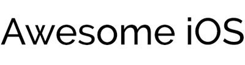

A curated list of awesome iOS frameworks, libraries, tutorials, plugins Xcode, components and much more.
The list is divided into categories such as Frameworks, Components, Testing and others,  open source projects, free and paid services. There is no pre-established order of items in each category, the order is for contribution. If you want to contribute, please read the [guide](https://github.com/vsouza/awesome-ios/blob/master/CONTRIBUTING.md).

Projects in Swift language will be marked with :large_orange_diamond: and :watch: for Apple Watch projects. Feel free to add your project.

### Contents
 - [Getting Started](#getting-started)
 - [Library and Frameworks](#libraries-and-frameworks)
     - [Audio](#audio)
     - [Bluetooth](#bluetooth)
     - [Cache](#cache)
     - [Core Data](#core-data)
     - [Charts](#charts)
     - [Database](#database)
     - [HUD](#hud)
     - [iBeacon](#ibeacon)
     - [Images](#images)
     - [EventBus](#eventbus)
     - [JSON](#json)
     - [Layout](#layout)
     - [Logging](#logging)
     - [Maps](#maps)
     - [Messaging](#messaging)
     - [Location](#location)
     - [Networking](#networking)
     - [Push Notifications](#push-notifications)
     - [Passbook](#passbook)
     - [Permissions](#permissions)
     - [Text](#text)
     - [Walkthrough / Intro / Tutorial](#walkthrough--intro--tutorial)
     - [UI](#ui)
     - [Websocket](#websocket)
     - [Code Quality](#code-quality)
     - [Analytics](#analytics)
     - [Payments](#payments)
     - [Products](#products)
     - [Utility](#utility)
     - [Security](#security)
     - [Video](#video)

- [Project setup](#project-setup)
- [Dependency / Package Manager](#dependency--package-manager)
- [Testing](#testing)
    - [TDD / BDD](#tdd--bdd)
    - [UI Testing](#ui-testing)
    - [Beta Distribution](#beta-distribution)
    - [Other Testing](#other-testing)
- [Platforms](#platforms)
- [Toolchains](#toolchains)
- [Tools](#tools)
- [Rapid Development](#rapid-development)
- [Deployment](#deployment)
- [App Store](#app-store)
- [SDK](#sdk)
- [Xcode](#xcode)
    - [Plugins](#plugins)
    - [Themes](#themes)
    - [Other Xcode](#other-xcode)
- [Style Guides](#style-guides)
- [Good Websites](#good-websites)
    - [News, Blogs and Feeds](#news-blogs-and-feeds)
    - [UIKIt references](#uikit-references)
    - [Components and Packages](#components-and-packages)
    - [Forums and discuss lists](#forums-and-discuss-lists)
    - [Tutorials and Keynotes](#tutorials-and-keynotes)
    - [Prototyping](#prototyping)
- [Twitter](#twitter)
- [Facebook Groups](#facebook-groups)
- [Podcasts](#podcasts)
- [Books](#books)
- [Other Awesome Lists](#other-awesome-lists)
- [Contributing](#contributing)

# Getting Started
 * [Road Map iOS](https://developer.apple.com/library/ios/referencelibrary/GettingStarted/RoadMapiOS/) - Start Developing iOS Apps Today, Apple Guide.
 * [Lifehacker](http://lifehacker.com/i-want-to-write-ios-apps-where-do-i-start-1644802175) - I Want to Write iOS Apps. Where Do I Start?
 * [Codeproject](http://www.codeproject.com/Articles/88929/Getting-Started-with-iPhone-and-iOS-Development) - Getting Started with iPhone and iOS Development.
 * [Ray Wenderlich](http://www.raywenderlich.com/38557/learn-to-code-ios-apps-1-welcome-to-programming) - Learn to code iOS Apps.
 * [Stanford - Developing Apps to iOS](https://itunes.apple.com/us/itunes-u/developing-apps-for-ios-hd/id395605774?mt=10) - Stanford's iTunes U App Development Course (Audio and Video).
 * [Stanford - Developing iOS 8 Apps with Swift](https://itunes.apple.com/us/course/developing-ios-8-apps-swift/id961180099) - Stanford's 2015 iTunes U App Development Course. :large_orange_diamond:

# Libraries And Frameworks

### Audio
 * [AudioBus](https://developer.audiob.us/) - Add Next Generation Live App-to-App Audio Routing
 * [AudioKit](https://github.com/audiokit/AudioKit) - A powerful toolkit for synthesizing, processing, and analyzing sounds.
 * [EZAudio](https://github.com/syedhali/EZAudio) - An iOS/OSX audio visualization framework built upon Core Audio useful for anyone doing real-time, low-latency audio processing and visualizations.
 * [novocaine](https://github.com/alexbw/novocaine) - Painless high-performance audio on iOS and Mac OS X.

### Bluetooth
 * [Discovery](https://github.com/omergul123/Discovery) - A very simple library to discover and retrieve data from nearby devices (even if the peer app works at background).
 * [LGBluetooth](https://github.com/l0gg3r/LGBluetooth) - Simple, block-based, lightweight library over CoreBluetooth. Will clean up your Core Bluetooth related code.
 * [PeerKit](https://github.com/jpsim/PeerKit) An open-source Swift framework for building event-driven, zero-config Multipeer Connectivity apps. :large_orange_diamond:
 * [simple-share](https://github.com/lauraskelton/simple-share) - Easy Proximity-based Bluetooth LE Sharing for iOS.

### Cache
 * [SDURLCache](https://github.com/steipete/SDURLCache) - URLCache subclass with on-disk cache support on iPhone/iPad.

### Charts
 * [ios-charts](https://github.com/danielgindi/ios-charts) - A powerful chart / graph framework, the iOS equivalent to [MPAndroidChart](https://github.com/PhilJay/MPAndroidChart). :large_orange_diamond:
 * [JTChartView](https://github.com/kubatru/JTChartView)
 * [PNChart](https://github.com/kevinzhow/PNChart) - A simple and beautiful chart lib used in Piner and CoinsMan for iOS
 * [BEMSimpleLineGraph](https://github.com/Boris-Em/BEMSimpleLineGraph) - Elegant Line Graphs for iOS (charting library).

### Core Data
 * [CWCoreData](https://github.com/jayway/CWCoreData) - Additions and utilities to make it concurrency easier with the Core Data framework.
 * [Objective-Record](https://github.com/mneorr/Objective-Record) - Objective Record is a lightweight ActiveRecord way of managing Core Data objects.
 * [Magical Record](https://github.com/magicalpanda/MagicalRecord) -  Super Awesome Easy Fetching for Core Data.
 * [SSDataKit](https://github.com/soffes/SSDataKit) - Eliminate your Core Data boilerplate code.
 * [ios-queryable](https://github.com/martydill/ios-queryable) - ios-queryable is an implementation of IQueryable/IEnumerable for Core Data.
 * [ReactiveCoreData](https://github.com/apparentsoft/ReactiveCoreData) - ReactiveCoreData (RCD) is an attempt to bring Core Data into the ReactiveCocoa (RAC) world.
 * [Ensembles](https://github.com/drewmccormack/ensembles) - A synchronization framework for Core Data.
 * [SLRESTfulCoreData](https://github.com/OliverLetterer/SLRESTfulCoreData) - Objc naming conventions, autogenerated accessors at runtime, URL substitutions and intelligent attribute mapping.
 * [Mogenerator](https://github.com/rentzsch/mogenerator) - Automatic Core Data code generation.
 * [HardCoreData](https://github.com/Krivoblotsky/HardCoreData) - CoreData stack and controller that will never block UI thread.
 * [encrypted-core-data](https://github.com/project-imas/encrypted-core-data) - Core Data encrypted SQLite store using SQLCipher.

### Database
 * [Realm](https://github.com/realm/realm-cocoa) - The alternative to CoreData and SQLite: Simple, modern and fast.
 * [YapDatabase](https://github.com/yapstudios/YapDatabase) - YapDatabase is an extensible database for iOS & Mac.
 * [Couchbase Mobile](http://developer.couchbase.com/mobile/) - Couchbase document store for mobile with cloud sync.
 * [FMDB](https://github.com/ccgus/fmdb) - A Cocoa / Objective-C wrapper around SQLite.

### Encryption
* [AESCrypt-ObjC](https://github.com/Gurpartap/AESCrypt-ObjC) - A simple and opinionated AES encrypt / decrypt Objective-C class that just works.

### HUD
 * [MBProgressHUD](https://github.com/jdg/MBProgressHUD) - Drop-in class for displays a translucent HUD with an indicator and/or labels while work is being done in a background thread.
 * [SVProgressHUD](https://github.com/TransitApp/SVProgressHUD) - A clean and lightweight progress HUD for your iOS app.
 * [ProgressHUD](https://github.com/relatedcode/ProgressHUD) - ProgressHUD is a lightweight and easy-to-use HUD.
 * [M13ProgressSuite](https://github.com/Marxon13/M13ProgressSuite) - A suite containing many tools to display progress information on iOS.
 * [JHProgressHUD](https://github.com/harikrishnant1991/JHProgressHUD) - An easy and lightweight Swift library to show HUD in IOS applications. :large_orange_diamond:

### iBeacon
 * [Proxitee](https://github.com/Proxitee/iOS-SDK) - Allows developers to create proximity aware applications utilizing iBeacons & geo fences.
 * [OWUProximityManager](https://github.com/ohwutup/OWUProximityManager) - A handy iBeacon + CoreBluetooth manager.
 * [Vicinity](https://github.com/Instrument/Vicinity) - Vicinity replicates iBeacons (by analyzing RSSI) and supports broadcasting and detecting low-energy bluetooth devices in the background.
 * [BeaconEmitter](https://github.com/lgaches/BeaconEmitter) - Turn your Mac as an iBeacon.
 * [OWUProximityManager](https://github.com/ohwutup/OWUProximityManager) - iBeacons + CoreBluetooth.

### Images
 * [GPU Image](https://github.com/BradLarson/GPUImage) - An open source iOS framework for GPU-based image and video processing.
 * [UIImage DSP](https://github.com/gdawg/uiimage-dsp) - IOS UIImage processing functions using the vDSP/Accelerate framework for speed.
 * [QR Code Scanner](http://www.appcoda.com/qr-code-ios-programming-tutorial/) - QR Code implementation.
 * [AsyncImageView](https://github.com/nicklockwood/AsyncImageView) - Simple extension of UIImageView for loading and displaying images asynchronously without lock up the UI.
 * [SDWebImage](https://github.com/rs/SDWebImage) - Asynchronous image downloader with cache support with an UIImageView category.
 * [DFImageManager](https://github.com/kean/DFImageManager) - Modern framework for fetching images from various sources. Zero config yet immense customization and extensibility. Uses NSURLSession.
 * [MapleBacon](https://github.com/zalando/MapleBacon) - An image download and caching library for iOS written in Swift. :large_orange_diamond:
 * [NYTPhotoViewer](https://github.com/NYTimes/NYTPhotoViewer) - Slideshow and image viewer.
 * [IDMPhotoBrowser](https://github.com/ideaismobile/IDMPhotoBrowser) - Photo Browser / Viewer.
 * [JTSImageViewController](https://github.com/jaredsinclair/JTSImageViewController) - Interactive iOS image viewer.
 * [Concorde](https://github.com/contentful-labs/Concorde/) - Download and decode progressive JPEGs.
 * [SCRecorder](https://github.com/rFlex/SCRecorder) - Camera engine with Vine-like tap to record, animatable filters, slow motion, segments editing.
 * [HanekeSwift](https://github.com/Haneke/HanekeSwift) - A lightweight generic cache for iOS written in Swift with extra love for images. :large_orange_diamond:
 * [TOCropViewController](https://github.com/TimOliver/TOCropViewController) - A view controller that allows users to crop UIImage objects.
 * [YXTMotionView](https://github.com/hanton/YXTMotionView) - A custom image view that implements device motion scrolling.
 * [PINRemoteImage](https://github.com/pinterest/PINRemoteImage) - A thread safe, performant, feature rich image fetcher.
 * [SABlurImageView](https://github.com/szk-atmosphere/SABlurImageView) - Easily Adding Animated Blur/Unblur Effects To An Image. :large_orange_diamond:
 * [FastImageCache](https://github.com/path/FastImageCache) - iOS library for quickly displaying images while scrolling.
 * [BKAsciiImage](https://github.com/bkoc/BKAsciiImage) - A library to render UIImage as ASCII art

### EventBus
 * [Caravel](https://github.com/coshx/caravel) - A Swift event bus for UIWebView and JS :large_orange_diamond:
 * [SwiftEventBus](https://github.com/cesarferreira/SwiftEventBus) - A publish/subscribe event bus optimized for iOS8. :large_orange_diamond:
 * [PromiseKit](https://github.com/mxcl/PromiseKit) - Promises for iOS and OS X.

### JSON
 * [JSONKit](https://github.com/johnezang/JSONKit) - Objective-C JSON.
 * [TouchJSON](https://github.com/TouchCode/TouchJSON) - A humane JSON Objective-C un-framework.
 * [JSON-Framework](https://github.com/stig/json-framework) -  This framework implements a strict JSON parser and generator in Objective-C.
 * [Mantle](https://github.com/Mantle/Mantle) - Model framework for Cocoa and Cocoa Touch.
 * [Groot](https://github.com/gonzalezreal/Groot) - Convert JSON dictionaries and arrays to and from Core Data managed objects.
 * [KZPropertyMapper](https://github.com/krzysztofzablocki/KZPropertyMapper) - Data mapping and validation with minimal amount of code.
 * [JSONModel](https://github.com/icanzilb/JSONModel) - Magical Data Modelling Framework for JSON. Create rapidly powerful, atomic and smart data model classes.
 * [SwiftyJSON](https://github.com/SwiftyJSON/SwiftyJSON) - The better way to deal with JSON data in Swift. :large_orange_diamond:
 * [FastEasyMapping](https://github.com/Yalantis/FastEasyMapping) - Serialize & deserialize JSON fast.
 * [OCMapper](https://github.com/aryaxt/OCMapper) - Objective-C & Swift library to easily map NSDictionary to model objects. :large_orange_diamond:
 * [ObjectMapper](https://github.com/Hearst-DD/ObjectMapper) - A framework written in Swift that makes it easy for you to convert your Model objects (Classes and Structs) to and from JSON. :large_orange_diamond:
 * [JASON](https://github.com/delba/JASON) - JSON parsing with outstanding performances and convenient operators. :large_orange_diamond:

### Layout
* [ios-flexboxkit](https://github.com/alexdrone/ios-flexboxkit) - A simple UIKit extension to wrap Flexbox layouts.
* [Masonry](https://github.com/SnapKit/Masonry) - Harness the power of AutoLayout NSLayoutConstraints with a simplified, chainable and expressive syntax.
* [FLKAutoLayout](https://github.com/floriankugler/FLKAutoLayout) - UIView category which makes it easy to create layout constraints in code.
* [Façade](https://github.com/mamaral/Facade) - Programmatic view layout for the rest of us - an autolayout alternative.
* [PureLayout](https://github.com/smileyborg/PureLayout) - extend UIView/NSView, NSArray, and NSLayoutConstraint with methods which makes it easy to create layout constraints in code.

### Logging
 * [CleanroomLogger](https://github.com/emaloney/CleanroomLogger) - A configurable and extensible Swift-based logging API that is simple, lightweight and performant. :large_orange_diamond:
 * [CocoaLumberjack](https://github.com/CocoaLumberjack/CocoaLumberjack) - A fast & simple, yet powerful & flexible logging framework for Mac and iOS.
 * [NSLogger](https://github.com/fpillet/NSLogger) - a high perfomance logging utility which displays traces emitted by client applications running on Mac OS X, iOS and Android.
 * [Aardvark](https://github.com/square/Aardvark/) - A performant logging framework that makes it dead simple to create actionable bug reports on iOS.
 * [BlockTypeDescription](https://github.com/conradev/BlockTypeDescription) - Show type signatures when logging blocks.

### Maps
 * [Route-me](https://github.com/route-me/route-me) - Open source map library for iOS.
 * [Mapbox](https://github.com/mapbox/mapbox-ios-sdk) - Mapbox iOS SDK, an open source alternative to MapKit.
 * [NAMapKit](https://github.com/neilang/NAMapKit) - Allows you to use custom maps in iphone applications and attempts to mimics some of the behaviour of the MapKit framework.
 * [Mapbox GL](https://github.com/mapbox/mapbox-gl-native) - An OpenGL renderer for Mapbox Vector Tiles with SDK bindings for iOS.
 * [CMMapLauncher](https://github.com/citymapper/CMMapLauncher) - iOS library that makes it quick and easy to show directions in various mapping applications.

### Messaging
 * [LayerKit](https://github.com/layerhq/releases-ios) - iOS SDK for Layer, the easiest way to add in-app messaging (text, photos, videos, data) to any mobile or web application.
 * [Twilio](https://www.twilio.com/) - Power modern communications. Build the next generation of voice and SMS applications.
 * [Plivo](https://www.plivo.com/) - SMS API, Voice API, & Global Carrier Provider.
 * [XMPPFramework](https://github.com/robbiehanson/XMPPFramework) - An XMPP Framework in Objective-C for Mac and iOS.

### Location
 * [IngeoSDK](https://github.com/IngeoSDK/ingeo-ios-sdk) - Always-On Location monitoring framework for iOS.
 * [Proxitee](https://github.com/Proxitee/iOS-SDK) - Allows developers to create proximity aware applications utilizing iBeacons & geo fences.
 * [Intuit](https://github.com/intuit/LocationManager) - Provides a block-based asynchronous API to request the current location, either once or continuously.
 * [LocationKit](https://locationkit.io) - Advanced location SDK - highly accurate location data with very low battery drain and contextual location information

### Networking
 * [AFNetworking](https://github.com/AFNetworking/AFNetworking) - A delightful iOS and OS X networking framework.
 * [RestKit](http://restkit.org/) - RestKit is an Objective-C framework for iOS that aims to make interacting with RESTful web services simple, fast and fun.
 * [FSNetworking](https://github.com/foursquare/FSNetworking) - Foursquare iOS networking library.
 * [ASIHTTPRequest](https://github.com/pokeb/asi-http-request) - Easy to use CFNetwork wrapper for HTTP requests, Objective-C, Mac OS X and iPhone.
 * [Overcoat](https://github.com/gonzalezreal/Overcoat) - Overcoat is a small but powerful library that makes creating REST clients simple and fun.
 * [ROADFramework](https://github.com/epam/road-ios-framework) - Attributed-oriented approach for interacting with web services. The framework has built-in json and xml serialization for requests and responses and can be easily extensible.
 * [MBNetworkMonitor](https://github.com/emaloney/MBToolbox/blob/master/Code/Network/MBNetworkMonitor.h) - A modern replacement for Apple's `Reachability` class that uses CoreTelephony to report more [information about the user's network connection](https://rawgit.com/emaloney/MBToolbox/master/Documentation/html/Classes/MBNetworkMonitor.html).
 * [MBNetworkIndicator](https://github.com/emaloney/MBToolbox/blob/master/Code/Network/MBNetworkIndicator.h) - Provides a simple way to [coordinate the device's network activity indicator across multiple. requests](https://rawgit.com/emaloney/MBToolbox/master/Documentation/html/Classes/MBNetworkIndicator.html).
 * [Alamofire](https://github.com/Alamofire/Alamofire) - Alamofire is an HTTP networking library written in Swift, from the creator of AFNetworking. :large_orange_diamond:
 * [Transporter](https://github.com/nghialv/Transporter) - A tiny library makes uploading and downloading easier. :large_orange_diamond:
 * [CDZPinger](https://github.com/cdzombak/CDZPinger) - Easy-to-use ICMP Ping.
 * [NSRails](https://github.com/dingbat/nsrails) - Map client-side objects/classes to remote rest api objects/orm
 * [NKMultipeer](https://github.com/nathankot/NKMultipeer) - A testable abstraction over multipeer connectivity. :large_orange_diamond:
 * [CocoaAsyncSocket](https://github.com/robbiehanson/CocoaAsyncSocket) - Asynchronous socket networking library for Mac and iOS.

### Push Notifications
 * [Orbiter](https://github.com/mattt/Orbiter) - Push Notification Registration for iOS.
 * [PEM](https://github.com/KrauseFx/PEM) - Automatically generate push notification profiles for your server.
 * [Parse Push](https://parse.com/products/push) - Complete free Push Notifications Backend with the possibility of creating segments, scheduling and even A/B Testing.
 * [Urban Airship](http://urbanairship.com/products/mobile-app-engagement#push-messages) - Paid Push Notifications backend.
 * [Growth Push](https://growthpush.com) - Paid Push Notifications. It is one of the most popular tool in Japan.

### Passbook
 * [passbook](https://github.com/frozon/passbook) - Passbook gem let's you create pkpass for passbook iOS 6+.
 * [Dubai](https://github.com/nomad/dubai) - Generate and Preview Passbook Passes.
 * [Passkit](https://passkit.com) - Design, Create and validate Passbook Passes.

### Permissions
* [PermissionScope](https://github.com/nickoneill/PermissionScope) - Intelligent iOS permissions UI and unified API (Supports Location, Notifications, Camera, Contacts, Calendar, Photos, Microphone, BT, Activity Monitoring, HealthKit and CloudKit). :large_orange_diamond:
* [Proposer](https://github.com/nixzhu/Proposer) - Make permission request easier (Supports Camera, Photos, Microphone, Contacts, Location). :large_orange_diamond:
* [ICanHas](https://github.com/wircho/ICanHas) - Simplifies iOS user permission requests (Supports location, push notifications, camera, contacts, calendar, photos). :large_orange_diamond:
* [VWWPermissionKit](https://github.com/zakkhoyt/VWWPermissionKit) - A visual permission manager for iOS.
* [ISHPermissionKit](https://github.com/iosphere/ISHPermissionKit) - A unified way for iOS apps to request user permissions.
* [JLPermissions](https://github.com/jlaws/JLPermissions) - An iOS pre-permissions utility that lets developers ask users on their own dialog for calendar, contacts, location, photos, reminders, twitter, push notifications and more, before making the system-based permission request.

### Text
 * [Twitter Text Obj](https://github.com/twitter/twitter-text) - An Objective-C implementation of Twitter's text processing library.
 * [Nimbus](http://nimbuskit.info/) - Nimbus is a toolkit for experienced iOS software designers.
 * [NSStringEmojize](https://github.com/diy/nsstringemojize) - A category on NSString to convert Emoji Cheat Sheet codes to their equivalent Unicode characters.
 * [MMMarkdown](https://github.com/mdiep/MMMarkdown) - An Objective-C static library for converting Markdown to HTML.
 * [DTCoreText](https://github.com/Cocoanetics/DTCoreText) - Methods to allow using HTML code with CoreText.
 * [DTRichTextEditor](https://github.com/Cocoanetics/DTRichTextEditor) - A rich-text editor for iOS.
 * [NBEmojiSearchView](https://github.com/neerajbaid/NBEmojiSearchView) - A searchable emoji dropdown view that can be integrated with a text control
 * [ios-fontawesome](https://github.com/alexdrone/ios-fontawesome) - NSString+FontAwesome.
 * [Pluralize.swift](https://github.com/joshualat/Pluralize.swift) - Great Swift String Pluralize Extension :large_orange_diamond:

### Walkthrough / Intro / Tutorial
 * [Onboard](https://github.com/mamaral/Onboard) - Easily create a beautiful and engaging onboarding experience with only a few lines of code.
 * [EAIntroView](https://github.com/ealeksandrov/EAIntroView) - Highly customizable drop-in solution for introduction views.
 * [MYBlurIntroductionView](https://github.com/MatthewYork/MYBlurIntroductionView) - A super-charged version of MYIntroductionView for building custom app introductions and tutorials.
 * [BWWalkthrough](https://github.com/ariok/BWWalkthrough) - A class to build custom walkthroughs for your iOS App.
 * [GHWalkThrough](https://github.com/GnosisHub/GHWalkThrough) - A UICollectionView backed drop-in component for introduction views.
 * [ICETutorial](https://github.com/icepat/ICETutorial) - A nice tutorial like the one introduced in the Path 3.X App.
 * [JazzHands](https://github.com/IFTTT/JazzHands) - Jazz Hands is a simple keyframe-based animation framework for UIKit. Animations can be controlled via gestures, scroll views, KVO, or ReactiveCocoa.
 * [RazzleDazzle](https://github.com/IFTTT/RazzleDazzle) - A simple keyframe-based animation framework for iOS, written in Swift. Perfect for scrolling app intros. :large_orange_diamond:

### UI
 * [Chameleon](https://github.com/ViccAlexander/Chameleon) - A lightweight, yet powerful, flat color framework for iOS (ObjC & Swift). :large_orange_diamond:
 * [ActionSheetPicker-3.0](https://github.com/skywinder/ActionSheetPicker-3.0/) - Quickly reproduce the dropdown UIPickerView / ActionSheet functionality on iOS.
 * [FlatUIKit](https://github.com/Grouper/FlatUIKit) - A collection of awesome flat UI components for iOS.
 * [JVFloatLabeledTextField](https://github.com/jverdi/JVFloatLabeledTextField) - UITextField subclass with floating labels.
 * [SSBouncyButton](https://github.com/StyleShare/SSBouncyButton) - iOS7-style bouncy button UI component.
 * [BetweenKit](https://github.com/ice3-software/between-kit) - A robust drag-and-drop framework for iOS.
 * [JSQMessagesViewController](https://github.com/jessesquires/JSQMessagesViewController) - An elegant messages UI library for iOS.
 * [AMSmoothAlert](https://github.com/mtonio91/AMSmoothAlert) - A cool AlertView.
 * [TSMessages](https://github.com/toursprung/TSMessages) - Show notification views on top of screen such as success, error, warning or messages for iOS.
 * [NZAlertView](https://github.com/NZN/NZAlertView) - Simple and intuitive alert view. Similar to push notification effect.
 * [MGSwipeTableCell](https://github.com/MortimerGoro/MGSwipeTableCell) - UITableViewCell subclass that allows to display swippable buttons with a variety of transitions.
 * [ARAutocompleteTextView](https://github.com/alexruperez/ARAutocompleteTextView) - subclass of UITextView that automatically displays text suggestions in real-time. Perfect for email Textviews.
 * [TGCameraViewController](https://github.com/tdginternet/TGCameraViewController) - Custom camera with AVFoundation. Beautiful, light and easy to integrate with iOS projects.
 * [ENSwiftSideMenu](https://github.com/evnaz/ENSwiftSideMenu) - A simple side menu for iOS 7/8 written in Swift. :large_orange_diamond:
 * [MDCSwipeToChoose](https://github.com/modocache/MDCSwipeToChoose) - Swipe to "like" or "dislike" any view, just like Tinder.app. Build a flashcard app, a photo viewer, and more, in minutes, not hours!
 * [ParallaxTableViewHeader](https://github.com/Vinodh-G/ParallaxTableViewHeader) - Parallax scrolling effect on UITableView header view when a tableView is scrolled.
 * [JLToast](https://github.com/devxoul/JLToast) - Toast for iOS with very simple interface. :large_orange_diamond:
 * [SweetAlert](https://github.com/codestergit/SweetAlert-iOS) - Live animated Alert View for iOS written in Swift. :large_orange_diamond:
 * [Form](https://github.com/hyperoslo/Form) - JSON driven form
 * [BLKFlexibleHeightBar](https://github.com/bryankeller/BLKFlexibleHeightBar) - Create condensing header bars like those seen in the Facebook, Square Cash, and Safari iOS apps.
 * [NMPopUpView](https://github.com/psy2k/NMPopUpView) - Simple iOS class for showing nice popup windows. Swift and Objective-C versions available. :large_orange_diamond:
 * [SDevIconFonts](https://github.com/0x73/SDevIconFonts) - Fontawesome, Iconic, Ionicons, Octicon porting for swift. :large_orange_diamond:
 * [SDevBootstrapButton](https://github.com/0x73/SDevBootstrapButton) - Twitter Bootstrap buttons for Swift :large_orange_diamond:
 * [SDevCircleButton](https://github.com/0x73/SDevCircleButton) - Circle Button for Swift :large_orange_diamond:
 * [SDevFlatColors](https://github.com/0x73/SDevFlatColors) - Flat Colors on Swift :large_orange_diamond:
 * [ColorArt](https://github.com/vinhnx/ColorArt) - extract dominant colors from image like iTunes 11.
 * [IQKeyboardManager](https://github.com/hackiftekhar/IQKeyboardManager) - Codeless drop-in universal library allows to prevent issues of keyboard sliding up and cover UITextField/UITextView.
 * [WCFastCell](https://github.com/wczekalski/WCFastCell) - Fast cells for Tables/Collections scrolling (without animations).
 * [Motif](https://github.com/erichoracek/Motif) - A lightweight and customizable JSON stylesheet framework for iOS.
 * [VBFPopFlatButton](https://github.com/victorBaro/VBFPopFlatButton) - Flat button with 9 different states animated using Facebook POP.
 * [HTPressableButton](https://github.com/herinkc/HTPressableButton) - Flat design pressable button.
 * [AnimationEngine](https://github.com/intuit/AnimationEngine) - Easily build advanced custom animations on iOS.
 * [Cool-iOS-Camera](https://github.com/GabrielAlva/Cool-iOS-Camera) - A fully customisable and modern camera implementation for iOS made with AVFoundation.
 * [AsyncDisplayKit](https://github.com/facebook/AsyncDisplayKit/) - AsyncDisplayKit is an iOS framework that keeps even the most complex user interfaces smooth and responsive.
 * [AMTagListView](https://github.com/andreamazz/AMTagListView) - UIScrollView subclass that allows to add a list of highly customizable tags.
 * [MotionBlur](https://github.com/fastred/MotionBlur) - MotionBlur allows you to add motion blur effect to iOS animations.
 * [PBJVision](https://github.com/piemonte/PBJVision) - iOS camera engine, features touch-to-record video, slow motion video, and photo capture.
 * [DynamicColor](https://github.com/yannickl/DynamicColor) - Yet another extension to manipulate colors easily in Swift :large_orange_diamond:
 * [GaugeKit](https://github.com/skywinder/GaugeKit) - Customizable gauges. Easy reproduce Apple's style gauges. :large_orange_diamond:
 * [SVWebViewController](https://github.com/TransitApp/SVWebViewController) - A drop-in inline browser for your iOS app.
 * [MVAutocompletePlaceSearchTextField](https://github.com/mrugrajsinh/MVAutocompletePlaceSearchTextField) - A drop-in Autocompletion control for Place Search like Google Places, Uber, etc.
 * [MVMaterialView](https://github.com/mrugrajsinh/MVMaterialView) - Subclass of UIControls and UIButton to mimic Ripple effect of Material Design concept.
 * [Atlas](https://github.com/layerhq/Atlas-iOS) - A library of native iOS messaging user interface components for Layer.
 * [Swift-Prompts](https://github.com/GabrielAlva/Swift-Prompts) - A Swift library to design custom prompts with a great scope of options to choose from. :large_orange_diamond:
 * [IQDropDownTextField](https://github.com/hackiftekhar/IQDropDownTextField) - TextField with DropDown support using UIPickerView
 * [PJAlertView](https://github.com/PrajeetShrestha/PJAlertView) - Apple has deprecated beloved alert view but this library will add revamped alert view with far more customization possibility.
 * [CZPicker](https://github.com/chenzeyu/CZPicker) - A picker view shown as a popup for iOS.
 * [TisprCardStack](https://github.com/tispr/tispr-card-stack) - Library that allows to have cards UI. :large_orange_diamond:
 * [YXTPageView](https://github.com/hanton/YXTPageView) - A PageView, which supporting scrolling to transition between a UIView and a UITableView.
 * [DatePickerDialog](https://github.com/squimer/DatePickerDialog-iOS-Swift) - A Swift library that displays an UIDatePicker within an UIAlertView :large_orange_diamond:
 * [gifu](https://github.com/kaishin/gifu) - Highly performant animated GIF support for iOS in Swift :large_orange_diamond:
 * [SAHistoryNavigationViewController](https://github.com/szk-atmosphere/SAHistoryNavigationViewController) - Enhancing the back button with view history navigation. :large_orange_diamond:
 * [DOFavoriteButton](https://github.com/okmr-d/DOFavoriteButton) - Cute Animated Button written in Swift. :large_orange_diamond:
 * [LNRSimpleNotifications](https://github.com/LISNR/LNRSimpleNotifications) - Simple Swift in-app notifications. LNRSimpleNotifications is a simplified Swift port of [TSMessages](https://github.com/toursprung/TSMessages). :large_orange_diamond:
 * [NgKeyboardTracker](https://github.com/meiwin/NgKeyboardTracker) - Objective-C library for tracking keyboard in iOS apps.
 * [SAInboxViewController](https://github.com/szk-atmosphere/SAInboxViewController) - UIViewController subclass inspired by "Inbox by google" animated transitioning. :large_orange_diamond:
 * [TLYShyNavBar](https://github.com/telly/TLYShyNavBar) - Unlike all those arrogant UINavigationBar, this one is shy and humble! Easily create auto-scrolling navigation bars!
 * [BRYXBanner](https://github.com/bryx-inc/BRYXBanner) - A lightweight dropdown notification for iOS 7+, in Swift.
 * [NYAlertViewController](https://github.com/nealyoung/NYAlertViewController) - Highly configurable iOS Alert Views with custom content views.
 * [HDNotificationView](https://github.com/nhdang103/HDNotificationView) - Emulates the native Notification Banner UI for any alert.
<<<<<<< HEAD
 * [MZFormSheetPresentationController](https://github.com/m1entus/MZFormSheetPresentationController) - MZFormSheetPresentationController provides an alternative to the native iOS UIModalPresentationFormSheet, adding support for iPhone and additional opportunities to setup controller size and feel form sheet.
 * [AnimatedTransitionGallery](https://github.com/shu223/AnimatedTransitionGallery) - Collection of iOS 7 custom animated transitions using UIViewControllerAnimatedTransitioning protocol.
 * [iCarousel](https://github.com/nicklockwood/iCarousel) - A simple, highly customisable, data-driven 3D carousel for iOS and Mac OS.
 * [RESideMenu](https://github.com/romaonthego/RESideMenu) - iOS 7/8 style side menu with parallax effect inspired by Dribbble shots.
 * [FontAwesomeKit](https://github.com/PrideChung/FontAwesomeKit) - Icon font library for iOS. Currently supports Font-Awesome, Foundation icons, Zocial, and ionicons.

### WebSocket
 * [Socket Rocket](https://github.com/square/SocketRocket) - A conforming Objective-C WebSocket client library.

### Code Quality
 * [KZBootstrap](https://github.com/krzysztofzablocki/KZBootstrap) - Set of scripts and annotations that generate extra compile time errors and warnings on bad code quality.
 * [KZAsserts](https://github.com/krzysztofzablocki/KZAsserts) - Set of custom assertions that automatically generate NSError's, allow for both Assertions in Debug and Error handling in Release builds, with beatiful DSL.
 * [PSPDFUIKitMainThreadGuard](https://gist.github.com/steipete/5664345) - Simple snippet generating assertions when UIKit is used on background threads.
 * [Flex](https://github.com/Flipboard/FLEX) - An in-app debugging and exploration tool for iOS.
 * [chisel](https://github.com/facebook/chisel) - Collection of LLDB commands to assist debugging iOS apps.
 * [OCLint](http://oclint.org/) - Static code analysis tool for improving quality and reducing defects.
 * [ocstyle](https://github.com/Cue/ocstyle) - Objective-C style checker.
 * [SwiftLint](https://github.com/realm/SwiftLint) - An experimental tool to enforce Swift style and conventions. :large_orange_diamond:
 * [spacecommander](https://github.com/square/spacecommander) - Commit fully-formatted Objective-C code as a team without even trying.
 * [DWURecyclingAlert](https://github.com/diwu/DWURecyclingAlert) - Optimizing UITableViewCell For Fast Scrolling.
 * [DCIntrospect](https://github.com/domesticcatsoftware/DCIntrospect) - Small library of visual debugging tools for iOS.

### Analytics
 * [Flurry Analytics](http://www.flurry.com) - Free app Analytics API.
 * [Parse Analytics](https://parse.com/products/analytics) - Measure App Usage, track bugs and much more.
 * [Mixpanel](https://mixpanel.com/) - Advanced analytics platform.
 * [Localytics](http://www.localytics.com/) - Brings app marketing and analytics together.
 * [Answers by Fabric](https://get.fabric.io/answers) - Answers gives you real-time insight into people’s experience in your app.
 * [Liquid Analytics](https://onliquid.com) - Identify behaviours through Analytics and react with real-time Personalization.
 * [GTrack](https://github.com/gemr/GTrack) - Lightweight Objective-C wrapper around the Google Analytics for iOS SDK with some extra goodies.
 * [ARAnalytics](https://github.com/orta/ARAnalytics) - Analytics abstraction library offering a sane API for tracking events and user data.
 * [Segment](https://github.com/segmentio/analytics-ios) - The hassle-free way to integrate analytics into any iOS application.

### Payments
 * [Stripe](https://stripe.com) - Payment integration on your app with PAY. Suitable for people with low knowlege on Backend.
 * [Braintree](https://www.braintreepayments.com) - Free payment processing on your first $50k. Requires Backend.
 * [Venmo](https://github.com/venmo/venmo-ios-sdk) Make and accept payments in your iOS app via Venmo.

### Products
 * [Import.io](https://import.io) - Instantly Turn Web Pages into Data.
 * [Tapglue](https://www.tapglue.com) - Build social products and a activity feed with a few lines of code.

### Utility
  * [Underscore.m](https://github.com/robb/Underscore.m) - A DSL for Data Manipulation.
  * [SBConstants](https://github.com/paulsamuels/SBConstants) - Generate a constants file by grabbing identifiers from storyboards in a project.
  * [XExtensionItem](https://github.com/tumblr/XExtensionItem) - Easier sharing of structured data between iOS applications and share extensions.
  * [ReflectableEnum](https://github.com/fastred/ReflectableEnum) - Reflection for enumerations in Objective-C.
  * [VWWPermissionKit](https://github.com/zakkhoyt/VWWPermissionKit) - A visual permission manager for iOS.
  * [ClusterPrePermissions](https://github.com/clusterinc/ClusterPrePermissions) - Reusable pre-permissions utility that lets developers ask users for access in their own dialog, before making the system-based request.
  * [DateTools](https://github.com/MatthewYork/DateTools) - Dates and times made easy in Objective-C
  * [EKAlgorithms](https://github.com/EvgenyKarkan/EKAlgorithms) - Some well known CS algorithms & data structures in Objective-C.
  * [Tactile](https://github.com/delba/Tactile) - A safer and more idiomatic way to respond to gestures and control events. :large_orange_diamond:
  * [Colours](https://github.com/bennyguitar/Colours) - A beautiful set of predefined colors and a set of color methods to make your iOS/OSX development life easier.

### Security
 * [UICKeyChainStore](https://github.com/kishikawakatsumi/UICKeyChainStore) - UICKeyChainStore is a simple wrapper for Keychain on iOS.
 * [cocoapods-keys](https://github.com/orta/cocoapods-keys) - A key value store for storing environment and application keys.
 * [Valet](https://github.com/square/Valet) - Securely store data in the iOS or OS X Keychain without knowing a thing about how the Keychain works.
 * [libextobjc](https://github.com/jspahrsummers/libextobjc) - A Cocoa library to extend the Objective-C programming language.

### Video
 * [VIMVideoPlayer](https://github.com/vimeo/VIMVideoPlayer) - A simple wrapper around the AVPlayer and AVPlayerLayer classes.

# Project setup
 * [crafter](https://github.com/krzysztofzablocki/crafter) - CLI that allows you to configure iOS project's template using custom DSL syntax, simple to use and quite powerful.
 * [liftoff](https://github.com/thoughtbot/liftoff) - Another CLI for creating iOS projects.
 * [KZBootstrap](https://github.com/krzysztofzablocki/KZBootstrap) - iOS project bootstrap aimed at high quality coding.
 * [amaro](https://github.com/crushlovely/Amaro) - iOS Boilerplate full of delights.
 * [chairs](https://github.com/orta/chairs) - Swap around your iOS Simulator Documents

# Dependency / Package Manager
 * [Cocoa Pods](http://cocoapods.org/) - CocoaPods is the dependency manager for Objective-C projects. It has thousands of libraries and can help you scale your projects elegantly.
 * [Xcode Maven](http://sap-production.github.io/xcode-maven-plugin/site/) - The Xcode Maven Plugin can be used in order to run Xcode builds embedded in a Maven lifecycle.
 * [Gradle](http://openbakery.org/gradle.php) - The gradle xcode plugin can be used to build iOS or Mac OS X Projects using gradle.
 * [Carthage](https://github.com/Carthage/Carthage) - A simple, decentralized dependency manager for Cocoa. :large_orange_diamond:
 * [SWM (Swift Modules)](https://github.com/jankuca/swm) - A package/dependency manager for Swift projects similar to npm (node.js package manager) or bower (browser package manager from Twitter). Does not require the use of XCode. :large_orange_diamond:
 * [Alcatraz](http://alcatraz.io/) - The package manager for Xcode.

# Testing

### TDD / BDD
 * [Kiwi](https://github.com/kiwi-bdd/Kiwi) - A behavior-driven development library for iOS development.
 * [Specta](https://github.com/specta/specta) - A light-weight TDD / BDD framework for Objective-C & Cocoa.
 * [Quick](https://github.com/Quick/Quick) - A behavior-driven development framework for Swift and Objective-C.
 * [XcodeCoverage](https://github.com/jonreid/XcodeCoverage) - Code coverage for Xcode projects.
 * [OHHTTPStubs](https://github.com/AliSoftware/OHHTTPStubs) - Stub your network requests easily! Test your apps with fake network data and custom response time, response code and headers!
 * [Dixie](https://github.com/Skyscanner/Dixie) - Dixie is an open source Objective-C testing framework for altering object behaviours.
 * [gh-unit](https://github.com/gh-unit/gh-unit) - Test Framework for Objective-C.

### UI Testing
 * [CrashMonkey](https://github.com/mokemokechicken/CrashMonkey) - Monkey Test Tool For iOS.
 * [appium](http://appium.io/) - Appium is an open source test automation framework for use with native and hybrid mobile apps.
 * [robotframework-appiumlibrary](https://github.com/jollychang/robotframework-appiumlibrary) - AppiumLibrary is an appium testing library for RobotFramework.
 * [Cucumber](http://cukes.info/) - Behavior driver development for iOS.
 * [Kif](https://github.com/kif-framework/KIF) - An iOS Functional Testing Framework.
 * [Subliminal](https://github.com/inkling/Subliminal) - An understated approach to iOS integration testing.
 * [UIAutomation](https://developer.apple.com/library/ios/documentation/DeveloperTools/Reference/UIAutomationRef/Introduction/Introduction.html) - JavaScript library to write test scripts that exercise your app’s user interface elements while the app runs on a connected device.
 * [ios-driver](http://ios-driver.github.io/ios-driver/index.html) - Test any IOS native, hybrid, or mobile web application using Selenium / WebDriver.
 * [Zucchini](http://www.zucchiniframework.org/) - A visual iOS testing framework that loves your apps.
 * [Remote](https://github.com/johnno1962/Remote) - Control your iPhone from inside Xcode for end-to-end testing.

### Other Testing
 * [NaughtyKeyboard](https://github.com/Palleas/NaughtyKeyboard) - The Big List of Naughty Strings is a list of strings which have a high probability of causing issues when used as user-input data. This is a keyboard to help you test your app from your iOS device.
 * [PonyDebugger](https://github.com/square/PonyDebugger) - Remote network and data debugging for your native iOS app using Chrome Developer Tools
 * [ios-snapshot-test-case](https://github.com/facebook/ios-snapshot-test-case) - Snapshot view unit tests for iOS.

### Beta Distribution
 * [Crashlytics](https://www.crashlytics.com/) - A crash reporting and beta testing service.
 * [TestFlight Beta Testing](https://developer.apple.com/testflight/) - The beta testing service hosted on iTunes Connect (requires iOS 8 or later).
 * [HockeyApp](http://hockeyapp.net/) - With HockeyApp, you can distribute beta versions of your app, collect live crash reports, get feedback from users, and analyze test coverage.
 * [boarding](https://github.com/fastlane/boarding) - Instantly create a simple signup page for TestFlight beta testers.

# Platforms
* [Fabric by Twitter](https://get.fabric.io/) - The Tools You Need to Build the Best Apps. Includes crash reporting, beta distribution, mobile analytics and authentication using Twitter and/or Digits.
* [HockeyApp](http://hockeyapp.net/) - Includes crash reporting, beta distribution, mobile analytics and more.

# Toolchains
 * [RubyMotion](http://www.rubymotion.com/) - RubyMotion is a revolutionary toolchain that lets you quickly develop and test native iOS and OS X applications for iPhone, iPad and Mac, all using the Ruby language.

# Tools
 * [Shark](https://github.com/kaandedeoglu/Shark) - Swift Script that transforms the .xcassets folder into a type safe enum. :large_orange_diamond:
 * [R.swift](https://github.com/mac-cain13/R.swift) - Tool to get strong typed, autocompleted resources like images, cells and segues in your Swift project. :large_orange_diamond:
 * [SwiftGen](https://github.com/AliSoftware/SwiftGen) - A collection of Swift tools to generate Swift code (enums for your assets, storyboards, Localizable.strings and UIColors). :large_orange_diamond:

# Rapid Development
 * [KZPlayground](https://github.com/krzysztofzablocki/KZPlayground) - Playgrounds for Objective-C for extremely fast prototyping / learning.
 * [dyci](https://github.com/DyCI/dyci-main) - Code injection tool.
 * [injectionforxcode](https://github.com/johnno1962/injectionforxcode) - Code injection including Swift.
 * [MMBarricade](https://github.com/mutualmobile/MMBarricade) - Runtime configurable local server for iOS apps.
 * [NetworkObjects](https://github.com/colemancda/NetworkObjects) - Generate RESTful server from your Core Data Model.
 * [STV Framework](http://www.sensiblecocoa.com) - Native visual iOS development.

# Deployment
 * [fastlane](https://github.com/KrauseFx/fastlane) Connect all iOS deployment tools into one streamlined workflow.
 * [deliver](https://github.com/krausefx/deliver) Deploy screenshots, app metadata and app updates to the App Store using just one command.
 * [snapshot](https://github.com/krausefx/snapshot) Automatically create screenshots in all languages on all devices.

# App Store
 * [Average App Store Review Times](http://appreviewtimes.com) This site tracks the average App Store review times for both the iOS and the Mac App Store using data crowdsourced from iOS and Mac developers.
 * [Apple's Common App Rejections Styleguide](https://developer.apple.com/app-store/review/rejections/)  Highlighted some of the most common issues that cause apps to get rejected.
 * [Free App Store Optimization Tool](https://www.mobileaction.co) Lets you track your App Store visibility in terms of keywords and competitors.

# SDK

## Official

 * [Spotify](https://github.com/spotify/ios-sdk) Spotify iOS SDK.
 * [Facebook](https://github.com/facebook/facebook-ios-sdk) Facebook iOS SDK.
 * [Google Analytics](https://developers.google.com/analytics/devguides/collection/ios/v3/) Google Analytics SDK for iOS
 * [Paypal iOS SDK](https://github.com/paypal/PayPal-iOS-SDK) The PayPal Mobile SDKs enable native apps to easily accept PayPal and credit card payments.
 * [Pocket](https://github.com/Pocket/Pocket-ObjC-SDK) SDK for saving stuff to Pocket.
 * [Tumblr](https://github.com/tumblr/TMTumblrSDK) Library for easily integrating Tumblr data into your iOS or OS X application.
 * [Evernote](https://github.com/evernote/evernote-sdk-ios) Evernote SDK for iOS.
 * [Box](https://github.com/box/box-ios-sdk-v2) iOS + OS X SDK for the Box API.
 * [OneDrive](https://github.com/OneDrive/onedrive-sdk-ios) Live SDK for iOS.
 * [Stripe](https://github.com/stripe/stripe-ios) Stripe bindings for iOS and OS X.
 * [Venmo](https://github.com/venmo/venmo-ios-sdk) Make and accept payments in your iOS app via Venmo.
 * [AWS](https://github.com/aws/aws-sdk-ios) Amazon Web Services Mobile SDK for iOS.
 * [Zendesk](https://github.com/zendesk/zendesk_sdk_ios) Zendesk Mobile SDK for iOS.
 * [Adobe Creative SDK](https://creativesdk.adobe.com/) Adobe creative tools and Creative Cloud SDK.
 * [Dropbox](https://www.dropbox.com/developers) SDKs for Drop-ins and Dropbox Core API.
 * [Twitter](https://dev.twitter.com/fabric/ios) Fabric Twitter Kit for iOS.
 * [Liquid Analytics](https://github.com/lqd-io/liquid-sdk-ios) Identify behaviours through Analytics and react with real-time Personalization.

## Unofficial

 * [STTwitter](https://github.com/nst/STTwitter) A stable, mature and comprehensive Objective-C library for Twitter REST API 1.1
 * [FHSTwitterEngine](https://github.com/fhsjaagshs/FHSTwitterEngine) Twitter API for Cocoa developers.
 * [Giphy](https://github.com/heyalexchoi/Giphy-iOS) Giphy API client for iOS in Objective-C.
 * [UberKit](https://github.com/sachinkesiraju/UberKit) - A simple, easy-to-use Objective-C wrapper for the Uber API.
 * [InstagramKit](https://github.com/shyambhat/InstagramKit) - Instagram iOS SDK.
 * [DribbbleSDK](https://github.com/agilie/dribbble-ios-sdk) - Dribbble iOS SDK.
 * [objectiveflickr](https://github.com/lukhnos/objectiveflickr) - ObjectiveFlickr, a Flickr API framework for Objective-C.

# Xcode

### Plugins
 * [FuzzyAutocompletePlugin](https://github.com/FuzzyAutocomplete/FuzzyAutocompletePlugin) - A Xcode 5+ plugin that adds more flexible autocompletion rather than just prefix-matching.
 * [SCXcodeMiniMap](https://github.com/stefanceriu/SCXcodeMiniMap) - SCXcodeMiniMap is a plugin that adds a source editor MiniMap to Xcode.
 * [Show in Github](https://github.com/larsxschneider/ShowInGitHub) - Xcode plugin to open the GitHub page of the commit of the currently selected line in the editor window.
 * [BBUFullIssueNavigator](https://github.com/neonichu/BBUFullIssueNavigator) - Xcode plugin for showing all issue content in the issue navigator.
 * [BBUDebuggerTuckAway](https://github.com/neonichu/BBUDebuggerTuckAway) - Xcode plugin for auto-hiding the debugger once you start typing in the source code editor.
 * [SCXcodeSwitchExpander](https://github.com/stefanceriu/SCXcodeSwitchExpander) - SCXcodeSwitchExpander is a small Xcode plugin that expands switch statements by inserting missing cases.
 * [VVDocumenter-Xcode](https://github.com/onevcat/VVDocumenter-Xcode) - Xcode plug-in which helps you write Javadoc style documents easier.
 * [XAlign](https://github.com/qfish/XAlign) - An amazing Xcode plugin to align regular code. It can align anything by using custom alignment patterns.
 * [Cocoapods Xcode Plugin](https://github.com/kattrali/cocoapods-xcode-plugin) - Dependency management helper for your CocoaPods, right in Xcode.
 * [KSImageNamed-Xcode](https://github.com/ksuther/KSImageNamed-Xcode) - Xcode plug-in that provides autocomplete for imageNamed: calls.
 * [ColorSense-for-Xcode](https://github.com/omz/ColorSense-for-Xcode) - Plugin for Xcode to make working with colors more visual.
 * [Backlight-for-XCode](https://github.com/limejelly/Backlight-for-XCode) - Highlights the current editing line in Xcode
 * [UIColor-Hex-Swift](https://github.com/yeahdongcn/UIColor-Hex-Swift) - Convenience method for creating autoreleased color using RGBA hex string. :large_orange_diamond:
 * [KPRunEverywhereXcodePlugin](https://github.com/kitschpatrol/KPRunEverywhereXcodePlugin) - An Xcode plugin to build and run an app across multiple iOS devices with one click.
 * [RevealPlugin](https://github.com/shjborage/Reveal-Plugin-for-Xcode) - Plugin for Xcode to integrate the Reveal App to your project automatic.
 * [RealmPlugin](http://realm.io/docs/cocoa/0.81.0/)- Xcode plugin to generate new Realm models.
 * [AdjustFontSize](https://github.com/zats/AdjustFontSize-Xcode-Plugin) - Instant font size adjustment with `⌘ +` / `⌘ -`.
 * [Lin](https://github.com/questbeat/Lin) - Xcode plugin that provides auto-completion for NSLocalizedString.
 * [Rephrase](https://www.rephrase.io) - Localise from Xcode.
 * [XCActionBar](https://github.com/pdcgomes/XCActionBar) - "Alfred for Xcode" plugin.
 * [QuickJump](https://github.com/wiruzx/QuickJump) - Quick code navigation for Xcode.
 * [CATweaker](https://github.com/keefo/CATweaker) - Plugin for creating beautiful CAMediaTimingFunction curve.
 * [XcodeWay](https://github.com/onmyway133/XcodeWay) - An Xcode plugin that makes navigating to many places easier (available via Alcatraz).
 * [GitDiff](https://github.com/johnno1962/GitDiff) - Highlights deltas against git repo in Xcode.
 * [MCLog](https://github.com/yuhua-chen/MCLog) - Xcode plugin for filtering the console area.
 * [XToDo](https://github.com/trawor/XToDo) - Dialog with list of all TODO, FIXME, ??? and !!! in the project.
 * [HTYCopyIssue](https://github.com/hanton/CopyIssue-Xcode-Plugin) - Makes Copy Xcode Issue Description Easy.
 * [RTImageAssets](https://github.com/rickytan/RTImageAssets) - A Xcode plugin to automatically generate all the App icons needed.
 * [BBUncrustifyPlugin-Xcode](https://github.com/benoitsan/BBUncrustifyPlugin-Xcode) - Xcode plugin to format source code using ClangFormat or Uncrustify.
 * [Aviator](https://github.com/marksands/Aviator) - Xcode plugin that brings ⇧⌘T (source/test toggle) from AppCode over to Xcode.
 * [JumpMarks](https://github.com/merrickp/JumpMarks) - Navigate your code files with numbered bookmarks.
 * [XCSnippetr](https://github.com/dzenbot/XCSnippetr) - An Xcode Plugin to upload code snippets directly into Slack and Gist.

### Themes
 * [Dracula Theme](https://github.com/zenorocha/dracula-theme) - A dark theme for Xcode.
 * [Xcode themes list](https://github.com/hdoria/xcode-themes) - Color themes for Xcode.
 * [Solarized-Dark-for-Xcode](https://github.com/ArtSabintsev/Solarized-Dark-for-Xcode/) - Solarized Dark Theme for Xcode 5.

### Other Xcode
 * [Synx](https://github.com/venmo/synx) - A command-line tool that reorganizes your Xcode project folder to match your Xcode groups.
 * [dsnip](https://github.com/Tintenklecks/IBDelegateCodesippets) - Tool to generate (native) Xcode code snippets from all protocols/delegate methods of UIKit (UITableView, ...)

# Style Guides
* [NY Times - Objective C Style Guide](https://github.com/NYTimes/objective-c-style-guide) - The Objective-C Style Guide used by The New York Times.
* [raywenderlich Style Guide](https://github.com/raywenderlich/objective-c-style-guide) - A style guide that outlines the coding conventions for raywenderlich.com.
* [Github Objective-C Style Guide](https://github.com/github/objective-c-style-guide) - Style guide & coding conventions for Objective-C projects.
* [Objective-C Coding Convention and Best Practices](https://gist.github.com/soffes/812796) - Gist with coding conventions.
* [Swift Style Guide by @raywenderlich](https://github.com/raywenderlich/swift-style-guide) - The official Swift style guide for raywenderlich.com. :large_orange_diamond:
* [Spotify Objective-C Coding Style](https://github.com/spotify/ios-style) - Guidelines for iOS development in use at Spotify.
* [Dropbox Objective-C Style Guide](https://dl.dropboxusercontent.com/s/5utnlwhr18ax05c/style-guide.html?dl=0) -
* [Github - Style guide & coding conventions for Swift projects](https://github.com/github/swift-style-guide) - A guide to our Swift style and conventions by @github. :large_orange_diamond:
* [Futurice iOS Good Practices](https://github.com/futurice/ios-good-practices) - iOS starting guide and good practices suggestions by [@futurice](https://github.com/futurice).

# Good Websites

### News, Blogs and Feeds
 * [BGR](http://bgr.com/ios-7/)
 * [iMore](http://www.imore.com/)
 * [Lifehacker](http://lifehacker.com/tag/ios)
 * [iCode Blog](http://www.icodeblog.com/)
 * [NSHipster](http://nshipster.com)
 * [Objc.io](http://www.objc.io)
 * [ASCIIwwdc](http://asciiwwdc.com)
 * [Natasha The Robot](http://natashatherobot.com)
 * [Apple's Swift Blog](https://developer.apple.com/swift/blog/) :large_orange_diamond:
 * [iOS Programming Subreddit](http://www.reddit.com/r/iosprogramming)
 * [iOS Dev Weekly](https://iosdevweekly.com/)
 * [iOS8-day-by-day](https://github.com/shinobicontrols/iOS8-day-by-day) :large_orange_diamond:
 * [iOScreator](http://www.ioscreator.com/) :large_orange_diamond:
 * [Mathew Sanders](http://mathewsanders.com/) :large_orange_diamond:

### UIKit references
 * [iOS Fonts](http://iosfonts.com/)
 * [UIAppearance list](https://gist.github.com/mattt/5135521)

### Components and Packages
 * [Cocoa Controls](http://www.cocoacontrols.com)
 * [Cocoa Pods](http://cocoapods.org/)

### Forums and discuss lists
 * [iPhone Dev SDK Forum](http://iphonedevsdk.com/)
 * ["iOS" on Stackoverflow](http://stackoverflow.com/questions/tagged/ios)

### Tutorials and Keynotes
 * [AppCoda](http://www.appcoda.com)
 * [Tutorials Point](http://www.tutorialspoint.com/ios/)
 * [Code with Cris](http://codewithchris.com/)
 * [Cocoa with Love](http://www.cocoawithlove.com/)
 * [Cocoa is my Girlfriend](http://www.cimgf.com/)
 * [Code School - Try Objective-C](http://tryobjectivec.codeschool.com/)
 * [Brian Advent youtube channel](https://www.youtube.com/channel/UCysEngjfeIYapEER9K8aikw/videos) - Swift tutorials Youtube Channel. :large_orange_diamond:
 * [RAYWENDERLICH](http://www.raywenderlich.com/tutorials) - Tutorials for developers and gamers
 * [Ry’s Objective-C Tutorial](http://rypress.com/tutorials/objective-c/)
 * [Mike Ash](https://www.mikeash.com/pyblog/)
 * [Big Nerd Ranch](https://www.bignerdranch.com/blog/categories/ios/) :large_orange_diamond:
 * [Tuts+](http://code.tutsplus.com/categories/ios-sdk) :large_orange_diamond:
 * [iOS-Blog](http://ios-blog.co.uk/) :large_orange_diamond:
 * [Thinkster](https://thinkster.io/a-better-way-to-learn-swift/) :large_orange_diamond:

### iOS UI Template
 * [App Icon Template](http://appicontemplate.com/ios8)
 * [iOS 8 GUI PSD Template](http://www.teehanlax.com/tools/iphone)
 * [iOS UI Design Kit](http://www.invisionapp.com/tethr)
 * [iOS Design Guidelines](http://iosdesign.ivomynttinen.com/)

### Prototyping
 * [FluidUI](https://www.fluidui.com)
 * [Proto.io](http://proto.io)
 * [Framer](http://framerjs.com/)
 * [Pixate](http://www.pixate.com/)

# Twitter
 * [@objcio](https://twitter.com/objcio)
 * [@nshipster](https://twitter.com/NSHipster)
 * [@CocoaPods](https://twitter.com/CocoaPods)
 * [@CocoaPodsFeed](https://twitter.com/CocoaPodsFeed)
 * [@RubyMotion](https://twitter.com/RubyMotion)

# Facebook Groups
 * [HH iOS](https://www.facebook.com/groups/hhios/)
 * [Sketch - Official group](https://www.facebook.com/groups/sketchformac/)
 * [Design-Code](https://www.facebook.com/groups/designcode/)
 * [Sketch-Design.io](https://www.facebook.com/groups/sketchdesignio)
 * [Origami Community](https://www.facebook.com/groups/origami.community/)
 * [Framer JS](https://www.facebook.com/groups/framerjs/)

# Podcasts
 * [The Ray Wenderlich Podcast](http://www.raywenderlich.com/rwpodcast)
 * [Debug](http://www.imore.com/debug)
 * [iDeveloper](http://ideveloper.co/)
 * [App Story](http://www.appstorypodcast.com)
 * [Mobile Couch](http://mobilecouch.co/)
 * [iOS Bytes](https://iosbytes.codeschool.com/)

# Books
 * [Programming with Objective-C by Apple](https://developer.apple.com/library/mac/documentation/Cocoa/Conceptual/ProgrammingWithObjectiveC/ProgrammingWithObjectiveC.pdf)
 * [Object-Oriented Programming with Objective-C by Apple](https://developer.apple.com/library/mac/documentation/Cocoa/Conceptual/OOP_ObjC/OOP_ObjC.pdf)
 * [The Swift Programming Language by Apple](https://itunes.apple.com/us/book/swift-programming-language/id881256329?mt=11) :large_orange_diamond:
 * [Using Swift with Cocoa and Objective C by Apple](https://itunes.apple.com/us/book/using-swift-cocoa-objective/id888894773?mt=11) :large_orange_diamond:
 * [iOS Programming: The Big Nerd Ranch Guide by Christian Keur, Aaron Hillegass, Joe Conway](http://www.bignerdranch.com/we-write/ios-programming.html)
 * [Programming in Objective-C by Stephen G. Kochan](http://www.amazon.com/Programming-Objective-C-6th-Developers-Library/dp/0321967607)
 * [Your First iOS App by Ash Furrow](https://leanpub.com/your-first-ios-app)
 * [The Complete Friday Q & A: Volume 1](https://www.mikeash.com/book.html)
 * [3D Graphics with Scenekit](http://ronnqvi.st/book/)
 * [Core Data for iOS: Developing Data-Driven Applications for the iPad, iPhone, and iPod touch](http://www.amazon.com/Core-Data-iOS-Data-Driven-Applications/dp/0321670426/)
 * [Cocoa Design Patterns](http://www.amazon.com/Cocoa-Design-Patterns-Erik-Buck/dp/0321535022)

# Other Awesome Lists
Other amazingly awesome lists can be found in the
 * [awesome-awesomeness](https://github.com/bayandin/awesome-awesomeness) list.
 * [Open Source apps](https://github.com/dkhamsing/open-source-ios-apps) list of open source ios apps
 * Awesome-swift
   * [@matteocrippa](https://github.com/matteocrippa/awesome-swift) - A collaborative list of awesome swift resources.
   * [@Wolg](https://github.com/Wolg/awesome-swift) - A curated list of awesome Swift frameworks, libraries and software.
 * [awesome watchkit apps](https://github.com/sanketfirodiya/sample-watchkit-apps) curated list of sample watchkit apps and tutorials. :watch:
 * [iOS Learning Resources](https://github.com/sanketfirodiya/iOS-learning-resources) Comprenehensive collection of high quality, frequently updated and well maintained iOS tutorial sites.
 * [awesome-ios-animation](https://github.com/sxyx2008/awesome-ios-animation) - A curated list of awesome iOS animation, including Objective-C and Swift libraries.
 * [awesome-ios-chart](https://github.com/sxyx2008/awesome-ios-chart) - A curated list of awesome iOS chart libraries, including Objective-C and Swift.
 * [awesome-gists](https://github.com/vsouza/awesome-gists#ios) - A list of amazing gists (iOS section).
 * [awesome-ios-ui](https://github.com/cjwirth/awesome-ios-ui) - A curated list of awesome iOS UI/UX libraries.
 * [iOS App Development on Medium](https://medium.com/ios-os-x-development) - Stories and technical tips about building apps for iOS, Apple Watch, and iPad/iPhone

# Contributing
[See the guide](https://github.com/vsouza/awesome-ios/blob/master/CONTRIBUTING.md)

# License

To the extent possible under law, [Vinicius Souza](https://github.com/vsouza) has waived all copyright and related or neighboring rights to this work.
