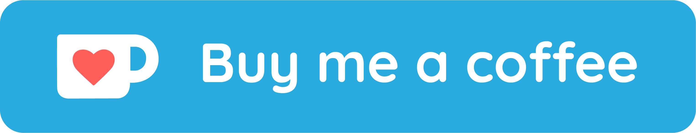

    

    
    

This project is supported by:
    

## Contributing and Collaborating

Please see [CONTRIBUTING](https://github.com/vsouza/awesome-ios/blob/master/.github/CONTRIBUTING.md) and [CODE-OF-CONDUCT](https://github.com/vsouza/awesome-ios/blob/master/CODE_OF_CONDUCT.md) for details.

## Contents

- [Analytics](#analytics)
- [App Routing](#app-routing)
- [Apple TV](#apple-tv)
- [App Store](#app-store)
- [Architecture Patterns](#architecture-patterns)
- [ARKit](#arkit)
- [Authentication](#authentication)
- [Blockchain](#blockchain)
- [Books](#books)
- [Cache](#cache)
- [Charts](#charts)
- [Code Injection](#code-injection)
- [Code Quality](#code-quality)
    - [Linter](#linter)
- [Color](#color)
- [Command Line](#command-line)
- [Concurrency](#concurrency)
- [Core Data](#core-data)
- [Courses](#courses)
    - [Getting Started](#getting-started)
- [Database](#database)
- [Data Structures / Algorithms](#data-structures--algorithms)
- [Date & Time](#date--time)
- [Debugging](#debugging)
- [Dependency Injection](#dependency-injection)
- [Dependency / Package Manager](#dependency--package-manager)
- [Deployment / Distribution](#deployment--distribution)
- [EventBus](#eventbus)
- [Files](#files)
- [Functional Programming](#functional-programming)
- [Games](#games)
- [GCD](#gcd)
- [Gesture](#gesture)
- [Graphics](#graphics)
- [Hardware](#hardware)
    - [Bluetooth](#bluetooth)
    - [Camera](#camera)
    - [Force Touch](#force-touch)
    - [iBeacon](#ibeacon)
    - [Location](#location)
    - [Other Hardware](#other-hardware)
- [Layout](#layout)
- [Localization](#localization)
- [Logging](#logging)
- [Machine Learning](#machine-learning)
- [Maps](#maps)
- [Math](#math)
- [Media](#media)
    - [Audio](#audio)
    - [GIF](#gif)
    - [Image](#image)
    - [Media Processing](#media-processing)
    - [PDF](#pdf)
    - [Streaming](#streaming)
    - [Video](#video)
- [Messaging](#messaging)
- [Networking](#networking)
- [Newsletters](#newsletters)
- [Notifications](#notifications)
    - [Push Notifications](#push-notifications)
    - [Push Notification Providers](#push-notification-providers)
- [Objective-C Runtime](#objective-c-runtime)
- [Optimization](#optimization)
- [Other Awesome Lists](#other-awesome-lists)
- [Parsing](#parsing)
    - [CSV](#csv)
    - [JSON](#json)
    - [XML & HTML](#xml--html)
    - [Other Parsing](#other-parsing)
- [Passbook](#passbook)
- [Payments](#payments)
- [Permissions](#permissions)
- [Podcasts](#podcasts)
- [Project setup](#project-setup)
- [Prototyping](#prototyping)
- [Rapid Development](#rapid-development)
- [Reactive Programming](#reactive-programming)
    - [React-Like](#react-like)
- [Reference](#reference)
- [Reflection](#reflection)
- [Regex](#regex)
- [SDK](#sdk)
    - [Official](#official)
    - [Unofficial](#unofficial)
- [Security](#security)
    - [Encryption](#encryption)
    - [Keychain](#keychain)
- [Server](#server)
- [Style Guides](#style-guides)
- [Testing](#testing)
    - [TDD / BDD](#tdd--bdd)
    - [A/B Testing](#ab-testing)
    - [UI Testing](#ui-testing)
    - [Other Testing](#other-testing)
- [Text](#text)
    - [Font](#font)
- [UI](#ui)
    - [Activity Indicator](#activity-indicator)
    - [Alert & Action Sheet](#alert--action-sheet)
    - [Animation](#animation)
    - [Transition](#transition)
    - [Badge](#badge)
    - [Button](#button)
    - [Calendar](#calendar)
    - [Cards](#cards)
    - [Form & Settings](#form--settings)
    - [Keyboard](#keyboard)
    - [Label](#label)
    - [Login](#login)
    - [Menu](#menu)
    - [Navigation Bar](#navigation-bar)
    - [PickerView](#pickerview)
    - [Popup](#popup)
    - [Progress View](#progress-view)
    - [Pull to Refresh](#pull-to-refresh)
    - [Rating Stars](#rating-stars)
    - [ScrollView](#scrollview)
    - [Segmented Control](#segmented-control)
    - [Slider](#slider)
    - [Splash View](#splash-view)
    - [Status Bar](#status-bar)
    - [Stepper](#stepper)
    - [Switch](#switch)
    - [Tab Bar](#tab-bar)
    - [Table View / Collection View](#table-view--collection-view)
      - [Table View](#table-view)
      - [Collection View](#collection-view)
      - [Expandable Cell](#expandable-cell)
      - [Header](#header)
      - [Placeholder](#placeholder)
      - [Collection View Layout](#collection-view-layout)
    - [Tag](#tag)
    - [TextField & TextView](#textfield--textview)
    - [UIPageControl](#uipagecontrol)
    - [Web View](#web-view)
- [Utility](#utility)
- [User Consent](#user-consent)
- [VR](#vr)
- [Walkthrough / Intro / Tutorial](#walkthrough--intro--tutorial)
- [Websites](#websites)
- [Websocket](#websocket)
- [Tools](#tools)
- [Tutorials and Keynotes](#tutorials-and-keynotes)
- [UI Templates](#ui-templates)
- [Xcode](#xcode)
    - [Extensions (Xcode 8+)](#extensions-xcode-8)
    - [Themes](#themes)
    - [Other Xcode](#other-xcode)

## Analytics

 *Analytics platforms, SDK's, error tracking and real-time answers about your app*

- [Answers by Fabric](https://get.fabric.io) - Answers gives you real-time insight into people’s experience in your app.
- [Aptabase](https://aptabase.com/for-swift) - Open Source, Privacy-First and Simple Analytics for Swift Apps.
- [Bugsnag](https://www.bugsnag.com/platforms/ios-crash-reporting) - Error tracking with a free tier. Error reports include data on device, release, user, and allows arbitrary data.
- [Countly](https://count.ly) - Open source, mobile & web analytics, crash reports and push notifications platform for iOS & Android.
- [devtodev](https://www.devtodev.com/) - Comprehensive analytics service that improves your project and saves time for product development.
- [Embrace](http://embrace.io) - Mobile observability, built on OpenTelemetry, to provide user-focused, reliable apps.
- [Emerge Tools](https://www.emergetools.com) - Prevent app size & performance regressions on every pull request, get automated insights on how to improve.
- [Instabug](https://instabug.com) - In-app feedback, Bug and Crash reporting, Fix Bugs Faster through user-steps, video recordings, screen annotation, network requests logging.
- [Matomo](https://github.com/matomo-org/matomo-sdk-ios) - The MatomoTracker is an iOS, tvOS and macOS SDK for sending app analytics to a Matomo server.
- [Measure](https://measure.sh/) - Open source, self-hostable mobile app monitoring with error tracking, performance tracing and full session timelines to spend less time stitching context and fix issues faster.
- [Mixpanel](https://mixpanel.com/) - Advanced analytics platform.
- [MOCA Analytics](https://www.mocaplatform.com/features) - Paid cross-platform analytics backend.
- [Segment](https://github.com/segmentio/analytics-ios) - The hassle-free way to integrate analytics into any iOS application.
- [Sentry](https://sentry.io/) - Sentry provides self-hosted and cloud-based error monitoring that helps all software teams discover, triage, and prioritize errors in real-time.
- [Shake](https://www.shakebugs.com/) - In-app feedback and bug reporting tool. Fix app bugs up to 50x faster with detailed device data, repro steps, video recording, black box data, network requests and custom logging.

**[back to top](#contributing-and-collaborating)**

## App Routing

  *Elegant URL routing, navigation frameworks, deep links and more*

- [ApplicationCoordinator](https://github.com/AndreyPanov/ApplicationCoordinator) - Coordinator is an object that handles navigation flow and shares flow’s handling for the next coordinator after switching on the next chain.
- [Appz](https://github.com/SwiftKitz/Appz) - Easily launch and deeplink into external applications, falling back to web if not installed.
- [Composable Navigator](https://github.com/Bahn-X/swift-composable-navigator) - An open source library for building deep-linkable SwiftUI applications with composition, testing and ergonomics in mind
- [Crossroad](https://github.com/giginet/Crossroad) - Crossroad is an URL router focused on handling Custom URL Schemes. Using this, you can route multiple URL schemes and fetch arguments and parameters easily.
- [DeepLinkKit](https://github.com/button/DeepLinkKit) - A splendid route-matching, block-based way to handle your deep links.
- [JLRoutes](https://github.com/joeldev/JLRoutes) - URL routing library for iOS with a simple block-based API.
- [Linker](https://github.com/MaksimKurpa/Linker) - Lightweight way to handle internal and external deeplinks for iOS.
- [LiteRoute](https://github.com/SpectralDragon/LiteRoute) - Easy transition between VIPER modules, implemented on pure Swift.
- [Marshroute](https://github.com/avito-tech/Marshroute) - Marshroute is an iOS Library for making your Routers simple but extremely powerful.
- [RouteComposer](https://github.com/ekazaev/route-composer) - Library that helps to handle view controllers composition, routing and deeplinking tasks.
- [Router](https://github.com/freshOS/Router) - Simple Navigation for iOS.
- [RxFlow](https://github.com/RxSwiftCommunity/RxFlow) - Navigation framework for iOS applications based on a Reactive Flow Coordinator pattern.
- [SwiftCurrent](https://github.com/wwt/SwiftCurrent) - A library for managing complex workflows.
- [SwiftRouter](https://github.com/skyline75489/SwiftRouter) - A URL Router for iOS.
- [URLNavigator](https://github.com/devxoul/URLNavigator) - Elegant URL Routing for Swift
- [WAAppRouting](https://github.com/Wasappli/WAAppRouting) - iOS routing done right. Handles both URL recognition and controller displaying with parsed parameters. All in one line, controller stack preserved automatically!
- [ZIKRouter](https://github.com/Zuikyo/ZIKRouter) - An interface-oriented router for discovering modules and injecting dependencies with protocol in OC & Swift, iOS & macOS. Handles route in a type safe way.

**[back to top](#contributing-and-collaborating)**

## App Store

*Apple Guidelines and version notification libraries*

- [Apple Review Guidelines](https://developer.apple.com/app-store/review/#common-app-rejections) - Highlighted some of the most common issues that cause apps to get rejected.
- [Free App Store Optimization Tool](https://www.mobileaction.co) - Lets you track your App Store visibility in terms of keywords and competitors.

**[back to top](#contributing-and-collaborating)**

## Apple TV

*tvOS view controllers, wrappers, template managers and video players.*

- [FocusTvButton](https://github.com/dcordero/FocusTvButton) - Light wrapper of UIButton that allows extra customization for tvOS
- [ParallaxView](https://github.com/PGSSoft/ParallaxView) - iOS controls and extensions that add parallax effect to your application.
- [Swift-GA-Tracker-for-Apple-tvOS](https://github.com/adswerve/Swift-GA-Tracker-for-Apple-tvOS) - Google Analytics tracker for Apple tvOS provides an easy integration of Google Analytics’ measurement protocol for Apple TV.
- [TvOSCustomizableTableViewCell](https://github.com/zattoo/TvOSCustomizableTableViewCell) - Light wrapper of UITableViewCell that allows extra customization for tvOS.
- [TvOSMoreButton](https://github.com/cgoldsby/TvOSMoreButton) - A basic tvOS button which truncates long text with '... More'.
- [TvOSPinKeyboard](https://github.com/zattoo/TvOSPinKeyboard) - PIN keyboard for tvOS.
- [TvOSScribble](https://github.com/dcordero/TvOSScribble) - Handwriting numbers recognizer for Siri Remote.
- [TvOSSlider](https://github.com/zattoo/TvOSSlider) - TvOSSlider is an implementation of UISlider for tvOS.
- [TvOSTextViewer](https://github.com/dcordero/TvOSTextViewer) - Light and scrollable view controller for tvOS to present blocks of text
- [XCDYouTubeKit](https://github.com/0xced/XCDYouTubeKit) - YouTube video player for iOS, tvOS and macOS.

**[back to top](#contributing-and-collaborating)**

## Architecture Patterns

*Clean architecture, Viper, MVVM, Reactive... choose your weapon.*

- [Clean Architecture for SwiftUI + Combine](https://github.com/nalexn/clean-architecture-swiftui) - A demo project showcasing the production setup of the SwiftUI app with Clean Architecture.
- [CleanArchitectureRxSwift](https://github.com/sergdort/CleanArchitectureRxSwift) - Example of Clean Architecture of iOS app using RxSwift.
- [ios-architecture](https://github.com/tailec/ios-architecture) - A collection of iOS architectures - MVC, MVVM, MVVM+RxSwift, VIPER, RIBs and many others.
- [iOS-Viper-Architecture](https://github.com/MindorksOpenSource/iOS-Viper-Architecture) - This repository contains a detailed sample app that implements VIPER architecture in iOS using libraries and frameworks like Alamofire, AlamofireImage, PKHUD, CoreData etc.
- [Reactant](https://github.com/Brightify/Reactant) - Reactant is a reactive architecture for iOS.
- [Spin](https://github.com/Spinners/Spin.Swift) - A universal implementation of a Feedback Loop system for RxSwift, ReactiveSwift and Combine
- [SwiftyVIPER](https://github.com/codytwinton/SwiftyVIPER) - Makes implementing VIPER architecture much easier and cleaner.
- [The Composable Architecture](https://github.com/pointfreeco/swift-composable-architecture) - The Composable Architecture is a library for building applications in a consistent and understandable way, with composition, testing, and ergonomics in mind.
- [VIPER Module Generator](https://github.com/Kaakati/VIPER-Module-Generator) - A Clean VIPER Modules Generator with comments and predfined functions.
- [Viperit](https://github.com/ferranabello/Viperit) - Viper Framework for iOS. Develop an app following VIPER architecture in an easy way. Written and tested in Swift.

**[back to top](#contributing-and-collaborating)**

## ARKit

*Library and tools to help you build unparalleled augmented reality experiences*

- [ARKit Emperor](https://github.com/kboy-silvergym/ARKit-Emperor) - The Emperor give you the most practical ARKit samples ever.
- [ARKit Virtual Objects](https://github.com/ignacio-chiazzo/ARKit) - Placing Virtual Objects in Augmented Reality.
- [ARKit-CoreLocation](https://github.com/ProjectDent/ARKit-CoreLocation) - Combines the high accuracy of AR with the scale of GPS data.
- [ARVideoKit](https://github.com/AFathi/ARVideoKit) - Record and capture ARKit videos, photos, Live Photos, and GIFs.
- [Placenote](https://github.com/Placenote/PlacenoteSDK-iOS) - A library that makes ARKit sessions persistent to a location using advanced computer vision.
- [SmileToUnlock](https://github.com/rsrbk/SmileToUnlock) - This library uses ARKit Face Tracking in order to catch a user's smile.

**[back to top](#contributing-and-collaborating)**

## Authentication

*Oauth and Oauth2 libraries, social logins and captcha tools.*

- [Heimdallr.swift](https://github.com/trivago/Heimdallr.swift) - Easy to use OAuth 2 library for iOS, written in Swift.
- [InstagramSimpleOAuth](https://github.com/rbaumbach/InstagramSimpleOAuth) - A quick and simple way to authenticate an Instagram user in your iPhone or iPad app.
- [LinkedInSignIn](https://github.com/serhii-londar/LinkedInSignIn) - Simple view controller to login and retrieve access token from LinkedIn.
- [OAuth2](https://github.com/p2/OAuth2) - OAuth2 framework for macOS and iOS, written in Swift.
- [OAuthSwift](https://github.com/OAuthSwift/OAuthSwift) - Swift based OAuth library for iOS
- [ReCaptcha](https://github.com/fjcaetano/ReCaptcha) - (In)visible ReCaptcha for iOS.
- [SwiftyOAuth](https://github.com/delba/SwiftyOAuth) - A simple OAuth library for iOS with a built-in set of providers.

**[back to top](#contributing-and-collaborating)**

## Blockchain

*Tool for smart contract interactions. Bitcoin protocol implementations and Frameworks for interacting with cryptocurrencies.*

- [BitcoinKit](https://github.com/yenom/BitcoinKit) - Bitcoin protocol toolkit for Swift, BitcoinKit implements Bitcoin protocol in Swift. It is an implementation of the Bitcoin SPV protocol written in swift.
- [CoinpaprikaAPI](https://github.com/coinpaprika/coinpaprika-api-swift-client) - Coinpaprika API client with free & frequently updated market data from the world of crypto: coin prices, volumes, market caps, ATHs, return rates and more.
- [EthereumKit](https://github.com/yuzushioh/EthereumKit) - EthereumKit is a free, open-source Swift framework for easily interacting with the Ethereum.
- [EtherWalletKit](https://github.com/SteadyAction/EtherWalletKit) - Ethereum Wallet Toolkit for iOS - You can implement Ethereum wallet without a server and blockchain knowledge.
- [Web3.swift](https://github.com/Boilertalk/Web3.swift) - Web3 library for interacting with the Ethereum blockchain.
- [web3swift](https://github.com/web3swift-team/web3swift) - Elegant Web3js functionality in Swift. Native ABI parsing and smart contract interactions.

**[back to top](#contributing-and-collaborating)**

## Books

*Most recommended books*

- [Advanced Swift by Chris Eidhof, Ole Begemann, and Airspeed Velocity](https://www.objc.io/books/advanced-swift/)
- [Anyone Can Create an App by Wendy L. Wise](https://www.manning.com/books/anyone-can-create-an-app)
- [Classic Computer Science Problems in Swift](https://www.manning.com/books/classic-computer-science-problems-in-swift)
- [Cocoa Design Patterns](https://www.amazon.com/Cocoa-Design-Patterns-Erik-Buck/dp/0321535022)
- [Core Data by Florian Kugler and Daniel Eggert](https://www.objc.io/books/core-data/)
- [Functional Swift by Chris Eidhof, Florian Kugler, and Wouter Swierstra](https://www.objc.io/books/functional-swift/)
- [Hello Swift! by Tanmay Bakshi with Lynn Beighley](https://www.manning.com/books/hello-swift)
- [iOS Development with Swift by Craig Grummitt](https://www.manning.com/books/ios-development-with-swift)
- [iOS Programming: The Big Nerd Ranch Guide by Christian Keur, Aaron Hillegass](https://www.bignerdranch.com/books/ios-programming-the-big-nerd-ranch-guide-seventh-edition/)
- [Programming in Objective-C by Stephen G. Kochan](https://www.amazon.com/Programming-Objective-C-6th-Developers-Library/dp/0321967607)
- [Swift in Depth](https://www.manning.com/books/swift-in-depth)
- [The Complete Friday Q & A: Volume 1](https://www.mikeash.com/book.html)
- [The Swift Programming Language by Apple](https://books.apple.com/us/book/swift-programming-language/id881256329)

**[back to top](#contributing-and-collaborating)**

## Cache

*Thread safe, offline and high performance cache libs and frameworks.*

- [Awesome Cache](https://github.com/aschuch/AwesomeCache) - Delightful on-disk cache (written in Swift).
- [Cache](https://github.com/hyperoslo/Cache) - Nothing but Cache.
- [Cache](https://github.com/soffes/Cache) - Swift caching library.
- [Disk](https://github.com/saoudrizwan/Disk) - Delightful framework for iOS to easily persist structs, images, and data.
- [HanekeSwift](https://github.com/Haneke/HanekeSwift) - A lightweight generic cache for iOS written in Swift with extra love for images.
- [Johnny](https://github.com/zolomatok/Johnny) - Melodic Caching for Swift.
- [mattress](https://github.com/buzzfeed/mattress) - iOS Offline Caching for Web Content.
- [PINCache](https://github.com/pinterest/PINCache) - Fast, non-deadlocking parallel object cache for iOS and macOS.
- [RocketData](https://github.com/plivesey/RocketData) - A caching and consistency solution for immutable models.
- [SPTPersistentCache](https://github.com/spotify/SPTPersistentCache) - Everyone tries to implement a cache at some point in their iOS app’s lifecycle, and this is ours. By Spotify.
- [Track](https://github.com/maquannene/Track) - Track is a thread safe cache write by Swift. Composed of DiskCache and MemoryCache which support LRU.
- [UITableView Cache](https://github.com/Kilograpp/UITableView-Cache) - UITableView cell cache that cures scroll-lags on a cell instantiating.
- [YYCache](https://github.com/ibireme/YYCache) - High performance cache framework for iOS.

**[back to top](#contributing-and-collaborating)**

## Charts

*Explore beautiful, easy-to-use, and customizable iOS charting libraries, perfect for creating dynamic and stunning data visualizations.*

- [ANDLineChartView](https://github.com/anaglik/ANDLineChartView) - ANDLineChartView is easy to use view-based class for displaying animated line chart.
- [Charts](https://github.com/danielgindi/Charts) - A powerful chart/graph framework, the iOS equivalent to [MPAndroidChart](https://github.com/PhilJay/MPAndroidChart).
- [core-plot](https://github.com/core-plot/core-plot) - A 2D plotting lib which is highly customizable and capable of drawing many types of plots.
- [CoreCharts](https://github.com/cagricolak/CoreCharts) - CoreCharts is a simple powerful yet Charts library for apple products.
- [CSPieChart](https://github.com/youkchansim/CSPieChart) - iOS PieChart Opensource. This is very easy to use and customizable.
- [DDSpiderChart](https://github.com/dadalar/DDSpiderChart) - Easy to use and customizable Spider (Radar) Chart library for iOS written in Swift.
- [Dr-Charts](https://github.com/Zomato/DR-charts) - Dr-Charts is a highly customisable, easy to use and interactive chart/graph framework in Objective-C.
- [EatFit](https://github.com/Yalantis/EatFit) - Eat fit is a component for attractive data representation inspired by Google Fit.
- [EChart](https://github.com/zhuhuihuihui/EChart) - iOS/iPhone/iPad Chart, Graph. Event handling and animation supported.
- [FlowerChart](https://github.com/drinkius/flowerchart) - Flower-shaped chart with custom appearance animation, fully vector.
- [FSInteractiveMap](https://github.com/ArthurGuibert/FSInteractiveMap) - A charting library to visualize and interact with a vector map on iOS. It's like Geochart but for iOS.
- [FSLineChart](https://github.com/ArthurGuibert/FSLineChart) - A line chart library for iOS.
- [Graphs](https://github.com/recruit-mtl/Graphs) - Light weight charts view generator for iOS.
- [JBChartView](https://github.com/Jawbone/JBChartView) - iOS-based charting library for both line and bar graphs.
- [JYRadarChart](https://github.com/johnnywjy/JYRadarChart) - An iOS open source Radar Chart implementation.
- [MagicPie](https://github.com/AlexandrGraschenkov/MagicPie) - Awesome layer-based pie chart. Fantastically fast and fully customizable. Amazing animations available with MagicPie.
- [PieCharts](https://github.com/i-schuetz/PieCharts) - Easy to use and highly customizable pie charts library for iOS.
- [PNChart](https://github.com/kevinzhow/PNChart) - A simple and beautiful chart lib used in Piner and CoinsMan for iOS.
- [Scrollable-GraphView](https://github.com/philackm/ScrollableGraphView) - An adaptive scrollable graph view for iOS to visualise simple discrete datasets. Written in Swift.
- [SMDiagramViewSwift](https://github.com/VRGsoftUA/SMDiagramView) - Meet cute and very flexibility library for iOS application for different data view in one circle diagram.
- [Swift LineChart](https://github.com/zemirco/swift-linechart) - Line Chart library for iOS written in Swift.
- [SwiftChart](https://github.com/gpbl/SwiftChart) - Line and area chart library for iOS.
- [TEAChart](https://github.com/xhacker/TEAChart) - Simple and intuitive iOS chart library. Contribution graph, clock chart, and bar chart.
- [TKRadarChart](https://github.com/TBXark/TKRadarChart) - A customizable radar chart in Swift.
- [TWRCharts](https://github.com/chasseurmic/TWRCharts) - An iOS wrapper for ChartJS. Easily build animated charts by leveraging the power of native Obj-C code.

**[back to top](#contributing-and-collaborating)**

## Code Injection

 *Decrease development time with these tools*

- [Inject](https://github.com/krzysztofzablocki/Inject) - Hot Reloading for Swift applications!
- [injectionforxcode](https://github.com/johnno1962/injectionforxcode) - Code injection including Swift.
- [Vaccine](https://github.com/zenangst/Vaccine) - Vaccine is a framework that aims to make your apps immune to recompile-decease.

**[back to top](#contributing-and-collaborating)**

## Code Quality

 *Quality always matters. Code checkers, memory vigilants, syntax sugars and more.*

- [Aardvark](https://github.com/square/Aardvark) - Aardvark is a library that makes it dead simple to create actionable bug reports.
- [Bootstrap](https://github.com/krzysztofzablocki/Bootstrap) - iOS project bootstrap aimed at high quality coding.
- [Bugsee](https://www.bugsee.com) - In-app bug and crash reporting with video, logs, network traffic and traces.
- [FBRetainCycleDetector](https://github.com/facebook/FBRetainCycleDetector) - iOS library to help detecting retain cycles in runtime.
- [HeapInspector-for-iOS](https://github.com/tapwork/HeapInspector-for-iOS) - Find memory issues & leaks in your iOS app without instruments.
- [KZAsserts](https://github.com/krzysztofzablocki/KZAsserts) - Asserts on roids, test all your assumptions with ease.
- [MLeaksFinder](https://github.com/Tencent/MLeaksFinder) - Find memory leaks in your iOS app at develop time.
- [PSTModernizer](https://github.com/PSPDFKit-labs/PSTModernizer) - Makes it easier to support older versions of iOS by fixing things and adding missing methods.
- [spacecommander](https://github.com/square/spacecommander) - Commit fully-formatted Objective-C code as a team without even trying.
- [SwiftCop](https://github.com/andresinaka/SwiftCop) -  SwiftCop is a validation library fully written in Swift and inspired by the clarity of Ruby On Rails Active Record validations.
- [SwiftFormat](https://github.com/nicklockwood/SwiftFormat) - A code library and command-line formatting tool for reformatting Swift code.
- [Tailor](https://github.com/sleekbyte/tailor) - Cross-platform static analyzer for Swift that helps you to write cleaner code and avoid bugs.
- [WeakableSelf](https://github.com/vincent-pradeilles/weakable-self) - A Swift micro-framework to encapsulate `[weak self]` and `guard` statements within closures.

**[back to top](#contributing-and-collaborating)**

### Linter

*Static code analyzers to enforce style and conventions.*

- [AnyLint](https://github.com/Flinesoft/AnyLint) - Lint anything by combining the power of Swift & regular expressions.
- [IBLinter](https://github.com/IBDecodable/IBLinter) - A linter tool for Interface Builder.
- [OCLint](https://github.com/oclint/oclint) - Static code analysis tool for improving quality and reducing defects.
- [Swiftlint](https://github.com/realm/SwiftLint) - A tool to enforce Swift style and conventions.

**[back to top](#contributing-and-collaborating)**

## Color

*Hex color extensions, theming, color pickers and other awesome color tools.*

- [BCColor](https://github.com/boycechang/BCColor) - A lightweight but powerful color kit (Swift).
- [ChromaColorPicker](https://github.com/joncardasis/ChromaColorPicker) - An intuitive iOS color picker built in Swift.
- [Colours](https://github.com/bennyguitar/Colours) - A beautiful set of predefined colors and a set of color methods to make your iOS/macOS development life easier.
- [CostumeKit](https://github.com/jakemarsh/CostumeKit) - Base types for theming an app.
- [CSS3ColorsSwift](https://github.com/WorldDownTown/CSS3ColorsSwift) - A UIColor extension with CSS3 Colors name.
- [DynamicColor](https://github.com/yannickl/DynamicColor) - Yet another extension to manipulate colors easily in Swift.
- [FlatUIColors](https://github.com/brynbellomy/FlatUIColors) - Flat UI color palette helpers written in Swift.
- [Gestalt](https://github.com/regexident/Gestalt) - An unintrusive & light-weight iOS app-theming library with support for animated theme switching.
- [Hue](https://github.com/zenangst/Hue) - Hue is the all-in-one coloring utility that you'll ever need.
- [Lorikeet](https://github.com/valdirunars/Lorikeet) - Aesthetic color-scheme generation written in Swift.
- [PFColorHash](https://github.com/PerfectFreeze/PFColorHash) - Generate color based on the given string.
- [PrettyColors](https://github.com/jdhealy/PrettyColors) - Styles and colors text in the Terminal with ANSI escape codes. Conforms to ECMA Standard 48.
- [RandomColorSwift](https://github.com/onevcat/RandomColorSwift) - An attractive color generator for Swift. Ported from `randomColor.js`.
- [SheetyColors](https://github.com/chrs1885/SheetyColors) - An action sheet styled color picker for iOS.
- [SwiftHEXColors](https://github.com/thii/SwiftHEXColors) - HEX color handling as an extension for UIColor.
- [UIColor-Hex-Swift](https://github.com/yeahdongcn/UIColor-Hex-Swift) - Convenience method for creating autoreleased color using RGBA hex string.

**[back to top](#contributing-and-collaborating)**

## Command Line

*Smart, beautiful and elegant tools to help you create command line applications.*

- [Ashen](https://github.com/colinta/Ashen) - A framework for writing terminal applications in Swift.
- [ColorizeSwift](https://github.com/mtynior/ColorizeSwift) - Terminal string styling for Swift.
- [CommandCougar](https://github.com/surfandneptune/CommandCougar) - An elegant pure Swift library for building command line applications.
- [Commander](https://github.com/kylef/Commander) - Compose beautiful command line interfaces in Swift.
- [Crayon](https://github.com/luoxiu/Crayon) - Terminal string styling with expressive API and 256/TrueColor support.
- [Guaka](https://github.com/nsomar/Guaka) - The smartest and most beautiful (POSIX compliant) command line framework for Swift.
- [Linenoise](https://github.com/andybest/linenoise-swift) - A pure Swift replacement for readline
- [ModuleInterface](https://github.com/minuscorp/ModuleInterface) - Command Line Tool that generates the Module's Interface from a Swift project.
- [nef](https://github.com/bow-swift/nef) - Command line tool to ease the creation of documentation in the form of Swift Playgrounds.
- [Progress](https://github.com/jkandzi/Progress.swift) - Add beautiful progress bars to your loops.
- [SourceDocs](https://github.com/eneko/SourceDocs) - Command Line Tool that generates Markdown documentation from inline source code comments.
- [Swift Argument Parser](https://github.com/apple/swift-argument-parser) - Straightforward, type-safe argument parsing for Swift
- [SwiftCLI](https://github.com/jakeheis/SwiftCLI) - A powerful framework for developing CLIs in Swift
- [Swiftline](https://github.com/nsomar/Swiftline) - Swiftline is a set of tools to help you create command line applications.
- [SwiftShell](https://github.com/kareman/SwiftShell) - A Swift framework for shell scripting and running shell commands.
- [SwiftyTextTable](https://github.com/scottrhoyt/SwiftyTextTable) - A lightweight library for generating text tables.

**[back to top](#contributing-and-collaborating)**

## Concurrency

*Job schedulers, Coroutines, Asynchronous and Type safe threads libs and frameworks written in Swift*

- [Aojet](https://github.com/aojet/Aojet) - An actor model library for swift.
- [AsyncNinja](https://github.com/AsyncNinja/AsyncNinja) - A complete set of concurrency and reactive programming primitives.
- [AsyncQueue](https://github.com/dfed/swift-async-queue) - A library of queues that enable sending ordered tasks from synchronous to asynchronous contexts.
- [Brisk](https://github.com/jmfieldman/Brisk) - A Swift DSL that allows concise and effective concurrency manipulation.
- [Concurrent](https://github.com/typelift/Concurrent) - Functional Concurrency Primitives.
- [Flow](https://github.com/JohnSundell/Flow) - Operation Oriented Programming in Swift.
- [Flow-iOS](https://github.com/roytornado/Flow-iOS) - Make your logic flow and data flow clean and human readable.
- [GroupWork](https://github.com/quanvo87/GroupWork) - Easy concurrent, asynchronous tasks in Swift.
- [Queuer](https://github.com/FabrizioBrancati/Queuer) - A queue manager, built on top of OperationQueue and Dispatch (aka GCD).
- [StickyLocking](https://github.com/stickytools/sticky-locking) - A general purpose embedded hierarchical lock manager used to build highly concurrent applications of all types.
- [SwiftQueue](https://github.com/lucas34/SwiftQueue) - Job Scheduler with Concurrent run, failure/retry, persistence, repeat, delay and more.
- [Threadly](https://github.com/nvzqz/Threadly) - Type-safe thread-local storage in Swift.
- [Venice](https://github.com/Zewo/Venice) - CSP (Coroutines, Channels, Select) for Swift.

**[back to top](#contributing-and-collaborating)**

## Core Data

*Core data Frameworks, wrappers, generators and boilerplates.*

- [AERecord](https://github.com/tadija/AERecord) - Super awesome Core Data wrapper in Swift.
- [Cadmium](https://github.com/jmfieldman/cadmium) - A complete swift framework that wraps CoreData and helps facilitate best practices.
- [CloudCore](https://github.com/deeje/CloudCore) - Robust CloudKit synchronization: offline editing, relationships, shared and public databases, field-level deltas, and more.
- [Core Data Query Interface](https://github.com/prosumma/CoreDataQueryInterface) A type-safe, fluent query framework for Core Data.
- [CoreStore](https://github.com/JohnEstropia/CoreStore) - Powerful Core Data framework for Incremental Migrations, Fetching, Observering, etc.
- [DataKernel](https://github.com/mrdekk/DataKernel) - Simple CoreData wrapper to ease operations.
- [Ensembles](https://github.com/drewmccormack/ensembles) - A synchronization framework for Core Data.
- [Graph](https://github.com/CosmicMind/Graph) - An elegant data-driven framework for CoreData in Swift.
- [JSQCoreDataKit](https://github.com/jessesquires/JSQCoreDataKit) - A swifter Core Data stack.
- [MagicalRecord](https://github.com/magicalpanda/MagicalRecord) - Super Awesome Easy Fetching for Core Data.
- [Mogenerator](https://github.com/rentzsch/mogenerator) - Automatic Core Data code generation.
- [PredicateFlow](https://github.com/andreadelfante/PredicateFlow) - Write amazing, strong-typed and easy-to-read NSPredicate, allowing you to write flowable NSPredicate, without guessing attribution names, predicate operation or writing wrong arguments type.
- [PrediKit](https://github.com/KrakenDev/PrediKit) - An NSPredicate DSL for iOS, macOS, tvOS, & watchOS. Inspired by SnapKit and lovingly written in Swift.
- [Skopelos](https://github.com/albertodebortoli/Skopelos) - A minimalistic, thread safe, non-boilerplate and super easy to use version of Active Record on Core Data. Simply all you need for doing Core Data.
- [Sync](https://github.com/3lvis/Sync) - Modern Swift JSON synchronization to Core Data.

**[back to top](#contributing-and-collaborating)**

## Courses

*Online courses, tutorials and learning resources to kickstart your iOS development journey.*

### Getting Started

*Courses, tutorials, guides and bootcamps*

- [100 Days of SwiftUI](https://www.hackingwithswift.com/100/swiftui) - Free collection of videos and tutorials updated for iOS 15 and Swift 5.5.
- [Apple - Object-Oriented Programming with Objective-C](https://developer.apple.com/library/archive/documentation/Cocoa/Conceptual/OOP_ObjC/Introduction/Introduction.html)
- [ARStarter](https://github.com/codePrincess/ARStarter) - Get started with ARKit - A little exercise for beginners.
- [Classpert - A list of 500 iOS Development courses (free and paid), from top e-learning platforms](https://classpert.com/ios-development) - Complete catalog of courses from Udacity, Pluralsight, Coursera, Edx, Treehouse and Skillshare.
- [iOS & Swift - The Complete iOS App Development Bootcamp](https://www.udemy.com/course/ios-13-app-development-bootcamp/)
- [Ray Wenderlich](https://www.raywenderlich.com/2690-learn-to-code-ios-apps-1-welcome-to-programming) - Learn to code iOS Apps.
- [Stanford - Developing apps for iOS](https://cs193p.stanford.edu/) - Stanford's CS193p - Developing Apps for iOS.
- [Udacity - Intro to iOS App Development with Swift](https://www.udacity.com/course/intro-to-ios-app-development-with-swift--ud585) - Udacity free course. Make Your First iPhone App.

**[back to top](#contributing-and-collaborating)**

## Database

*Wrappers, clients, Parse alternatives and safe tools to deal with ephemeral and persistent data.*

- [Couchbase Mobile](https://www.couchbase.com/products/mobile/) - Couchbase document store for mobile with cloud sync.
- [Default](https://github.com/Nirma/Default) - Modern interface to UserDefaults + Codable support.
- [Defaults](https://github.com/sindresorhus/Defaults) - Swifty and modern UserDefaults.
- [DuckDB](https://github.com/duckdb/duckdb-swift) - DuckDB is a high-performance analytical database system.
- [FCModel](https://github.com/marcoarment/FCModel) - An alternative to Core Data for people who like having direct SQL access.
- [FileMaker](https://github.com/PerfectlySoft/Perfect-FileMaker) - A Swift wrapper around the FileMaker XML Web publishing interface, enabling access to FileMaker servers.
- [FirebaseHelper](https://github.com/quanvo87/FirebaseHelper) - Safe and easy wrappers for common Firebase Realtime Database functions.
- [Fluent](https://github.com/vapor/fluent) - Simple ActiveRecord implementation for working with your database in Swift.
- [FMDB](https://github.com/ccgus/fmdb) - A Cocoa / Objective-C wrapper around SQLite.
- [GRDB.swift](https://github.com/groue/GRDB.swift) - A versatile SQLite toolkit for Swift, with WAL mode support.
- [IceCream](https://github.com/caiyue1993/IceCream) - Sync Realm Database with CloudKit.
- [MMKV](https://github.com/Tencent/MMKV) - An efficient, small mobile key-value storage framework developed by WeChat. Works on iOS, Android, macOS and Windows.
- [ModelAssistant](https://github.com/ssamadgh/ModelAssistant) - Elegant library to manage the interactions between view and model in Swift.
- [MongoDB](https://github.com/PerfectlySoft/Perfect-MongoDB) - A Swift wrapper around the mongo-c client library, enabling access to MongoDB servers.
- [MongoKitten](https://github.com/OpenKitten/MongoKitten) - A pure Swift MongoDB client implementation with support for embedded databases.
- [MySQL](https://github.com/PerfectlySoft/Perfect-MySQL) - A Swift wrapper around the MySQL client library, enabling access to MySQL servers.
- [Nora](https://github.com/SD10/Nora) - Nora is a Firebase abstraction layer for working with FirebaseDatabase and FirebaseStorage.
- [ObjectBox](https://github.com/objectbox/objectbox-swift) - ObjectBox is a superfast, light-weight object persistence framework.
- [ObjectiveRocks](https://github.com/iabudiab/ObjectiveRocks) - An Objective-C wrapper of Facebook's RocksDB - A Persistent Key-Value Store for Flash and RAM Storage.
- [OHMySQL](https://github.com/oleghnidets/OHMySQL) - An Objective-C wrapper of MySQL C API.
- [PersistenceKit](https://github.com/Teknasyon-Teknoloji/PersistenceKit) - Store and retrieve Codable objects to various persistence layers, in a couple lines of code.
- [PersistentStorageSerializable](https://github.com/IvanRublev/PersistentStorageSerializable) - Swift library that makes easier to serialize the user's preferences (app's settings) with system User Defaults or Property List file on disk.
- [PostgreSQL](https://github.com/PerfectlySoft/Perfect-PostgreSQL) - A Swift wrapper around the libpq client library, enabling access to PostgreSQL servers.
- [Prephirences](https://github.com/phimage/Prephirences) - Prephirences is a Swift library that provides useful protocols and convenience methods to manage application preferences, configurations and app-state.
- [QuickDB](https://github.com/behrad-kzm/QuickDB) - Save and Retrieve any `Codable` in JUST ONE line of code + more easy usecases.
- [Realm](https://github.com/realm/realm-cocoa) - The alternative to CoreData and SQLite: Simple, modern and fast.
- [RealmGeoQueries](https://github.com/mhergon/RealmGeoQueries) - RealmGeoQueries simplifies spatial queries with Realm Cocoa. In the absence of and official functions, this library provide the possibility to do proximity search.
- [RealmWrapper](https://github.com/k-lpmg/RealmWrapper) - Safe and easy wrappers for RealmSwift.
- [Redis](https://github.com/PerfectlySoft/Perfect-Redis) - A Swift wrapper around the Redis client library, enabling access to Redis.
- [SecureDefaults](https://github.com/vpeschenkov/SecureDefaults) - A lightweight wrapper over UserDefaults/NSUserDefaults with an extra AES-256 encryption layer.
- [Shallows](https://github.com/dreymonde/Shallows) - Your lightweight persistence toolbox.
- [SQLite.swift](https://github.com/stephencelis/SQLite.swift) - A type-safe, Swift-language layer over SQLite3.
- [StorageKit](https://github.com/StorageKit/StorageKit) - Your Data Storage Troubleshooter.
- [StorageManager](https://github.com/iAmrSalman/StorageManager) - Safe and easy way to use FileManager as Database.
- [Storez](https://github.com/SwiftKitz/Storez) - Safe, statically-typed, store-agnostic key-value storage (with namespace support).
- [SugarRecord](https://github.com/modo-studio/SugarRecord)  - Data persistence management library.
- [SwiftStore](https://github.com/hemantasapkota/SwiftStore) - Key-Value store for Swift backed by LevelDB.
- [SwiftyUserDefaults](https://github.com/sunshinejr/SwiftyUserDefaults) - Statically-typed NSUserDefaults.
- [TypedDefaults](https://github.com/tasanobu/TypedDefaults) - TypedDefaults is a utility library to type-safely use NSUserDefaults.
- [Unrealm](https://github.com/arturdev/Unrealm) - Unrealm enables you to easily store Swift native Classes, Structs and Enums into Realm.
- [UserDefaults](https://github.com/nmdias/DefaultsKit) - Simple, Strongly Typed UserDefaults for iOS, macOS and tvOS.
- [WCDB](https://github.com/Tencent/wcdb) - WCDB is an efficient, complete, easy-to-use mobile database framework for iOS, macOS.
- [YapDatabase](https://github.com/yapstudios/YapDatabase) - YapDatabase is an extensible database for iOS & Mac.
- [YapDatabaseExtensions](https://github.com/danthorpe/YapDatabaseExtensions) - YapDatabase extensions for use with Swift.

**[back to top](#contributing-and-collaborating)**

## Data Structures / Algorithms

*Diffs, keypaths, sorted lists and other amazing data structures wrappers and libraries.*

- [Algorithm](https://github.com/CosmicMind/Algorithm) - Algorithm is a collection of data structures that are empowered by a probability toolset.
- [Brick](https://github.com/hyperoslo/Brick) - A generic view model for both basic and complex scenarios.
- [BTree](https://github.com/attaswift/BTree) - Fast ordered collections for Swift using in-memory B-trees.
- [Buffer](https://github.com/alexdrone/Buffer) - Swift μ-framework for efficient array diffs, collection observation and cell configuration.
- [Changeset](https://github.com/osteslag/Changeset) - Minimal edits from one collection to another.
- [Dekoter](https://github.com/artemstepanenko/Dekoter) - `NSCoding`'s counterpart for Swift structs.
- [diff](https://github.com/soffes/diff) - Simple diff library in pure Swift.
- [Differ](https://github.com/tonyarnold/Differ) - Swift library to generate differences and patches between collections.
- [DifferenceKit](https://github.com/ra1028/DifferenceKit) - A fast and flexible O(n) difference algorithm framework for Swift collection.
- [Differific](https://github.com/zenangst/Differific) - A fast and convenient diffing framework.
- [Dispatch](https://github.com/alexdrone/Store) - Multi-store Flux implementation in Swift.
- [Dollar](https://github.com/ankurp/Dollar) - A functional tool-belt for Swift Language similar to Lo-Dash or Underscore.js in Javascript https://www.dollarswift.org/.
- [EKAlgorithms](https://github.com/EvgenyKarkan/EKAlgorithms) - Some well known CS algorithms & data structures in Objective-C.
- [HeckelDiff](https://github.com/mcudich/HeckelDiff) - A fast Swift diffing library.
- [Impeller](https://github.com/david-coyle-sjc/impeller) - A Distributed Value Store in Swift.
- [KeyPathKit](https://github.com/vincent-pradeilles/KeyPathKit) - KeyPathKit provides a seamless syntax to manipulate data using typed keypaths.
- [Monaka](https://github.com/naru-jpn/Monaka) - Convert custom struct and fundamental values to NSData.
- [OneWaySynchronizer](https://github.com/ladeiko/OneWaySynchronizer) - The simplest abstraction to synchronize local data with remote source.
- [Pencil](https://github.com/naru-jpn/pencil) - Write values to file and read it more easily.
- [Probably](https://github.com/harlanhaskins/Probably) - A Swift probability and statistics library.
- [RandMyMod](https://github.com/jamesdouble/RandMyMod) - RandMyMod base on your own struct or class create one or a set of randomized instance.
- [Result](https://github.com/antitypical/Result) - Swift type modeling the success/failure of arbitrary operations.
- [swift-algorithm-club](https://github.com/raywenderlich/swift-algorithm-club) - Algorithms and data structures in Swift, with explanations!
- [SwiftGraph](https://github.com/davecom/SwiftGraph) - Graph data structure and utility functions in pure Swift.
- [SwiftPriorityQueue](https://github.com/davecom/SwiftPriorityQueue) - A priority queue with a classic binary heap implementation in pure Swift.
- [SwiftStructures](https://github.com/waynewbishop/SwiftStructures) - Examples of commonly used data structures and algorithms in Swift.

**[back to top](#contributing-and-collaborating)**

## Date & Time

*Time and NSCalendar libraries. Also contains Sunrise and Sunset time generators, time pickers and NSTimer interfaces.*

- [10Clock](https://github.com/joedaniels29/10Clock) - This Control is a beautiful time-of-day picker heavily inspired by the iOS 10 "Bedtime" timer.
- [AnyDate](https://github.com/Kawoou/AnyDate) - Swifty Date & Time API inspired from Java 8 DateTime API.
- [Chronology](https://github.com/davedelong/Chronology) - Building a better date/time library.
- [DateHelper](https://github.com/melvitax/DateHelper) - Convenience extension for NSDate in Swift.
- [DateTools](https://github.com/MatthewYork/DateTools) - Dates and times made easy in Objective-C.
- [EmojiTimeFormatter](https://github.com/thomaspaulmann/EmojiTimeFormatter) - Format your dates/times as emojis.
- [iso-8601-date-formatter](https://github.com/boredzo/iso-8601-date-formatter) - A Cocoa NSFormatter subclass to convert dates to and from ISO-8601-formatted strings. Supports calendar, week, and ordinal formats.
- [Kronos](https://github.com/lyft/Kronos) - Elegant NTP date library in Swift.
- [LFTimePicker](https://github.com/awesome-labs/LFTimePicker) - Custom Time Picker ViewController with Selection of start and end times in Swift.
- [NVDate](https://github.com/novalagung/nvdate) - Swift4 Date extension library.
- [Schedule](https://github.com/luoxiu/Schedule) - ⏳ A missing lightweight task scheduler for Swift with an incredibly human-friendly syntax.
- [Solar](https://github.com/ceeK/Solar) - A Swift micro library for generating Sunrise and Sunset times.
- [SwiftDate](https://github.com/malcommac/SwiftDate) - The best way to manage Dates and Timezones in Swift.
- [SwiftyTimer](https://github.com/radex/SwiftyTimer) - Swifty API for NSTimer.
- [Time](https://github.com/dreymonde/Time) - Type-safe time calculations in Swift, powered by generics.
- [Timepiece](https://github.com/naoty/Timepiece) - Intuitive NSDate extensions in Swift.
- [TimeZonePicker](https://github.com/gligorkot/TimeZonePicker) - A TimeZonePicker UIViewController similar to the iOS Settings app.
- [TrueTime](https://github.com/instacart/TrueTime.swift) - Get the true current time impervious to device clock time changes.

**[back to top](#contributing-and-collaborating)**

## Debugging

*Debugging tools, crash reports, logs and console UI's.*

- [AEConsole](https://github.com/tadija/AEConsole) - Customizable Console UI overlay with debug log on top of your iOS App.
- [Alpha](https://github.com/Legoless/Alpha) - Next generation debugging framework for iOS.
- [AppSpector](https://appspector.com) - Remote iOS and Android debugging and data collection service. You can debug networking, logs, CoreData, SQLite, NSNotificationCenter and mock device's geo location.
- [Atlantis](https://github.com/ProxymanApp/atlantis) - A little and powerful iOS framework for intercepting HTTP/HTTPS Traffic from your iOS app. No more messing around with proxy and certificate config. Inspect Traffic Log with Proxyman app.
- [chisel](https://github.com/facebook/chisel) - Collection of LLDB commands to assist debugging iOS apps.
- [DBDebugToolkit](https://github.com/dbukowski/DBDebugToolkit) - Set of easy to use debugging tools for iOS developers & QA engineers.
- [DebugSwift](https://github.com/DebugSwift/DebugSwift) - A comprehensive toolkit designed to simplify and enhance the debugging process for iOS applications.
- [DoraemonKit](https://github.com/didi/DoraemonKit) - A full-featured iOS App development assistant，30+ tools included. You deserve it.
- [Droar](https://github.com/myriadmobile/Droar) - Droar is a modular, single-line installation debugging window.
- [Flex](https://github.com/Flipboard/FLEX) - An in-app debugging and exploration tool for iOS.
- [GodEye](https://github.com/zixun/GodEye) - Automatically display Log,Crash,Network,ANR,Leak,CPU,RAM,FPS,NetFlow,Folder and etc with one line of code based on Swift.
- [Httper-iOS](https://github.com/MuShare/Httper-iOS) - App for developers to test REST API.
- [Hyperion](https://github.com/willowtreeapps/Hyperion-iOS) - In-app design review tool to inspect measurements, attributes, and animations.
- [LayoutInspector](https://github.com/isavynskyi/LayoutInspector) - Debug app layouts directly on iOS device: inspect layers in 3D and debug each visible view attributes.
- [MTHawkeye](https://github.com/meitu/MTHawkeye) - Profiling / Debugging assist tools for iOS, include tools: UITimeProfiler, Memory Allocations, Living ObjC Objects Sniffer, Network Transaction Waterfall, etc.
- [Netfox](https://github.com/kasketis/netfox) - A lightweight, one line setup, iOS / macOS network debugging library!
- [NetworkEye](https://github.com/coderyi/NetworkEye) - a iOS network debug library, It can monitor HTTP requests within the App and displays information related to the request.
- [Playbook](https://github.com/playbook-ui/playbook-ios) - A library for isolated developing UI components and automatically snapshots of them.
- [PonyDebugger](https://github.com/square/PonyDebugger) - Remote network and data debugging for your native iOS app using Chrome Developer Tools.
- [Scyther](https://github.com/bstillitano/Scyther) - A full-featured, in-app debugging menu packed full of useful tools including network logging, layout inspection, location spoofing, console logging and so much more.
- [Woodpecker](http://www.woodpeck.cn) - View sandbox files, UserDefaults, network request from Mac.
- [Wormholy](https://github.com/pmusolino/Wormholy) - iOS network debugging, like a wizard.
- [Xniffer](https://github.com/xmartlabs/Xniffer) - A swift network profiler built on top of URLSession.

**[back to top](#contributing-and-collaborating)**

## Dependency Injection

*Dependency injection frameworks and libraries for decoupled, testable iOS code.*

- [Alchemic](https://github.com/drekka/Alchemic) - Advanced, yet simple to use DI framework for Objective-C.
- [DITranquillity](https://github.com/ivlevAstef/DITranquillity) - Dependency injection framework for iOS applications written in clean Swift.
- [Guise](https://github.com/prosumma/Guise) - An elegant, flexible, type-safe dependency resolution framework for Swift.
- [Kraken](https://github.com/sabirvirtuoso/Kraken) - A Dependency Injection Container for Swift with easy-to-use syntax.
- [Locatable](https://github.com/vincent-pradeilles/locatable) - A micro-framework that leverages Property Wrappers to implement the Service Locator pattern.
- [Needle](https://github.com/uber/needle) — Compile-time safe Swift dependency injection framework with real code.
- [Perform](https://github.com/thoughtbot/Perform) - Easy dependency injection for storyboard segues.
- [Pilgrim](https://github.com/appsquickly/pilgrim) - Powerful dependency injection Swift (successor to Typhoon).
- [Reliant](https://github.com/appfoundry/Reliant) - Nonintrusive Objective-C dependency injection.
- [SafeDI](https://github.com/dfed/safedi) - Compile-time safe dependency injection in Swift 6.
- [StoryboardBuilder](https://github.com/hiro-nagami/StoryboardBuilder) - Simple dependency injection for generating views from storyboard.
- [Swinject](https://github.com/Swinject/Swinject) - Dependency injection framework for Swift.
- [Typhoon](https://github.com/appsquickly/Typhoon) - Powerful dependency injection for Objective-C.
- [ViperServices](https://github.com/ladeiko/ViperServices) - Dependency injection container for iOS applications written in Swift. Each service can have boot and shutdown code.
- [Weaver](https://github.com/scribd/Weaver) - A declarative, easy-to-use and safe Dependency Injection framework for Swift.

**[back to top](#contributing-and-collaborating)**

## Dependency / Package Manager

*Tools to manage third-party dependencies and packages in your iOS projects.*

- [Accio](https://github.com/JamitLabs/Accio) - A SwiftPM based dependency manager for iOS & Co. with improvements over Carthage.
- [Carthage](https://github.com/Carthage/Carthage) - A simple, decentralized dependency manager for Cocoa.
- [CocoaPods](https://cocoapods.org/) - CocoaPods is the dependency manager for Objective-C projects. It has thousands of libraries and can help you scale your projects elegantly.
- [Rome](https://github.com/tmspzz/Rome) - A cache tool for Carthage built frameworks.
- [swift-package-manager](https://github.com/apple/swift-package-manager) - The Package Manager for the Swift Programming Language.
- [SWM (Swift Modules)](https://github.com/jankuca/swm) - A package/dependency manager for Swift projects similar to npm (node.js package manager) or bower (browser package manager from Twitter). Does not require the use of Xcode.
- [Xcode Maven](http://sap-production.github.io/xcode-maven-plugin/site/) - The Xcode Maven Plugin can be used in order to run Xcode builds embedded in a Maven lifecycle.

**[back to top](#contributing-and-collaborating)**

## Deployment / Distribution

*Continuous integration, delivery and distribution tools for shipping iOS apps.*

- [AppCenter](https://appcenter.ms) - Continuously build, test, release, and monitor apps for every platform.
- [Appcircle.io](https://appcircle.io) — An enterprise-grade mobile DevOps platform that automates the build, test, and publish store of mobile apps for faster, efficient release cycle
- [Appfigurate](https://github.com/electricbolt/appfiguratesdk) - Secure runtime configuration for iOS and watchOS, apps and app extensions.
- [AppLaunchpad](https://theapplaunchpad.com/) - Free App Store screenshot builder.
- [Bitrise](https://www.bitrise.io) - Mobile Continuous Integration & Delivery with dozens of integrations to build, test, deploy and collaborate.
- [boarding](https://github.com/fastlane/boarding) - Instantly create a simple signup page for TestFlight beta testers.
- [buddybuild](https://www.buddybuild.com/) - A mobile iteration platform - build, deploy, and collaborate.
- [Codemagic](https://codemagic.io) - Build, test and deliver iOS apps 20% faster with Codemagic CI/CD.
- [Crashlytics](https://firebase.google.com/products/crashlytics/) - A crash reporting and beta testing service.
- [deliver](https://github.com/fastlane/fastlane/tree/master/deliver) - Upload screenshots, metadata and your app to the App Store using a single command.
- [fastlane](https://github.com/fastlane/fastlane) - Connect all iOS deployment tools into one streamlined workflow.
- [Instabug](https://instabug.com) - In-app feedback, Bug and Crash reporting, Fix Bugs Faster through user-steps, video recordings, screen annotation, network requests logging.
- [ios-uploader](https://github.com/simonnilsson/ios-uploader) - Easy to use, cross-platform tool to upload iOS apps to App Store Connect.
- [LaunchKit](https://github.com/LaunchKit/LaunchKit) - A set of web-based tools for mobile app developers, now open source!
- [Rollout.io](https://rollout.io/) - SDK to patch, fix bugs, modify and manipulate native apps (Obj-c & Swift) in real-time.
- [Runway](https://runway.team) - Easier mobile releases for teams. Integrates across tools (version control, project management, CI, app stores, crash reporting, etc.) to provide a single source of truth for mobile teams to come together around during release cycles. Equal parts automation and collaboration.
- [Screenplay](https://screenplay.dev) - Instant rollbacks and canary deployments for iOS.
- [ScreenshotFramer](https://github.com/IdeasOnCanvas/ScreenshotFramer) - With Screenshot Framer you can easily create nice-looking and localized App Store Images.
- [Semaphore](https://semaphoreci.com/product/ios) - CI/CD service which makes it easy to build, test and deploy applications for any Apple device. iOS support is fully integrated in Semaphore 2.0, so you can use the same powerful CI/CD pipeline features for iOS as you do for Linux-based development.
- [snapshot](https://github.com/fastlane/fastlane/tree/master/snapshot) - Automate taking localized screenshots of your iOS app on every device.
- [TestFlight Beta Testing](https://developer.apple.com/testflight/) - The beta testing service hosted on iTunes Connect (requires iOS 8 or later).
- [watchbuild](https://github.com/fastlane/watchbuild) - Get a notification once your iTunes Connect build is finished processing.

**[back to top](#contributing-and-collaborating)**

## EventBus

*Promises and Futures libraries to help you write better async code in Swift.*

- [Bluebird.swift](https://github.com/AndrewBarba/Bluebird.swift) - Promise/A+, Bluebird inspired, implementation in Swift 4.
- [Bolts](https://github.com/BoltsFramework/Bolts-ObjC) - Bolts is a collection of low-level libraries designed to make developing mobile apps easier, including tasks (promises) and app links (deep links).
- [Bolts-Swift](https://github.com/BoltsFramework/Bolts-Swift) - Bolts is a collection of low-level libraries designed to make developing mobile apps easier.
- [FutureKit](https://github.com/FutureKit/FutureKit) - A Swift based Future/Promises Library for iOS and macOS.
- [FutureLib](https://github.com/couchdeveloper/FutureLib) - FutureLib is a pure Swift 2 library implementing Futures & Promises inspired by Scala.
- [Futures](https://github.com/formbound/Futures) - Lightweight promises for iOS, macOS, tvOS, watchOS, and server-side Swift.
- [Hydra](https://github.com/malcommac/Hydra) - Promises & Await - Write better async code in Swift.
- [NoticeObserveKit](https://github.com/marty-suzuki/NoticeObserveKit) - NoticeObserveKit is type-safe NotificationCenter wrapper that associates notice type with info type.
- [Promis](https://github.com/albertodebortoli/Promis) - The easiest Future and Promises framework in Swift. No magic. No boilerplate.
- [Promise](https://github.com/khanlou/Promise) - A Promise library for Swift, based partially on Javascript's A+ spec.
- [PromiseKit](https://github.com/mxcl/PromiseKit) - Promises for iOS and macOS.
- [RWPromiseKit](https://github.com/deput/RWPromiseKit) - A light-weighted Promise library for Objective-C.
- [signals-ios](https://github.com/uber/signals-ios) - Typeful eventing.
- [SwiftEventBus](https://github.com/cesarferreira/SwiftEventBus) - A publish/subscribe event bus optimized for iOS.
- [SwiftNotificationCenter](https://github.com/100mango/SwiftNotificationCenter) - A Protocol-Oriented NotificationCenter which is type safe, thread safe and with memory safety.
- [SwiftTask](https://github.com/ReactKit/SwiftTask) - Promise + progress + pause + cancel + retry for Swift.
- [then🎬](https://github.com/freshOS/then) - Elegant Async code in Swift.
- [TopicEventBus](https://github.com/mcmatan/topicEventBus) - Publish–subscribe design pattern implementation framework, with ability to publish events by topic. (NotificationCenter extended alternative).
- [When](https://github.com/vadymmarkov/When) - A lightweight implementation of Promises in Swift.

**[back to top](#contributing-and-collaborating)**

## Files

*File management, file browser, zip handling and file observers.*

- [AMSMB2](https://github.com/amosavian/AMSMB2) - Swift framework to connect SMB 2/3 shares for iOS.
- [AppFolder](https://github.com/dreymonde/AppFolder) - AppFolder is a lightweight framework that lets you design a friendly, strongly-typed representation of a directories inside your app's container.
- [Ares](https://github.com/indragiek/Ares) - Zero-setup P2P file transfer between Macs and iOS devices.
- [FileBrowser](https://github.com/marmelroy/FileBrowser) - Powerful Swift file browser for iOS.
- [FileExplorer](https://github.com/Augustyniak/FileExplorer) - Powerful file browser for iOS that allows its users to choose and remove files and/or directories.
- [FileKit](https://github.com/nvzqz/FileKit) - Simple and expressive file management in Swift.
- [FileProvider](https://github.com/amosavian/FileProvider) - FileManager replacement for Local, iCloud and Remote (WebDAV/FTP/Dropbox/OneDrive/SMB2) files on iOS/tvOS and macOS.
- [KZFileWatchers](https://github.com/krzysztofzablocki/KZFileWatchers) - A micro-framework for observing file changes, both local and remote. Helpful in building developer tools.
- [Zip](https://github.com/marmelroy/Zip) - Swift framework for zipping and unzipping files.
- [ZipArchive](https://github.com/ZipArchive/ZipArchive) - ZipArchive is a simple utility class for zipping and unzipping files on iOS and Mac.
- [ZIPFoundation](https://github.com/weichsel/ZIPFoundation) - Effortless ZIP Handling in Swift.
- [ZipZap](https://github.com/pixelglow/ZipZap) - zip file I/O library for iOS, macOS and tvOS.

**[back to top](#contributing-and-collaborating)**

## Functional Programming

*Collection of Swift functional programming tools.*

- [Argo](https://github.com/thoughtbot/Argo) - Functional JSON parsing library for Swift.
- [Bow](https://github.com/bow-swift/bow) - Typed Functional Programming companion library for Swift.
- [Forbind](https://github.com/ulrikdamm/Forbind) - Functional chaining and promises in Swift.
- [Funky](https://github.com/brynbellomy/Funky) - Functional programming tools and experiments in Swift.
- [LlamaKit](https://github.com/LlamaKit/LlamaKit) - Collection of must-have functional Swift tools.
- [OptionalExtensions](https://github.com/RuiAAPeres/OptionalExtensions) - Swift µframework with extensions for the  Optional Type.
- [Oriole](https://github.com/tptee/Oriole) - A functional utility belt implemented as Swift protocol extensions.
- [Prelude](https://github.com/robrix/Prelude) - Swift µframework of simple functional programming tools.
- [Runes](https://github.com/thoughtbot/Runes) - Infix operators for monadic functions in Swift.
- [Swiftx](https://github.com/typelift/Swiftx) - Functional data types and functions for any project.
- [Swiftz](https://github.com/typelift/Swiftz) -  Functional programming in Swift.

**[back to top](#contributing-and-collaborating)**

## Games

*Game engines, frameworks and sample projects for building games on iOS.*

- [AssetImportKit](https://github.com/eugenebokhan/AssetImportKit) - Swifty cross platform library (macOS, iOS) that converts Assimp supported models to SceneKit scenes.
- [CollectionNode](https://github.com/bwide/CollectionNode) - A swift framework for a collectionView in SpriteKit.
- [glide engine](https://github.com/cocoatoucher/Glide) - SpriteKit and GameplayKit based engine for making 2d games, with practical examples and tutorials.
- [Sage](https://github.com/nvzqz/Sage) - A cross-platform chess library for Swift.
- [ShogibanKit](https://github.com/codelynx/ShogibanKit) - ShogibanKit is a framework for implementing complex Japanese Chess (Shogii) in Swift. No UI, nor AI.
- [SKTiled](https://github.com/mfessenden/SKTiled) - Swift framework for working with Tiled assets in SpriteKit.
- [SwiftFortuneWheel](https://github.com/sh-khashimov/SwiftFortuneWheel) - A cross-platform framework for games like a Wheel of Fortune.

**[back to top](#contributing-and-collaborating)**

## GCD

*Grand Central Dispatch syntax sugars, tools and timers.*

- [Async](https://github.com/duemunk/Async) - Syntactic sugar in Swift for asynchronous dispatches in Grand Central Dispatch.
- [GCDKit](https://github.com/JohnEstropia/GCDKit) - Grand Central Dispatch simplified with Swift.
- [GCDTimer](https://github.com/hemantasapkota/GCDTimer) - Well tested Grand Central Dispatch (GCD) Timer in Swift.
- [Me](https://github.com/pascalbros/Me) - A super slim solution to the nested asynchronous computations.
- [SwiftyTask](https://github.com/Albinzr/SwiftyTask) - An extreme queuing system with high performance for managing all task in app with closure.
- [Threader](https://github.com/mitchtreece/Threader) - Pretty GCD calls and easier code execution.
- [YYDispatchQueuePool](https://github.com/ibireme/YYDispatchQueuePool) - iOS utility class to manage global dispatch queue.

**[back to top](#contributing-and-collaborating)**

## Gesture

*Libraries and tools to handle gestures.*

- [DBPathRecognizer](https://github.com/didierbrun/DBPathRecognizer) - Gesture recognizer tool.
- [FDFullscreenPopGesture](https://github.com/forkingdog/FDFullscreenPopGesture) - An UINavigationController's category to enable fullscreen pop gesture in an iOS7+ system style with AOP.
- [Sensitive](https://github.com/hellowizman/Sensitive) - Special way to work with gestures in iOS.
- [SplitViewDragAndDrop](https://github.com/MarioIannotta/SplitViewDragAndDrop) - Easily add drag and drop to pass data between your apps in split view mode.
- [SwiftyGestureRecognition](https://github.com/b3ll/SwiftyGestureRecognition) - Aids with prototyping UIGestureRecognizers in Xcode Playgrounds.
- [Tactile](https://github.com/delba/Tactile) - A better way to handle gestures on iOS.

**[back to top](#contributing-and-collaborating)**

## Graphics

*CoreGraphics, CoreAnimation, SVG, CGContext libraries, helpers and tools.*

- [AEConicalGradient](https://github.com/tadija/AEConicalGradient) - Conical (angular) gradient layer written in Swift.
- [AnimatedGradientView](https://github.com/rwbutler/AnimatedGradientView) - A simple framework to add animated gradients to your iOS app.
- [BlockiesSwift](https://github.com/Boilertalk/BlockiesSwift) - Unique blocky identicons/profile picture generator.
- [DePict](https://github.com/davidcairns/DePict) - A simple, declarative, functional drawing framework, in Swift!
- [Drawsana](https://github.com/Asana/Drawsana) - iOS framework for building raster drawing and image markup views.
- [EPShapes](https://github.com/ipraba/EPShapes) - Design shapes in Interface Builder.
- [EZYGradientView](https://github.com/shashankpali/EZYGradientView) - Create gradients and blur gradients without a single line of code.
- [Graphicz](https://github.com/SwiftKitz/Graphicz) - Light-weight, operator-overloading-free complements to CoreGraphics!
- [GraphLayout](https://github.com/bakhtiyork/GraphLayout) - UI controls for graph visualization. It is powered by Graphviz.
- [HxSTLParser](https://github.com/victorgama/HxSTLParser) - Basic STL loader for SceneKit.
- [InkKit](https://github.com/shaps80/InkKit) - Write-Once, Draw-Everywhere for iOS and macOS.
- [jot](https://github.com/IFTTT/jot) - An iOS framework for easily adding drawings and text to images.
- [Macaw](https://github.com/exyte/macaw) - Powerful and easy-to-use vector graphics library with SVG support written in Swift.
- [MKGradientView](https://github.com/maxkonovalov/MKGradientView) - Core Graphics based gradient view capable of producing Linear (Axial), Radial (Circular), Conical (Angular), Bilinear (Four Point) gradients, written in Swift.
- [MPWDrawingContext](https://github.com/mpw/MPWDrawingContext) - An Objective-C wrapper for CoreGraphics CGContext.
- [NXDrawKit](https://github.com/Nicejinux/NXDrawKit) - NXDrawKit is a simple and easy but useful drawing kit for iPhone.
- [Rough](https://github.com/bakhtiyork/Rough) - lets you draw in a sketchy, hand-drawn-like, style.
- [Snowflake](https://github.com/onmyway133/Snowflake) - SVG in Swift.
- [SVGKit](https://github.com/SVGKit/SVGKit) - Display and interact with SVG Images on iOS / macOS, using native rendering (CoreAnimation) (currently only supported for iOS - macOS code needs updating).
- [SwiftSVG](https://github.com/mchoe/SwiftSVG) -  A single pass SVG parser with multiple interface options (String, NS/UIBezierPath, CAShapeLayer, and NS/UIView).
- [YYAsyncLayer](https://github.com/ibireme/YYAsyncLayer) - iOS utility classes for asynchronous rendering and display.

**[back to top](#contributing-and-collaborating)**

## Hardware

*Libraries and utilities for interacting with iOS device hardware.*

### Bluetooth

*Libraries to deal with nearby devices, BLE tools and MultipeerConnectivity wrappers.*

- [Apple Family](https://github.com/kirankunigiri/Apple-Family) - Quickly connect Apple devices together with Bluetooth, wifi, and USB.
- [AZPeerToPeerConnection](https://github.com/AfrozZaheer/AZPeerToPeerConnection) - AZPeerToPeerConnectivity is a wrapper on top of Apple iOS Multipeer Connectivity framework. It provides an easier way to create and manage sessions. Easy to integrate.
- [BabyBluetooth](https://github.com/coolnameismy/BabyBluetooth) - The easiest way to use Bluetooth (BLE) in iOS/MacOS.
- [BerkananSDK](https://github.com/zssz/BerkananSDK) - Mesh messaging SDK with the goal to create a decentralized mesh network for the people, powered by their device's Bluetooth antenna.
- [Bleu](https://github.com/1amageek/Bleu) - BLE (Bluetooth LE) for U.
- [BlueCap](https://github.com/troystribling/BlueCap) - iOS Bluetooth LE framework.
- [Bluejay](https://github.com/steamclock/bluejay) - A simple Swift framework for building reliable Bluetooth LE apps.
- [Bluetonium](https://github.com/e-sites/Bluetonium) - Bluetooth mapping in Swift.
- [BluetoothKit](https://github.com/rhummelmose/BluetoothKit) - Easily communicate between iOS/macOS devices using BLE.
- [Discovery](https://github.com/omergul/Discovery) - A very simple library to discover and retrieve data from nearby devices (even if the peer app works at background).
- [ExtendaBLE](https://github.com/AntonTheDev/ExtendaBLE) - Simple Blocks-Based BLE Client for iOS/tvOS/watchOS/OSX/Android. Quickly configuration for centrals/peripherals, perform packet based read/write operations, and callbacks for characteristic updates.
- [LGBluetooth](https://github.com/LGBluetooth/LGBluetooth) - Simple, block-based, lightweight library over CoreBluetooth. Will clean up your Core Bluetooth related code.
- [MultiPeer](https://github.com/dingwilson/MultiPeer) - Multipeer is a wrapper for Apple's MultipeerConnectivity framework for offline data transmission between Apple devices. It makes easy to automatically connect to multiple nearby devices and share information using either bluetooth or wifi.
- [PeerConnectivity](https://github.com/rchatham/PeerConnectivity) - Functional wrapper for Apple's MultipeerConnectivity framework.
- [PeerKit](https://github.com/jpsim/PeerKit) An open-source Swift framework for building event-driven, zero-config Multipeer Connectivity apps.

**[back to top](#contributing-and-collaborating)**

### Camera

*Mocks, ImagePickers, and multiple options of customizable camera implementation*

- [BarcodeScanner](https://github.com/hyperoslo/BarcodeScanner) - Simple and beautiful barcode scanner.
- [CameraBackground](https://github.com/yonat/CameraBackground) -  Show camera layer as a background to any UIView.
- [CameraKit-iOS](https://github.com/CameraKit/camerakit-ios) - Massively increase camera performance and ease of use in your next iOS project.
- [CameraManager](https://github.com/imaginary-cloud/CameraManager) - Simple Swift class to provide all the configurations you need to create custom camera view in your app.
- [Cool-iOS-Camera](https://github.com/GabrielAlva/Cool-iOS-Camera) - A fully customisable and modern camera implementation for iOS made with AVFoundation.
- [DKCamera](https://github.com/zhangao0086/DKCamera) - A lightweight & simple camera framework for iOS. Written in Swift.
- [ExyteMediaPicker](https://github.com/exyte/mediapicker) - Customizable media picker
- [FastttCamera](https://github.com/IFTTT/FastttCamera) - Fasttt and easy camera framework for iOS with customizable filters.
- [FDTake](https://github.com/fulldecent/FDTake) - Easily take a photo or video or choose from library.
- [Fusuma](https://github.com/ytakzk/Fusuma) - Instagram-like photo browser and a camera feature with a few line of code in Swift.
- [HorizonSDK-iOS](https://github.com/HorizonCamera/HorizonSDK-iOS) - State of the art real-time video recording / photo shooting iOS library.
- [HybridCamera](https://github.com/eonist/HybridCamera) - Video and photo camera for iOS, similar to the SnapChat camera.
- [iOS-Depth-Sampler](https://github.com/shu223/iOS-Depth-Sampler) - A collection of code examples for Depth APIs.
- [LLSimpleCamera](https://github.com/omergul/LLSimpleCamera) - A simple, customizable camera control - video recorder for iOS.
- [Lumina](https://github.com/dokun1/Lumina) - Full service camera that takes photos, videos, streams frames, detects metadata, and streams CoreML predictions.
- [MijickCamera](https://github.com/Mijick/Camera) - Camera made simple. Fully customizable camera library that significantly reduces implementation time and effort. Written with and for SwiftUI.
- [MockImagePicker](https://github.com/yonat/MockImagePicker) - Mock UIImagePickerController for testing camera based UI in simulator.
- [NextLevel](https://github.com/NextLevel/NextLevel) - Next Level is a media capture camera library for iOS.
- [RAImagePicker](https://github.com/rallahaseh/RAImagePicker) - RAImagePicker is a protocol-oriented framework that provides custom features from the built-in Image Picker Edit.
- [RSBarcodes_Swift](https://github.com/yeahdongcn/RSBarcodes_Swift) - 1D and 2D barcodes reader and generators for iOS 8 with delightful controls. Now Swift.
- [SCRecorder](https://github.com/rFlex/SCRecorder) - Camera engine with Vine-like tap to record, animatable filters, slow motion, segments editing.
- [SwiftyCam](https://github.com/Awalz/SwiftyCam) -  A Snapchat Inspired iOS Camera Framework written in Swift.
- [TakeASelfie](https://github.com/abdullahselek/TakeASelfie) - An iOS framework that uses the front camera, detects your face and takes a selfie.
- [YPImagePicker](https://github.com/Yummypets/YPImagePicker) - Instagram-like image picker & filters for iOS.

**[back to top](#contributing-and-collaborating)**

### Force Touch

*Quick actions and peek and pop interactions*

- [PeekView](https://github.com/itsmeichigo/PeekView) - PeekView supports peek, pop and preview actions for iOS devices without 3D Touch capibility.
- [QuickActions](https://github.com/ricardopereira/QuickActions) - Swift wrapper for iOS Home Screen Quick Actions (App Icon Shortcuts).

**[back to top](#contributing-and-collaborating)**

### iBeacon

*Device detect libraries and iBeacon helpers*

- [BeaconEmitter](https://github.com/lgaches/BeaconEmitter) - Turn your Mac as an iBeacon.
- [JMCBeaconManager](https://github.com/izotx/JMCBeaconManager) - An iBeacon Manager class that is responsible for detecting beacons nearby.
- [MOCA Proximity](https://www.mocaplatform.com/features) - Paid proximity marketing platform that lets you add amazing proximity  experiences to your app.
- [OWUProximityManager](https://github.com/ohayon/OWUProximityManager) - iBeacons + CoreBluetooth.
- [Proxitee](https://github.com/Proxitee/iOS-SDK) - Allows developers to create proximity aware applications utilizing iBeacons & geo fences.

**[back to top](#contributing-and-collaborating)**

### Location

*Location monitoring, detect motion and geofencing libraries*

- [AsyncLocationKit](https://github.com/AsyncSwift/AsyncLocationKit) - Wrapper for Apple CoreLocation framework with Modern Concurrency Swift (async/await).
- [BBLocationManager](https://github.com/benzamin/BBLocationManager) - A Location Manager for easily implementing location services & geofencing in iOS.
- [IngeoSDK](https://github.com/IngeoSDK/ingeo-ios-sdk) - Always-On Location monitoring framework for iOS.
- [LocationManager](https://github.com/intuit/LocationManager) - Provides a block-based asynchronous API to request the current location, either once or continuously.
- [NominatimKit](https://github.com/caloon/NominatimKit) - A Swift wrapper for (reverse) geocoding of OpenStreetMap data.
- [set-simulator-location](https://github.com/lyft/set-simulator-location) - CLI for setting location in the iOS simulator.
- [SOMotionDetector](https://github.com/arturdev/SOMotionDetector) - Simple library to detect motion. Based on location updates and acceleration.
- [SwiftLocation](https://github.com/malcommac/SwiftLocation) - Location & Beacon Monitoring in Swift.

**[back to top](#contributing-and-collaborating)**

### Other Hardware

*Helpers for accelerometers, gyroscopes, haptics and other device sensors.*

- [DarkLightning](https://github.com/jensmeder/DarkLightning) - Simply the fastest way to transmit data between iOS/tvOS and macOS.
- [Device](https://github.com/Ekhoo/Device) - Light weight tool for detecting the current device and screen size written in swift.
- [Device.swift](https://github.com/schickling/Device.swift) - Super-lightweight library to detect used device.
- [DeviceKit](https://github.com/devicekit/DeviceKit) - DeviceKit is a value-type replacement of UIDevice.
- [Deviice](https://github.com/andrealufino/Deviice) - Simply library to detect the device on which the app is running (and some properties).
- [Haptico](https://github.com/iSapozhnik/Haptico) - Easy to use haptic feedback generator with pattern-play support.
- [Luminous](https://github.com/andrealufino/Luminous) - Luminous is a big framework which can give you a lot of information (more than 50) about the current system.
- [MotionKit](https://github.com/MHaroonBaig/MotionKit) - Get the data from Accelerometer, Gyroscope and Magnetometer in only Two or a few lines of code. CoreMotion now made insanely simple.
- [NFCNDEFParse](https://github.com/jvk75/NFCNDEFParse) - NFC Forum Well Known Type Data Parser for iOS11 and Core NFC.
- [NFCPassportReader](https://github.com/AndyQ/NFCPassportReader) - Swift library  to read an NFC enabled passport. Supports BAC, Secure Messaging, and both active and passive authentication. Requires iOS 13 or above.
- [SDVersion](https://github.com/sebyddd/SDVersion) - Lightweight Cocoa library for detecting the running device's model and screen size.
- [TapticEngine](https://github.com/WorldDownTown/TapticEngine) - TapticEngine generates iOS Device vibrations.
- [UIDeviceComplete](https://github.com/Nirma/UIDeviceComplete) - UIDevice extensions that fill in the missing pieces.
- [WatchCon](https://github.com/abdullahselek/WatchCon) - WatchCon is a tool which enables creating easy connectivity between iOS and WatchOS.
- [WatchShaker](https://github.com/ezefranca/WatchShaker) - WatchShaker is a watchOS helper to get your shake movement written in swift.

**[back to top](#contributing-and-collaborating)**

## Layout

*Auto Layout, UI frameworks and a gorgeous list of tools to simplify layout constructions*

- [Anchorage](https://github.com/Rightpoint/Anchorage) - A collection of operators and utilities that simplify iOS layout code.
- [Anchorman](https://github.com/mergesort/Anchorman) - An autolayout library for the damn fine citizens of San Diego.
- [Auto Layout Magic](http://akordadev.github.io/AutoLayoutMagic/) - Build 1 scene, let Auto Layout Magic generate the  constraints for you!  Scenes look great across all devices!
- [AutoLayoutPlus](https://github.com/ruipfcosta/AutoLayoutPlus) - A bit of steroids for AutoLayout.
- [Bamboo](https://github.com/wordlessj/Bamboo) - Bamboo makes Auto Layout (and manual layout) elegant and concise.
- [BrickKit](https://github.com/wayfair/brickkit-ios) - With BrickKit, you can create complex and responsive layouts in a simple way. It's easy to use and easy to extend. Create your own reusable bricks and behaviors.
- [Cartography](https://github.com/robb/Cartography) - A declarative Auto Layout DSL for Swift.
- [CGLayout](https://github.com/k-o-d-e-n/CGLayout) - Powerful autolayout framework based on constraints, that can manage UIView(NSView), CALayer and not rendered views. Not Apple Autolayout wrapper.
- [Cupcake](https://github.com/nerdycat/Cupcake) - An easy way to create and layout UI components for iOS.
- [EasyAnchor](https://github.com/onmyway133/EasyAnchor) - Declarative, extensible, powerful Auto Layout.
- [EasyPeasy](https://github.com/nakiostudio/EasyPeasy) - Auto Layout made easy.
- [EEStackLayout](https://github.com/efekanegeli/EEStackLayout) - A structured vertical stack layout.
- [Façade](https://github.com/mamaral/Facade) - Programmatic view layout for the rest of us - an autolayout alternative.
- [FDTemplateLayoutCell](https://github.com/forkingdog/UITableView-FDTemplateLayoutCell) - Template auto layout cell for automatically UITableViewCell height calculating.
- [FlexLayout](https://github.com/layoutBox/FlexLayout) - FlexLayout gently wraps the highly optimized [facebook/yoga](https://github.com/facebook/yoga) flexbox implementation in a concise, intuitive & chainable syntax.
- [FlightLayout](https://github.com/AntonTheDev/FlightLayout) -  Balanced medium between manual layout and auto-layout. Great for calculating frames for complex animations.
- [FLKAutoLayout](https://github.com/floriankugler/FLKAutoLayout) - UIView category which makes it easy to create layout constraints in code.
- [FormationLayout](https://github.com/evan-liu/FormationLayout) - Work with auto layout and size classes easily.
- [Grid](https://github.com/exyte/Grid) - The most powerful Grid container missed in SwiftUI.
- [Layout](https://github.com/nicklockwood/layout) - A declarative UI framework for iOS.
- [Layoutless](https://github.com/DeclarativeHub/Layoutless) - Minimalistic declarative layout and styling framework built on top of Auto Layout.
- [ManualLayout](https://github.com/isair/ManualLayout) - Easy to use and flexible library for manually laying out views and layers for iOS and tvOS. Supports AsyncDisplayKit.
- [Manuscript](https://github.com/floriankrueger/Manuscript) - AutoLayoutKit in pure Swift.
- [Masonry](https://github.com/SnapKit/Masonry) - Harness the power of AutoLayout NSLayoutConstraints with a simplified, chainable and expressive syntax.
- [MisterFusion](https://github.com/marty-suzuki/MisterFusion) - A Swift DSL for AutoLayout. It is the extremely clear, but concise syntax, in addition, can be used in both Swift and Objective-C.
- [MondrianLayout](https://github.com/muukii/MondrianLayout) - A DSL based layout builder for AutoLayout.
- [MyLinearLayout](https://github.com/youngsoft/MyLinearLayout) - MyLayout is a powerful iOS UI framework implemented by Objective-C. It integrates the functions with Android Layout,iOS AutoLayout,SizeClass, HTML CSS float and flexbox and bootstrap.
- [Neon](https://github.com/mamaral/Neon) - A powerful Swift programmatic UI layout framework.
- [PinLayout](https://github.com/layoutBox/PinLayout) - Fast Swift Views layouting without auto layout. No magic, pure code, full control and blazing fast. Concise syntax, intuitive, readable & chainable.
- [PureLayout](https://github.com/PureLayout/PureLayout) - The ultimate API for iOS & macOS Auto Layout — impressively simple, immensely powerful. Objective-C and Swift compatible.
- [QLayout](https://github.com/josejuanqm/QLayout) - AutoLayout Utility for iOS.
- [QuickLayout](https://github.com/huri000/QuickLayout) - QuickLayout offers a simple way, to easily manage Auto Layout in code.
- [Relayout](https://github.com/stevestreza/Relayout) - Swift microframework for declaring Auto Layout constraints functionally.
- [Restraint](https://github.com/puffinsupply/Restraint) - Minimal Auto Layout in Swift.
- [SnapKit](https://github.com/SnapKit/SnapKit) - A Swift Autolayout DSL for iOS & macOS.
- [Stevia](https://github.com/freshOS/Stevia) - Elegant view layout for iOS.
- [SugarAnchor](https://github.com/ashikahmad/SugarAnchor) - Same native NSLayoutAnchor & NSLayoutConstraints; but with more natural and easy to read syntactic sugar. Typesafe, concise & readable.
- [SuperLayout](https://github.com/lionheart/SuperLayout) - Simplify Auto Layout with super syntactic sugar.
- [SwiftAutoLayout](https://github.com/indragiek/SwiftAutoLayout) - Tiny Swift DSL for Autolayout.
- [SwiftBond](https://github.com/DeclarativeHub/Bond) - Bond is a Swift binding framework that takes binding concepts to a whole new level. It's simple, powerful, type-safe and multi-paradigm.
- [SwiftBox](https://github.com/joshaber/SwiftBox) - Flexbox in Swift, using Facebook's css-layout.
- [Swiftstraints](https://github.com/Skyvive/Swiftstraints) - Auto Layout In Swift Made Easy.
- [SwiftyLayout](https://github.com/fhisa/SwiftyLayout) - Lightweight declarative auto-layout framework for Swift.
- [TinyConstraints](https://github.com/roberthein/TinyConstraints) -  The syntactic sugar that makes Auto Layout sweeter for human use.
- [Yalta](https://github.com/kean/Align) - An intuitive and powerful Auto Layout library.
- [YogaKit](https://github.com/facebook/yoga/tree/master/YogaKit) - Powerful layout engine which implements Flexbox.

**[back to top](#contributing-and-collaborating)**

## Localization

*Tools to manage strings files, translate and enable localization in your apps.*

- [attranslate](https://github.com/fkirc/attranslate) - Semi-automatically translate or synchronize .strings files or crossplatform-files from different languages.
- [BartyCrouch](https://github.com/Flinesoft/BartyCrouch) - Incrementally update/translate your Strings files from Code and Storyboards/XIBs.
- [CrowdinSDK](https://github.com/crowdin/mobile-sdk-ios) - Crowdin iOS SDK delivers all new translations from Crowdin project to the application immediately.
- [Hodor](https://github.com/Aufree/Hodor) - Simple solution to localize your iOS App.
- [IBLocalizable](https://github.com/PiXeL16/IBLocalizable) - Localize your views directly in Interface Builder with IBLocalizable.
- [L10n-swift](https://github.com/Decybel07/L10n-swift) - Localization of an application with ability to change language "on the fly" and support for plural forms in any language.
- [LocalizationKit](https://github.com/willpowell8/LocalizationKit_iOS) - Localization management in realtime from a web portal. Easily manage your texts and translations without redeploy and resubmission.
- [Localize](https://github.com/andresilvagomez/Localize) - Easy tool to localize apps using JSON or Strings and of course IBDesignables with extensions for UI components.
- [Localize-Swift](https://github.com/marmelroy/Localize-Swift) - Swift 2.0 friendly localization and i18n with in-app language switching.
- [LocalizedView](https://github.com/darkcl/LocalizedView) - Setting up application specific localized string within Xib file.
- [locheck](https://github.com/Asana/locheck) - Validate .strings, .stringsdict, and strings.xml files for correctness to avoid crashes and bad translations.
- [nslocalizer](https://github.com/samdmarshall/nslocalizer) - A tool for finding missing and unused NSLocalizedStrings.
- [Respresso Localization Converter](https://respresso.io/localization-converter) - Multiplatform localization converter for iOS (.strings + Objective-C getters), Android (strings.xml) and Web (.json).
- [Rubustrings](https://github.com/dcordero/Rubustrings) - Check the format and consistency of Localizable.strings files.
- [StringSwitch](https://stringswitch.com) - Easily convert iOS .strings files to Android strings.xml format and vice versa.
- [Swifternalization](https://github.com/tomkowz/Swifternalization) - Localize iOS apps in a smarter way using JSON files. Swift framework.
- [transai](https://github.com/Jintin/transai) - command line tool help you manage localization string files.

**[back to top](#contributing-and-collaborating)**

## Logging

*Debugging lives here. Logging tools, frameworks, integrations and more.*

- [AELog](https://github.com/tadija/AELog) - Simple, lightweight and flexible debug logging framework written in Swift.
- [Atlantis](https://github.com/DrewKiino/Atlantis) - A powerful input-agnostic swift logging framework made to speed up development with maximum readability.
- [Bugfender](https://github.com/bugfender/BugfenderSDK-iOS) - Cloud storage for your app logs. Track user behaviour to find problems in your mobile apps.
- [CleanroomLogger](https://github.com/emaloney/CleanroomLogger) - A configurable and extensible Swift-based logging API that is simple, lightweight and performant.
- [CocoaLumberjack](https://github.com/CocoaLumberjack/CocoaLumberjack) - A fast & simple, yet powerful & flexible logging framework for Mac and iOS.
- [Colors](https://github.com/icodeforlove/Colors) - A pure Swift library for using ANSI codes. Basically makes command-line coloring and styling very easy!
- [Diagnostics](https://github.com/WeTransfer/Diagnostics) - Allow users to easily share Diagnostics with your support team to improve the flow of fixing bugs.
- [Gedatsu](https://github.com/bannzai/gedatsu) - Provide readable format about AutoLayout error console log.
- [Lighty](https://github.com/abdullahselek/Lighty) - Easy to use and lightweight logger for iOS, macOS, tvOS, watchOS and Linux.
- [Log](https://github.com/delba/Log) - A logging tool with built-in themes, formatters, and a nice API to define your owns.
- [LogDog](https://log.dog) - LogDog is a remote debugging/logging sdk (iOS and Android) with a web ui. Captures all logs and requests in real-time and allows to intercept them. 
- [LumberMill](https://github.com/ubclaunchpad/LumberMill) - Stupidly simple logging.
- [LxDBAnything](https://github.com/DeveloperLx/LxDBAnything) - Automate box any value! Print log without any format control symbol! Change debug habit thoroughly!
- [NSLogger](https://github.com/fpillet/NSLogger) - a high performance logging utility which displays traces emitted by client applications running on macOS, iOS and Android.
- [OkLog](https://github.com/diegotl/OkLog-Swift) - A network logger for iOS and macOS projects.
- [Pulse](https://github.com/kean/Pulse) - Pulse is a powerful logging system for Apple Platforms. Native. Built with SwiftUI.
- [QorumLogs](https://github.com/goktugyil/QorumLogs) — Swift Logging Utility for Xcode & Google Docs.
- [Rainbow](https://github.com/onevcat/Rainbow) - Delightful console output for Swift developers.
- [ReflectedStringConvertible](https://github.com/mattcomi/ReflectedStringConvertible) - A protocol that allows any class to be printed as if it were a struct.
- [Reqres](https://github.com/AckeeCZ/Reqres) - Network request and response body logger with Alamofire support.
- [Spy](https://github.com/appunite/Spy) - Lightweight, flexible, multiplatform (iOS, macOS, tvOS, watchOS, Linux) logging utility written in pure Swift that allows you to log on different levels and channels which you can define on your own depending on your needs.
- [StoryTeller](https://github.com/drekka/StoryTeller) - Taking a completely different approach to logging, Story Teller replacing fixed logging levels in It then uses dynamic expressions to control the logging so you only see what is important.
- [SwiftTrace](https://github.com/johnno1962/SwiftTrace) - Trace Swift and Objective-C method invocations.
- [SwiftyBeaver](https://github.com/SwiftyBeaver/SwiftyBeaver) - Convenient logging during development and release.
- [SwiftyTextTable](https://github.com/scottrhoyt/SwiftyTextTable) - A lightweight tool for generating text tables.
- [TinyConsole](https://github.com/Cosmo/TinyConsole) - A tiny log console to display information while using your iOS app.
- [TraceLog](https://github.com/tonystone/tracelog) - Dead Simple: logging the way it's meant to be! Runs on ios, osx, and Linux.
- [Twitter Logging Service](https://github.com/twitter/ios-twitter-logging-service) - Twitter Logging Service is a robust and performant logging framework for iOS clients.
- [Watchdog](https://github.com/wojteklu/Watchdog) - Class for logging excessive blocking on the main thread.
- [Willow](https://github.com/Nike-Inc/Willow) - Willow is a powerful, yet lightweight logging library written in Swift.
- [XCGLogger](https://github.com/DaveWoodCom/XCGLogger) - A debug log framework for use in Swift projects. Allows you to log details to the console (and optionally a file), just like you would have with NSLog or println, but with additional information, such as the date, function name, filename and line number.
- [XLTestLog](https://github.com/xareelee/XLTestLog) - Styling and coloring your XCTest logs on Xcode Console.

**[back to top](#contributing-and-collaborating)**

## Machine Learning

*A collection of ML Models, deep learning and neural networking libraries*

- [AIToolbox](https://github.com/KevinCoble/AIToolbox) - A toolbox of AI modules written in Swift: Graphs/Trees, Linear Regression, Support Vector Machines, Neural Networks, PCA, KMeans, Genetic Algorithms, MDP, Mixture of Gaussians.
- [Bender](https://github.com/xmartlabs/Bender) - Easily craft fast Neural Networks. Use TensorFlow models. Metal under the hood.
- [CoreML-Models](https://github.com/likedan/Awesome-CoreML-Models) - A collection of unique Core ML Models.
- [CoreML-samples](https://github.com/ytakzk/CoreML-samples) - Sample code for Core ML using ResNet50 provided by Apple and a custom model generated by coremltools.
- [DL4S](https://github.com/palle-k/DL4S) - Deep Learning for Swift: Accelerated tensor operations and dynamic neural networks based on reverse mode automatic differentiation for every device that can run Swift.
- [iOS-GenAI-Sampler](https://github.com/shu223/iOS-GenAI-Sampler) - A collection of Generative AI examples on iOS.
- [off-grid-mobile](https://github.com/alichherawalla/off-grid-mobile) - Run LLMs, vision models, and Stable Diffusion fully on-device. No internet, no data leaves the phone. React Native, supports iOS and Android. MIT license.
- [Revolver](https://github.com/petrmanek/Revolver) - A framework for building fast genetic algorithms in Swift. Comes with modular architecture, pre-implemented operators and loads of examples.
- [Swift-AI](https://github.com/Swift-AI/Swift-AI) - The Swift machine learning library.
- [Swift-Brain](https://github.com/vlall/Swift-Brain) - Artificial Intelligence/Machine Learning data structures and Swift algorithms for future iOS development. Bayes theorem, Neural Networks, and more AI.
- [SwiftCoreMLTools](https://github.com/JacopoMangiavacchi/SwiftCoreMLTools) - A Swift library for creating and exporting CoreML Models in Swift.
- [Tensorflow-iOS](https://github.com/tensorflow/tensorflow/tree/master/tensorflow/examples/ios) - The official Google-built powerful neural network library port for iOS.
- [TensorSwift](https://github.com/qoncept/TensorSwift) - A lightweight library to calculate tensors in Swift, which has similar APIs to TensorFlow's.

**[back to top](#contributing-and-collaborating)**

## Maps

*Map SDKs, geolocation utilities, clustering tools and route renderers.*

- [Cluster](https://github.com/efremidze/Cluster) - Easy Map Annotation Clustering.
- [ClusterKit](https://github.com/hulab/ClusterKit) - An iOS map clustering framework targeting MapKit, Google Maps and Mapbox.
- [FlyoverKit](https://github.com/SvenTiigi/FlyoverKit) - FlyoverKit enables you to present stunning 360° flyover views on your MKMapView with zero effort while maintaining full configuration possibilities.
- [GEOSwift](https://github.com/GEOSwift/GEOSwift) - The Swift Geographic Engine.
- [JDSwiftHeatMap](https://github.com/jamesdouble/JDSwiftHeatMap) - JDSwiftMap is an IOS Native MapKit Library. You can easily make a highly customized HeatMap.
- [MSFlightMapView](https://github.com/mabdulsubhan/MSFlightMapView) - Add and animate geodesic flights on Google map.
- [PXGoogleDirections](https://github.com/poulpix/PXGoogleDirections) - Google Directions API helper for iOS, written in Swift.
- [WhirlyGlobe-Maply](https://github.com/mousebird/WhirlyGlobe) - 3D globe and flat-map SDK for iOS. This toolkit has a large API for fine-grained control over the map or globe. It reads a wide variety of GIS data formats.

**[back to top](#contributing-and-collaborating)**

## Math

*Math frameworks, functions and libraries to custom operations, statistical calculations and more.*

- [Arithmosophi](https://github.com/phimage/Arithmosophi) - A set of protocols for Arithmetic and Logical operations.
- [BigInt](https://github.com/attaswift/BigInt) - Arbitrary-precision arithmetic in pure Swift.
- [Expression](https://github.com/nicklockwood/Expression) - A Mac and iOS library for evaluating numeric expressions at runtime.
- [iosMath](https://github.com/kostub/iosMath) - A library for displaying beautifully rendered math equations. Enables typesetting LaTeX math formulae in iOS.
- [Matft](https://github.com/jjjkkkjjj/Matft) - Matft is Numpy-like library in Swift. Matft allows us to handle n-dimensional array easily in Swift.
- [Metron](https://github.com/toineheuvelmans/Metron) - Metron is a comprehensive collection of geometric functions and types that extend the 2D geometric primitives provided by CoreGraphics.
- [NumericAnnex](https://github.com/xwu/NumericAnnex) - NumericAnnex supplements the numeric facilities provided in the Swift standard library.
- [SigmaSwiftStatistics](https://github.com/evgenyneu/SigmaSwiftStatistics) - A collection of functions for statistical calculation.
- [Swift-MathEagle](https://github.com/rugheid/Swift-MathEagle) - A general math framework to make using math easy. Currently supports function solving and optimisation, matrix and vector algebra, complex numbers, big int and big frac and general handy extensions and functions.
- [Upsurge](https://github.com/alejandro-isaza/Upsurge) - Swift math.
- [VectorMath](https://github.com/nicklockwood/VectorMath) - A Swift library for Mac and iOS that implements common 2D and 3D vector and matrix functions, useful for games or vector-based graphics.

**[back to top](#contributing-and-collaborating)**

## Media

*Libraries for handling audio, images, GIFs, video and other media formats.*

### Audio

*Audio playback, recording, effects and sound processing libraries.*

- [AudioBus](https://developer.audiob.us/) - Add Next Generation Live App-to-App Audio Routing.
- [AudioKit](https://github.com/audiokit/AudioKit) - A powerful toolkit for synthesizing, processing, and analyzing sounds.
- [AudioPlayer](https://github.com/delannoyk/AudioPlayer) - AudioPlayer is syntax and feature sugar over AVPlayer. It plays your audio files (local & remote).
- [AudioPlayerSwift]( https://github.com/tbaranes/AudioPlayerSwift) - AudioPlayer is a simple class for playing audio in iOS, macOS and tvOS apps.
- [Beethoven](https://github.com/vadymmarkov/Beethoven) - An audio processing Swift library for pitch detection of musical signals.
- [Cephalopod](https://github.com/evgenyneu/Cephalopod) - A sound fader for AVAudioPlayer written in Swift.
- [Chirp](https://github.com/trifl/Chirp) - The easiest way to prepare, play, and remove sounds in your Swift app!
- [ESTMusicIndicator](https://github.com/Aufree/ESTMusicIndicator) - Cool Animated music indicator view written in Swift.
- [EZAudio](https://github.com/syedhali/EZAudio) - An iOS/macOS audio visualization framework built upon Core Audio useful for anyone doing real-time, low-latency audio processing and visualizations.
- [FDSoundActivatedRecorder](https://github.com/fulldecent/FDSoundActivatedRecorder) - Start recording when the user speaks.
- [FDWaveformView](https://github.com/fulldecent/FDWaveformView) - An easy way to display an audio waveform in your app, including animation.
- [FluidAudio](https://github.com/FluidInference/FluidAudio) - Swift framework for local speech recognition, speaker diarization, voice activity detection, and text-to-speech using Core ML.
- [InteractivePlayerView](https://github.com/AhmettKeskin/InteractivePlayerView) - Custom iOS music player view.
- [IQAudioRecorderController](https://github.com/hackiftekhar/IQAudioRecorderController) - A drop-in universal library allows to record audio within the app with a nice User Interface.
- [ModernAVPlayer](https://github.com/noreasonprojects/ModernAVPlayer) - Persistence player to resume playback after bad network connection even in background mode, manage headphone interactions, system interruptions, now playing informations and remote commands.
- [MusicKit](https://github.com/benzguo/MusicKit) - A framework for composing and transforming music in Swift.
- [novocaine](https://github.com/alexbw/novocaine) - Painless high-performance audio on iOS and macOS.
- [NVDSP](https://github.com/bartolsthoorn/NVDSP) - iOS/macOS DSP for audio (with Novocaine).
- [PandoraPlayer](https://github.com/AppliKeySolutions/PandoraPlayer) - A lightweight music player for iOS, based on AudioKit.
- [Porcupine](https://github.com/Picovoice/Porcupine) - On-device wake word detection engine for macOS, iOS, and watchOS, powered by deep learning.
- [QHSpeechSynthesizerQueue](https://github.com/quentinhayot/QHSpeechSynthesizerQueue) - Queue management system for AVSpeechSynthesizer (iOS Text to Speech).
- [QuietModemKit](https://github.com/quiet/QuietModemKit) - iOS framework for the Quiet Modem (data over sound).
- [SubtleVolume](https://github.com/andreamazz/SubtleVolume) - Replace the system volume popup with a more subtle indicator.
- [SwiftySound](https://github.com/adamcichy/SwiftySound) - Super simple library that lets you play sounds with a single line of code (and much more). Written in Swift 3, supports iOS, macOS and tvOS. CocoaPods and Carthage compatible.
- [TheAmazingAudioEngine2](https://github.com/TheAmazingAudioEngine/TheAmazingAudioEngine2) - The Amazing Audio Engine is a sophisticated framework for iOS audio applications, built so you don't have to.
- [Voice Overlay](https://github.com/algolia/voice-overlay-ios) - An overlay that gets your user’s voice permission and input as text in a customizable UI.
**[back to top](#contributing-and-collaborating)**

### GIF

*Libraries for creating, displaying and sharing animated GIFs.*

- [AImage](https://github.com/wangjwchn/AImage) - A animated GIF&APNG engine for iOS in Swift with low memory & cpu usage.Optimized for Multi-Image case.
- [APNGKit](https://github.com/onevcat/APNGKit) - High performance and delightful way to play with APNG format in iOS.
- [FLAnimatedImage](https://github.com/Flipboard/FLAnimatedImage) - Performant animated GIF engine for iOS.
- [gifu](https://github.com/kaishin/gifu) - Highly performant animated GIF support for iOS in Swift.
- [NSGIF2](https://github.com/metasmile/NSGIF2) - Simplify creation of a GIF from the provided video file url.
- [SwiftyGif](https://github.com/kirualex/SwiftyGif) - High performance GIF engine.
- [XAnimatedImage](https://github.com/khaledmtaha/XAnimatedImage) - XAnimatedImage is a performant animated GIF engine for iOS written in Swift based on FLAnimatedImage
- [YLGIFImage](https://github.com/liyong03/YLGIFImage) - Async GIF image decoder and Image viewer supporting play GIF images. It just use very less memory.
- [YYImage](https://github.com/ibireme/YYImage) - Image framework for iOS to display/encode/decode animated WebP, APNG, GIF, and more.

**[back to top](#contributing-and-collaborating)**

### Image

*Image loading, caching, editing, filtering and display helpers.*

- [Agrume](https://github.com/JanGorman/Agrume) - A lemony fresh iOS image viewer written in Swift.
- [AlamofireImage](https://github.com/Alamofire/AlamofireImage) - An image component library for Alamofire.
- [APKenBurnsView](https://github.com/Alterplay/APKenBurnsView) - Ken Burns effect with face recognition!
- [APKenBurnsView](https://github.com/Alterplay/APKenBurnsView) - Ken Burns effect with face recognition!
- [AsyncImageView](https://github.com/nicklockwood/AsyncImageView) - Simple extension of UIImageView for loading and displaying images asynchronously without lock up the UI.
- [ATGMediaBrowser](https://github.com/altayer-digital/ATGMediaBrowser) - Image slide-show viewer with multiple predefined transition styles, and ability to create new transitions with ease.
- [ATGMediaBrowser](https://github.com/altayer-digital/ATGMediaBrowser) - Image slide-show viewer with multiple predefined transition styles, and ability to create new transitions with ease.
- [Avatar](https://github.com/wvabrinskas/Avatar) - Generate random user Avatar images using CoreGraphics and QuartzCore.
- [Avatar](https://github.com/wvabrinskas/Avatar) - Generate random user Avatar images using CoreGraphics and QuartzCore.
- [AXPhotoViewer](https://github.com/alexhillc/AXPhotoViewer) - An iPhone/iPad photo gallery viewer, useful for viewing a large (or small!) number of photos
- [AXPhotoViewer](https://github.com/alexhillc/AXPhotoViewer) - An iPhone/iPad photo gallery viewer, useful for viewing a large (or small!) number of photos
- [AZImagePreview](https://github.com/Minitour/AZImagePreview) - A framework that makes image viewing easy.
- [AZImagePreview](https://github.com/Minitour/AZImagePreview) - A framework that makes image viewing easy.
- [Banana](https://github.com/gauravkatoch007/banana) - Image slider with very simple interface.
- [BKAsciiImage](https://github.com/bkoc/BKAsciiImage) - Convert UIImage to ASCII art.
- [BSZoomGridScrollView](https://github.com/boraseoksoon/BSZoomGridScrollView) - iOS customizable grid style scrollView UI library to display your UIImage array input, designed primarily for SwiftUI as well as to interoperate with UIKit.
- [BSZoomGridScrollView](https://github.com/boraseoksoon/BSZoomGridScrollView) - iOS customizable grid style scrollView UI library to display your UIImage array input, designed primarily for SwiftUI as well as to interoperate with UIKit.
- [CDFlipView](https://github.com/jibeex/CDFlipView) - A view that takes a set of images, make transition from one to another by using flipping effects.
- [CLImageViewPopup](https://github.com/vinbhai4u/CLImageViewPopup/) - A simple Image full screen pop up.
- [CLImageViewPopup](https://github.com/vinbhai4u/CLImageViewPopup/) - A simple Image full screen pop up.
- [ComplimentaryGradientView](https://github.com/gkye/ComplimentaryGradientView) - Create complementary gradients generated from dominant and prominent colors in supplied image. Inspired by Grade.js.
- [ComplimentaryGradientView](https://github.com/gkye/ComplimentaryGradientView) - Create complementary gradients generated from dominant and prominent colors in supplied image. Inspired by Grade.js.
- [Concorde](https://github.com/contentful-labs/Concorde/) - Download and decode progressive JPEGs.
- [CTPanoramaView](https://github.com/scihant/CTPanoramaView) - Displays spherical or cylindrical panoramas or 360-photos with touch or motion based control options.
- [CTPanoramaView](https://github.com/scihant/CTPanoramaView) - Displays spherical or cylindrical panoramas or 360-photos with touch or motion based control options.
- [DTPhotoViewerController](https://github.com/tungvoduc/DTPhotoViewerController) - A fully customizable photo viewer ViewController, inspired by Facebook photo viewer.
- [DTPhotoViewerController](https://github.com/tungvoduc/DTPhotoViewerController) - A fully customizable photo viewer ViewController, inspired by Facebook photo viewer.
- [Ebblink](https://github.com/ebbapp/ebblinkSDK) - An iOS SDK for sharing photos that automatically expire and can be deleted at any time.
- [Ebblink](https://github.com/ebbapp/ebblinkSDK) - An iOS SDK for sharing photos that automatically expire and can be deleted at any time.
- [EBPhotoPages](https://github.com/EddyBorja/EBPhotoPages) - A photo gallery for iOS with a modern feature set. Similar features as the Facebook photo browser.
- [FastImageCache](https://github.com/path/FastImageCache) - iOS library for quickly displaying images while scrolling.
- [FlagKit](https://github.com/madebybowtie/FlagKit) - Beautiful flag icons for usage in apps and on the web.
- [FlexibleImage](https://github.com/kawoou/FlexibleImage) - A simple way to play with image!
- [FlexibleImage](https://github.com/kawoou/FlexibleImage) - A simple way to play with image!
- [Gallery](https://github.com/hyperoslo/Gallery) - Your next favorite image and video picker.
- [Gallery](https://github.com/hyperoslo/Gallery) - Your next favorite image and video picker.
- [GPU Image](https://github.com/BradLarson/GPUImage) - An open source iOS framework for GPU-based image and video processing.
- [GPUImage2](https://github.com/BradLarson/GPUImage2) - GPUImage 2 is a BSD-licensed Swift framework for GPU-accelerated video and image processing.
- [GPUImage2](https://github.com/BradLarson/GPUImage2) - GPUImage 2 is a BSD-licensed Swift framework for GPU-accelerated video and image processing.
- [GPUImage3](https://github.com/BradLarson/GPUImage3) - GPUImage 3 is a BSD-licensed Swift framework for GPU-accelerated video and image processing using Metal.
- [GPUImage3](https://github.com/BradLarson/GPUImage3) - GPUImage 3 is a BSD-licensed Swift framework for GPU-accelerated video and image processing using Metal.
- [greedo-layout-for-ios](https://github.com/500px/greedo-layout-for-ios) - Full aspect ratio grid layout for iOS.
- [greedo-layout-for-ios](https://github.com/500px/greedo-layout-for-ios) - Full aspect ratio grid layout for iOS.
- [Harbeth](https://github.com/yangKJ/Harbeth) - Metal API for GPU accelerated Graphics and Video and Camera filter framework.🔥💥
- [Harbeth](https://github.com/yangKJ/Harbeth) - Metal API for GPU accelerated Graphics and Video and Camera filter framework.🔥💥
- [IDMPhotoBrowser](https://github.com/thiagoperes/IDMPhotoBrowser) - Photo Browser / Viewer.
- [ImageButter](https://github.com/dollarshaveclub/ImageButter) - Makes dealing with images buttery smooth.
- [ImageButter](https://github.com/dollarshaveclub/ImageButter) - Makes dealing with images buttery smooth.
- [ImageDetect](https://github.com/Feghal/ImageDetect) - Detect and crop faces, barcodes and texts inside of your image, with iOS 11 Vision api.
- [ImageDetect](https://github.com/Feghal/ImageDetect) - Detect and crop faces, barcodes and texts inside of your image, with iOS 11 Vision api.
- [ImageLoaderSwift](https://github.com/hirohisa/ImageLoaderSwift) - A lightweight and fast image loader for iOS written in Swift.
- [ImagePickerSheetController](https://github.com/lbrndnr/ImagePickerSheetController) - ImagePickerSheetController is like the custom photo action sheet in iMessage just without the glitches.
- [ImagePickerSheetController](https://github.com/lbrndnr/ImagePickerSheetController) - ImagePickerSheetController is like the custom photo action sheet in iMessage just without the glitches.
- [ImageScout](https://github.com/kaishin/ImageScout) - A Swift implementation of fastimage. Supports PNG, GIF, and JPEG.
- [ImageSlideshow](https://github.com/zvonicek/ImageSlideshow) - Swift image slideshow with circular scrolling, timer and full screen viewer.
- [ImageSlideshow](https://github.com/zvonicek/ImageSlideshow) - Swift image slideshow with circular scrolling, timer and full screen viewer.
- [ImageViewer](https://github.com/Krisiacik/ImageViewer) - An image viewer à la Twitter.
- [ImageViewer](https://github.com/Krisiacik/ImageViewer) - An image viewer à la Twitter.
- [Imaginary](https://github.com/hyperoslo/Imaginary) - Remote images, as easy as one, two, three.
- [Imaginary](https://github.com/hyperoslo/Imaginary) - Remote images, as easy as one, two, three.
- [InitialsImageView](https://github.com/bachonk/InitialsImageView) - An UIImageView extension that generates letter initials as a placeholder for user profile images, with a randomized background color.
- [InitialsImageView](https://github.com/bachonk/InitialsImageView) - An UIImageView extension that generates letter initials as a placeholder for user profile images, with a randomized background color.
- [JMCMarchingAnts](https://github.com/izotx/JMCMarchingAnts) - Library that lets you add marching ants (animated) selection to the edges of the images.
- [LetterAvatarKit](https://github.com/vpeschenkov/LetterAvatarKit) - A UIImage extension that generates letter-based avatars written in Swift.
- [Lightbox](https://github.com/hyperoslo/Lightbox) - A convenient and easy to use image viewer for your iOS app.
- [MCScratchImageView](https://github.com/Minecodecraft/MCScratchImageView) - A custom ImageView that is used to cover the surface of other view like a scratch card, user can swipe the mulch to see the view below.
- [MetalPetal](https://github.com/MetalPetal/MetalPetal) - A GPU-accelerated image/video processing framework based on [Metal](https://developer.apple.com/metal/).
- [Moa](https://github.com/evgenyneu/moa) - An image download extension of the image view for iOS, tvOS and macOS.
- [OnlyPictures](https://github.com/KiranJasvanee/OnlyPictures) - A simple and flexible way to add source of overlapping circular pictures.
- [OverlayComposite](https://github.com/aaronjsutton/OverlayComposite) - An asynchronous, multithreaded, image compositing framework written in Swift.
- [Paparazzo](https://github.com/avito-tech/Paparazzo) - Custom iOS camera and photo picker with editing capabilities.
- [PhotoEditorSDK](https://photoeditorsdk.com/) - A fully customizable photo editor for your app.
- [Pixel](https://github.com/muukii/Pixel) - An image editor and engine using CoreImage.
- [PPAssetsActionController](https://github.com/pantuspavel/PPAssetsActionController) - Highly customizable Action Sheet Controller with Assets Preview.
- [Serrata](https://github.com/horitaku46/Serrata) - Slide image viewer library similar to Twitter and LINE.
- [SFSafeSymbols](https://github.com/piknotech/SFSafeSymbols) - Safely access Apple's SF Symbols using static typing.
- [ShadowImageView](https://github.com/olddonkey/ShadowImageView) - ShadowImageView is a iOS 10 Apple Music style image view, help you create elegent image with shadow.
- [Sharaku](https://github.com/makomori/Sharaku) - Instagram-like image filter ViewController.
- [ShinpuruImage](https://github.com/FlexMonkey/ShinpuruImage) - Syntactic Sugar for Accelerate/vImage and Core Image Filters.
- [SimpleImageViewer](https://github.com/aFrogleap/SimpleImageViewer) - A snappy image viewer with zoom and interactive dismissal transition.
- [SKPhotoBrowser](https://github.com/suzuki-0000/SKPhotoBrowser) - Simple PhotoBrowser/Viewer inspired by Facebook, Twitter photo browsers written by swift.
- [StyleArt](https://github.com/ileafsolutions/StyleArt) - Style Art library process images using COREML with a set of pre trained machine learning models and convert them to Art style.
- [SwiftyAvatar](https://github.com/dkalaitzidis/SwiftyAvatar) - A UiimageView class for creating circular avatar images, IBDesignable to make all changes via storyboard.
- [TGLParallaxCarousel](https://github.com/taglia3/TGLParallaxCarousel) - A lightweight 3D Linear Carousel with parallax effect.
- [THTiledImageView](https://github.com/TileImageTeamiOS/THTiledImageView) - Provide ultra-high-quality images through tiling techniques.
- [TinyCrayon](https://github.com/TinyCrayon/TinyCrayon-iOS-SDK) - A smart and easy-to-use image masking and cutout SDK for mobile apps.
- [TJProfileImage](https://github.com/tejas-ardeshna/TJProfileImage) - Live rendering of componet’s properties in Interface Builder.
- [TLPhotoPicker](https://github.com/tilltue/TLPhotoPicker) - Multiple phassets picker for iOS lib. like a facebook.
- [Twitter Image Pipline](https://github.com/twitter/ios-twitter-image-pipeline) - streamlined framework for fetching and storing images in an application.
- [Vulcan](https://github.com/jinSasaki/Vulcan) - Multi image downloader with priority in Swift.
- [YapImageManager](https://github.com/yapstudios/YapImageManager) - A high-performance image downloader written in Swift, powered by YapDatabase.
- [YUCIHighPassSkinSmoothing](https://github.com/YuAo/YUCIHighPassSkinSmoothing) - An implementation of High Pass Skin Smoothing using Apple's Core Image Framework.
- [ZImageCropper](https://github.com/ZaidPathan/ZImageCropper) - A Swift  project to crop image in any shape.

**[back to top](#contributing-and-collaborating)**

### Media Processing

*Media conversion, transcoding and processing utilities.*

- [EFQRCode](https://github.com/EFPrefix/EFQRCode) - A better way to operate two-dimensional code in Swift.
- [NSFWDetector](https://github.com/lovoo/NSFWDetector) - A NSFW (aka porn) detector with CoreML.
- [QR Code Scanner](https://www.appcoda.com/qr-code-ios-programming-tutorial/) - QR Code implementation.
- [QRCode](https://github.com/aschuch/QRCode) - A QRCode generator written in Swift.
- [SwiftOCR](https://github.com/garnele007/SwiftOCR) - Fast and simple OCR library written in Swift.

**[back to top](#contributing-and-collaborating)**

### PDF

*Libraries for creating, rendering and manipulating PDF documents on iOS.*

- [FastPdfKit](https://github.com/mobfarm/FastPdfKit) - A Static Library to be embedded on iOS applications to display pdf documents derived from Fast PDF.
- [PDFGenerator](https://github.com/sgr-ksmt/PDFGenerator) - A simple Generator of PDF in Swift. Generate PDF from view(s) or image(s).
- [PSPDFKit](https://pspdfkit.com/) - Render PDF, add/edit annotations, fill forms, add/edit pages, view/create digital signatures.
- [Reader](https://github.com/vfr/Reader) - PDF Reader Core for iOS.
- [SimplePDF](https://github.com/nRewik/SimplePDF) - Create a simple PDF effortlessly.
- [SwiftPDFGenerator](https://github.com/kayoslab/SwiftPDFGenerator) - PDF generator using UIViews; Swift Version of 'UIView 2 PDF'.
- [TPPDF](https://github.com/Techprimate/TPPDF) - Generate PDF using commands and automatic layout.
- [UIView 2 PDF](https://github.com/RobertAPhillips/UIView_2_PDF) - PDF generator using UIViews or UIViews with an associated XIB.

**[back to top](#contributing-and-collaborating)**

### Streaming

*Live and on-demand media streaming frameworks for iOS apps.*

- [Airstream](https://github.com/qasim/Airstream) - A framework for streaming audio between Apple devices using AirPlay.
- [HaishinKit.swift](https://github.com/shogo4405/HaishinKit.swift) - Camera and Microphone streaming library via RTMP, HLS for iOS, macOS.
- [LFLiveKit](https://github.com/LaiFengiOS/LFLiveKit) - H264 and AAC Hard coding，support GPUImage Beauty， rtmp transmission，weak network lost frame，Dynamic switching rate.
- [OTAcceleratorCore](https://github.com/opentok/accelerator-core-ios) - A painless way to integrate audio/video(screen sharing) to any iOS applications via Tokbox.
- [StreamingKit](https://github.com/tumtumtum/StreamingKit) - A fast and extensible gapless AudioPlayer/AudioStreamer for macOS and iOS.

**[back to top](#contributing-and-collaborating)**

### Video

*Video players, editors and utilities for iOS video workflows.*

- [ABMediaView](https://github.com/andrewboryk/ABMediaView) - UIImageView subclass for drop-in image, video, GIF, and audio display, with functionality for fullscreen and minimization to the bottom-right corner.
- [AVAnimator](http://www.modejong.com/AVAnimator/) - An open source iOS native library that makes it easy to implement non-trivial video/audio enabled apps.
- [AVPlayerViewController-Subtitles](https://github.com/mhergon/AVPlayerViewController-Subtitles) - AVPlayerViewController-Subtitles is a library to display subtitles on iOS. It's built as a Swift extension and it's very easy to integrate.
- [BMPlayer](https://github.com/BrikerMan/BMPlayer) - Video player in swift3 and swift2 for iOS, based on AVPlayer, support the horizontal, vertical screen. support adjust volume, brigtness and seek by slide.
- [ios-360-videos](https://github.com/NYTimes/ios-360-videos) - NYT360Video plays 360-degree video streamed from an AVPlayer.
- [JDVideoKit](https://github.com/jamesdouble/JDVideoKit) - You can easily transfer your video into Three common video type via this framework.
- [MHVideoPhotoGallery](https://github.com/mariohahn/MHVideoPhotoGallery) - A Photo and Video Gallery.
- [MobilePlayer](https://github.com/mobileplayer/mobileplayer-ios) - A powerful and completely customizable media player for iOS.
- [MPMoviePlayerController-Subtitles](https://github.com/mhergon/MPMoviePlayerController-Subtitles) - MPMoviePlayerController-Subtitles is a library to display subtitles on iOS. It's built as a Swift extension and it's very easy to integrate.
- [Periscope VideoViewController](https://github.com/gontovnik/Periscope-VideoViewController) - Video view controller with Periscope fast rewind control.
- [Player](https://github.com/piemonte/Player) - video player in Swift, simple way to play and stream media in your iOS or tvOS app.
- [PlayerView](https://github.com/davidlondono/PlayerView) - Player View is a delegated view using AVPlayer of Swift.
- [PryntTrimmerView](https://github.com/HHK1/PryntTrimmerView) - A set of UI elements to trim, crop and select frames inside a video.
- [swift-360-videos](https://github.com/gsabran/DDDKit) - Pure swift (no SceneKit) 3D library with focus on video and 360.
- [Swift-YouTube-Player](https://github.com/gilesvangruisen/Swift-YouTube-Player) - Swift library for embedding and controlling YouTube videos in your iOS applications!
- [VersaPlayer](https://github.com/josejuanqm/VersaPlayer) - Versatile AVPlayer implementation for iOS, macOS, and tvOS.
- [VideoPager](https://github.com/entotsu/VideoPager) - Paging Video UI, and some control components is available.
- [VLC for iOS](https://github.com/videolan/vlc-ios) - VLC is a free and open source multimedia player for iOS.
- [XCDYouTubeKit](https://github.com/0xced/XCDYouTubeKit) - YouTube video player for iOS, tvOS and macOS.
- [YoutubeKit](https://github.com/rinov/YoutubeKit) - A video player that fully supports Youtube IFrame API and YoutubeDataAPI for easily create a Youtube app.
- [ZFPlayer](https://github.com/renzifeng/ZFPlayer) - Based on AVPlayer, support for the horizontal screen, vertical screen (full screen playback can also lock the screen direction), the upper and lower slide to adjust the volume, the screen brightness, or so slide to adjust the playback progress.

**[back to top](#contributing-and-collaborating)**

## Messaging

*Chat UIs, real-time messaging SDKs and in-app messaging tools.*

Also see [push notifications](#push-notifications)

- [AsyncMessagesViewController](https://github.com/nguyenhuy/AsyncMessagesViewController) - A smooth, responsive and flexible messages UI library for iOS.
- [chat-sdk-ios](https://github.com/chat-sdk/chat-sdk-ios) - Chat SDK iOS - Open Source Mobile Messenger.
- [ChatLayout](https://github.com/ekazaev/ChatLayout) - A lightweight framework to build chat UI that uses custom `UICollectionViewLayout` to provide full control over the presentation as well as all the tools available in `UICollectionView`.
- [Chatto](https://github.com/badoo/Chatto) - A lightweight framework to build chat applications, made in Swift.
- [ExyteChat](https://github.com/exyte/Chat) - SwiftUI Chat UI framework with fully customizable message cells, input view, and a built-in media picker.
- [MessageKit](https://github.com/MessageKit/MessageKit) - Eventually, a Swift re-write of JSQMessagesViewController.
- [MessageViewController](https://github.com/GitHawkApp/MessageViewController) - A SlackTextViewController replacement written in Swift for the iPhone X.
- [Messenger](https://github.com/relatedcode/Messenger) - This is a native iOS Messenger app, making realtime chat conversations and audio calls with full offline support.
- [Messenger Chat with Firebase](https://github.com/instamobile/messenger-iOS-chat-swift-firestore) - Swift messaging chat app with Firebase Firestore integration.
- [SwiftKafka](https://github.com/IBM-Swift/SwiftKafka) - Swift SDK for Apache Kafka by IBM.
- [SwiftyMessenger](https://github.com/abdullahselek/SwiftyMessenger) - Swift toolkit for passing messages between iOS apps and extensions.
- [XMPPFramework](https://github.com/robbiehanson/XMPPFramework) - An XMPP Framework in Objective-C for Mac and iOS.

**[back to top](#contributing-and-collaborating)**

## Networking

*HTTP clients, socket libraries, reachability helpers and networking utilities.*

- [AFNetworking+RetryPolicy](https://github.com/kubatruhlar/AFNetworking-RetryPolicy) - An objective-c category that adds the ability to set the retry logic for requests made with AFNetworking.
- [AFNetworking-Synchronous](https://github.com/paulmelnikow/AFNetworking-Synchronous) - Synchronous requests for AFNetworking 1.x, 2.x, and 3.x.
- [AFNetworkingHelper](https://github.com/betacraft/AFNetworkingHelper) - A custom wrapper over AFNetworking library that we use inside RC extensively.
- [Alamofire](https://github.com/Alamofire/Alamofire) - Alamofire is an HTTP networking library written in Swift, from the creator of AFNetworking.
- [AlamoRecord](https://github.com/tunespeak/AlamoRecord) - An elegant yet powerful iOS networking layer inspired by ActiveRecord.
- [APIKit](https://github.com/ishkawa/APIKit) - A networking library for building type safe web API client in Swift.
- [ASIHTTPRequest](https://github.com/pokeb/asi-http-request) - Easy to use CFNetwork wrapper for HTTP requests, Objective-C, macOS and iPhone.
- [AssetCacheKit](https://github.com/Mohsenkhodadadzadeh/AssetCacheKit) - A Swift package that provides a generic and efficient way to asynchronously load and cache assets in SwiftUI applications.
- [Bamboots](https://github.com/mmoaay/Bamboots) - Bamboots is a network request framework based on Alamofire, aiming at making network request easier for business development.
- [Bridge](https://github.com/BridgeNetworking/Bridge) - A simple extensible typed networking library. Intercept and process/alter requests and responses easily.
- [Ciao](https://github.com/AlTavares/Ciao) - Publish and discover services using mDNS(Bonjour, Zeroconf).
- [CocoaAsyncSocket](https://github.com/robbiehanson/CocoaAsyncSocket) - Asynchronous socket networking library for Mac and iOS.
- [DBNetworkStack](https://github.com/dbsystel/DBNetworkStack) - Resource-oritented networking which is typesafe, extendable, composeable and makes testing a lot easier.
- [Digger](https://github.com/cornerAnt/Digger) - Digger is a lightweight download framework that requires only one line of code to complete the file download task.
- [Domainer](https://github.com/FelixLinBH/Domainer) - Manage multi-domain url auto mapping ip address table.
- [Dots](https://github.com/iAmrSalman/Dots) - Lightweight Concurrent Networking Framework.
- [EFInternetIndicator](https://github.com/ezefranca/EFInternetIndicator) - A little swift Internet error status indicator using ReachabilitySwift.
- [EVCloudKitDao](https://github.com/evermeer/EVCloudKitDao) - Simplified access to Apple's CloudKit.
- [EVURLCache](https://github.com/evermeer/EVURLCache) - a NSURLCache subclass for handling all web requests that use NSURLRequest.
- [FGRoute](https://github.com/Feghal/FGRoute) - An easy-to-use library that helps developers to get wifi ssid, router and device ip addresses.
- [FSNetworking](https://github.com/foursquare/FSNetworking) - Foursquare iOS networking library.
- [Gem](https://github.com/Albinzr/Gem) - An extreme light weight system with high performance for managing all http request with automated parser with modal.
- [Get](https://github.com/kean/Get) - A modern Swift web API client built using async/await.
- [HappyDns](https://github.com/qiniu/happy-dns-objc) - A Dns library, support custom dns server, dnspod httpdns. Only support A record.
- [Malibu](https://github.com/hyperoslo/Malibu) - Malibu is a networking library built on promises.
- [Merhaba](https://github.com/abdullahselek/Merhaba) - Bonjour networking for discovery and connection between iOS, macOS and tvOS devices.
- [MHNetwork](https://github.com/emadhegab/MHNetwork) - Protocol Oriented Network Layer Aim to avoid having bloated singleton NetworkManager.
- [MMLanScan](https://github.com/mavris/MMLanScan) - An iOS LAN Network Scanner library.
- [MonkeyKing](https://github.com/nixzhu/MonkeyKing) - MonkeyKing helps you post messages to Chinese Social Networks.
- [Moya](https://github.com/Moya/Moya) - Network abstraction layer written in Swift.
- [Netdiag](https://github.com/qiniu/iOS-netdiag) - A network diagnosis library. Support Ping/TcpPing/Rtmp/TraceRoute/DNS/external IP/external DNS.
- [NetKit](https://github.com/azizuysal/NetKit) - A Concise HTTP Framework in Swift.
- [Networking](https://github.com/3lvis/Networking) - Simple HTTP Networking in Swift a NSURLSession wrapper with image caching support.
- [NetworkKit](https://github.com/imex94/NetworkKit) - Lightweight Networking and Parsing framework made for iOS, Mac, WatchOS and tvOS.
- [Nikka](https://github.com/stremsdoerfer/Nikka) - A super simple Networking wrapper that supports many JSON libraries, Futures and Rx.
- [NKMultipeer](https://github.com/nathankot/NKMultipeer) - A testable abstraction over multipeer connectivity.
- [Overcoat](https://github.com/Overcoat/Overcoat) - Small but powerful library that makes creating REST clients simple and fun.
- [Pitaya](https://github.com/johnlui/Pitaya) - A Swift HTTP / HTTPS networking library just incidentally execute on machines.
- [QwikHttp](https://github.com/logansease/QwikHttp) - a robust, yet lightweight and simple to use HTTP networking library designed for RESTful APIs.
- [Reachability.swift](https://github.com/ashleymills/Reachability.swift) - Replacement for Apple's Reachability re-written in Swift with closures.
- [Reactor](https://github.com/RuiAAPeres/Reactor) - Powering your RAC architecture.
- [RealReachability](https://github.com/dustturtle/RealReachability) - We need to observe the REAL reachability of network. That's what RealReachability do.
- [ResponseDetective](https://github.com/netguru/ResponseDetective) - Sherlock Holmes of the networking layer.
- [RestKit](https://github.com/RestKit/RestKit) - RestKit is an Objective-C framework for iOS that aims to make interacting with RESTful web services simple, fast and fun.
- [RMHttp](https://github.com/rogermolas/RMHttp) - Lightweight REST library for iOS and watchOS.
- [ROADFramework](https://github.com/epam/road-ios-framework) - Attributed-oriented approach for interacting with web services. The framework has built-in json and xml serialization for requests and responses and can be easily extensible.
- [RxRestClient](https://github.com/stdevteam/RxRestClient) - Simple REST Client based on RxSwift and Alamofire.
- [Siesta](https://github.com/bustoutsolutions/siesta) - Elegant abstraction for RESTful resources that untangles stateful messes. An alternative to callback- and delegate-based networking.
- [SOAPEngine](https://github.com/priore/SOAPEngine) - This generic SOAP client allows you to access web services using a your iOS app, macOS app and AppleTV app.
- [SolarNetwork](https://github.com/ThreeGayHub/SolarNetwork) - Elegant network abstraction layer in Swift.
- [SwiftHTTP](https://github.com/daltoniam/SwiftHTTP) - Thin wrapper around NSURLSession in swift. Simplifies HTTP requests.
- [SwiftyZeroMQ](https://github.com/azawawi/SwiftyZeroMQ) - ZeroMQ Swift Bindings for iOS, macOS, tvOS and watchOS.
- [Swish](https://github.com/thoughtbot/Swish) - Nothing but Net(working).
- [SWNetworking](https://github.com/skywite/SWNetworking) - Powerful high-level iOS, macOS and tvOS networking library.
- [SWNetworking](https://github.com/isamankumara/skywite) - Powerful high-level iOS, macOS and tvOS networking library. from the creator of SWNetworking.
- [TermiNetwork](https://github.com/billp/TermiNetwork) - A networking library written with Swift 4.0 that supports multi-environment configuration, routing and automatic deserialization.
- [ThunderRequest](https://github.com/3sidedcube/ThunderRequest) - A simple URLSession wrapper with a generic protocol based request body approach and easy deserialisation of responses.
- [Tiercel](https://github.com/Danie1s/Tiercel) - Pure Swift iOS download framework with background downloads, relaunch recovery, resumable transfers, and task management.
- [Transporter](https://github.com/nghialv/Transporter) - A tiny library makes uploading and downloading easier.
- [TRON](https://github.com/MLSDev/TRON) - Lightweight network abstraction layer, written on top of Alamofire.
- [TWRDownloadManager](https://github.com/chasseurmic/TWRDownloadManager) - A modern download manager based on NSURLSession to deal with asynchronous downloading, management and persistence of multiple files.
- [WANetworkRouting](https://github.com/Wasappli/WANetworkRouting) - An iOS library to route API paths to objects on client side with request, mapping, routing and auth layers.
- [ws ☁️](https://github.com/freshOS/ws) - Elegant JSON WebService in Swift.
- [XMNetworking](https://github.com/kangzubin/XMNetworking) - A lightweight but powerful network library with simplified and expressive syntax based on AFNetworking.
- [YTKNetwork](https://github.com/yuantiku/YTKNetwork) - YTKNetwork is a high level request util based on AFNetworking.

**[back to top](#contributing-and-collaborating)**

## Newsletters

*Curated newsletters to keep up with the latest iOS and Swift news.*

- [AwesomeiOS Weekly](http://weekly.awesomeios.com) - AwesomeiOS Weekly.
- [Indie iOS Focus Weekly](http://indieiosfocus.com/) - Looking for the best iOS dev links, tutorials, & tips beyond the usual news? Curated by Chris Beshore. Published every Thursday.
- [Indie Watch](https://indie.watch/) - A weekly newsletter featuring the best apps made by indie iOS developers.
- [iOS Cookies Newsletter](https://us11.campaign-archive.com/home/?u=cd1f3ed33c6527331d82107ba&id=532dc7fb64) - A weekly digest of new iOS libraries written in Swift.
- [iOS Dev Tools Weekly](https://iosdev.tools) - The greatest iOS development tools, including websites, desktop and mobile apps, and back-end services.
- [iOS Dev Weekly](https://iosdevweekly.com/) - Subscribe to a hand-picked round up of the best iOS development links every week. Free.
- [iOS Goodies](https://ios-goodies.com) - Weekly iOS newsletter.
- [iOS Trivia Weekly](https://wanderbit.us4.list-manage.com/subscribe?u=4e20cd8ea3a0ce09ff4619a52&id=5898a5992b) - Three challenging questions about iOS development every Wednesday.
- [Mobile Developers Cafe](https://mobiledeveloperscafe.com) - A weekly newsletter for Mobile developers with loads of iOS content.
- [raywenderlich.com Weekly](https://www.raywenderlich.com/newsletter) - sign up to receive the latest tutorials from raywenderlich.com each week.
- [Server-Side Swift Weekly](https://www.serverswift.tech) - A weekly newsletter with the best links related to server-side Swift and cross-platform developer tools. Curated by [@maxdesiatov](https://twitter.com/maxdesiatov)
- [Swift Developments](https://andybargh.com/swiftdevelopments/) - A weekly curated newsletter containing a hand picked selection of the latest links, videos, tools and tutorials for people interested in designing and developing their own iOS, WatchOS and AppleTV apps using Swift.
- [Swift Weekly Brief](https://swiftweekly.github.io/) - A community-driven weekly newsletter about Swift.org. Curated by Jesse Squires and published for free every Thursday.
- [SwiftLee](https://www.avanderlee.com/) - A weekly blog about Swift, iOS and Xcode Tips and Tricks.

**[back to top](#contributing-and-collaborating)**

## Notifications

*Local notifications, push services and notification UI tools.*

### Push Notifications

*Libraries and helpers for handling push notifications on iOS.*

- [APNSUtil](https://github.com/pisces/APNSUtil) - Library makes code simple settings and landing for apple push notification service.
- [Knuff](https://github.com/KnuffApp/Knuff) - The debug application for Apple Push Notification Service (APNS).
- [NWPusher](https://github.com/noodlewerk/NWPusher) - macOS and iOS application and framework to play with the Apple Push Notification service (APNs).
- [PEM](https://github.com/fastlane/fastlane/tree/master/pem) - Automatically generate and renew your push notification profiles.
- [SimulatorRemoteNotifications](https://github.com/acoomans/SimulatorRemoteNotifications) - Library to send mock remote notifications to the iOS simulator.

**[back to top](#contributing-and-collaborating)**

### Push Notification Providers

*Third-party services for sending push notifications to iOS devices.*

Most of these are paid services, some have free tiers.

- [Batch](https://batch.com)
- [Boxcar](https://boxcar.io)
- [Braze](https://www.braze.com/)
- [Carnival](https://www.sailthru.com)
- [Catapush](https://www.catapush.com/)
- [Growth Push](https://growthpush.com) - Popular in Japan.
- [Netmera](https://www.netmera.com/)
- [OneSignal](https://onesignal.com) - Free.
- [PushBots](https://pushbots.com/)
- [Pusher](https://pusher.com/beams) - Free and unlimited.
- [Pushkin](https://github.com/Nordeus/pushkin) - Free and open-source.
- [Pushwoosh](https://www.pushwoosh.com)
- [Swrve](https://www.swrve.com)
- [Urban Airship](https://www.airship.com/platform/channels/mobile-app/)

**[back to top](#contributing-and-collaborating)**

## Objective-C Runtime

*Objective-C Runtime wrappers, libraries and tools.*

- [Lumos](https://github.com/sushinoya/lumos) - A light Swift wrapper around Objective-C Runtime.
- [Swizzlean](https://github.com/rbaumbach/Swizzlean) - An Objective-C Swizzle Helper Class.

**[back to top](#contributing-and-collaborating)**

## Optimization

*Profiling tools and techniques to squeeze performance out of iOS apps.*

- [SmallStrings](https://github.com/EmergeTools/SmallStrings) - Reduce localized .strings file sizes by 80%.
- [Unreachable](https://github.com/nvzqz/Unreachable) - Unreachable code path optimization hint for Swift.

**[back to top](#contributing-and-collaborating)**

## Other Awesome Lists

*Other amazingly awesome lists can be found in the*

- [awesome-awesomeness](https://github.com/bayandin/awesome-awesomeness) list.
- [Open Source apps](https://github.com/dkhamsing/open-source-ios-apps) list of open source iOS apps.

- [Awesome ARKit](https://github.com/olucurious/Awesome-ARKit) - A curated list of awesome ARKit projects and resources.
- [Awesome iOS Interview question list](https://github.com/dashvlas/awesome-ios-interview) - Guide for interviewers and interviewees. Review these iOS interview questions - and get some practical tips along the way.
- [Awesome list of open source applications for macOS](https://github.com/serhii-londar/open-source-mac-os-apps) - List of awesome open source applications for macOS.
- [awesome-gists](https://github.com/vsouza/awesome-gists#ios) - A list of amazing gists (iOS section).
- [awesome-ios-books](https://github.com/bystritskiy/awesome-ios-books) - A list of books for iOS developers.
- [awesome-ios-developer](https://github.com/jphong1111/awesome-ios-developer) - Useful knowledges and stuff for ios developer.
- [Awesome-iOS-Twitter](https://github.com/carolanitz/Awesome-iOS-Twitter) - A curated list of awesome iOS Twitter accounts.
- [awsome-ios-animation](https://github.com/ameizi/awesome-ios-animation) - A curated list of awesome iOS animation, including Objective-C and Swift libraries.
- [CocoaConferences](https://github.com/Lascorbe/CocoaConferences) - List of cocoa conferences for iOS & macOS developers.
- [Curated-Resources-for-Learning-Swift](https://hackr.io/tutorials/learn-ios-swift) - A curated list of resources recommended by the developers.
- [example-ios-apps](https://github.com/jogendra/example-ios-apps) - A curated list of Open Source example iOS apps developed in Swift.
- [iOS-Learning-Materials](https://github.com/jVirus/iOS-Learning-Materials) - Curated list of articles, web-resources, tutorials and code repositories that may help you dig a little bit deeper into iOS.
- [Top App Developers](https://github.com/app-developers/top) - A list of top iOS app developers.

**[back to top](#contributing-and-collaborating)**

## Parsing

*Parsers and serializers for common data formats.*

### CSV

*Libraries for reading and writing CSV files in Swift and Objective-C.*

- [CodableCSV](https://github.com/dehesa/CodableCSV) - Read and write CSV files row-by-row & field-by-field or through Swift's Codable interface.
- [CSV.swift](https://github.com/yaslab/CSV.swift) - CSV reading and writing library written in Swift.
- [CSwiftV](https://github.com/Daniel1of1/CSwiftV) - A csv parser written in swift conforming to rfc4180.

**[back to top](#contributing-and-collaborating)**

### JSON

*JSON parsing, mapping and serialization libraries.*

- [AlamofireObjectMapper](https://github.com/tristanhimmelman/AlamofireObjectMapper) - An Alamofire extension which converts JSON response data into swift objects using ObjectMapper.
- [Alembic](https://github.com/ra1028/Alembic) - Functional JSON parsing, mapping to objects, and serialize to JSON.
- [Arrow 🏹](https://github.com/freshOS/Arrow) - Elegant JSON Parsing in Swift.
- [Elevate](https://github.com/Nike-Inc/Elevate) - Elevate is a JSON parsing framework that leverages Swift to make parsing simple, reliable and composable.
- [FastEasyMapping](https://github.com/Yalantis/FastEasyMapping) - Serialize & deserialize JSON fast.
- [FlatBuffersSwift](https://github.com/mzaks/FlatBuffersSwift) - This project brings FlatBuffers (an efficient cross platform serialization library) to Swift.
- [Groot](https://github.com/gonzalezreal/Groot) - Convert JSON dictionaries and arrays to and from Core Data managed objects.
- [HandyJSON](https://github.com/alibaba/handyjson) - A handy swift JSON-object serialization/deserialization library for Swift.
- [Himotoki](https://github.com/ikesyo/Himotoki) - A type-safe JSON decoding library purely written in Swift.
- [JASON](https://github.com/delba/JASON) - JSON parsing with outstanding performances and convenient operators.
- [JAYSON](https://github.com/muukii/JAYSON) - Strict and Scalable JSON library.
- [jsoncafe.com](http://www.jsoncafe.com/) - Online Template driven Model Class Generator from JSON.
- [JSONExport](https://github.com/Ahmed-Ali/JSONExport) - JSONExport is a desktop application for macOS which enables you to export JSON objects as model classes with their associated constructors, utility methods, setters and getters in your favorite language.
- [JSONModel](https://github.com/JSONModel/JSONModel) - Magical Data Modeling Framework for JSON. Create rapidly powerful, atomic and smart data model classes.
- [Mantle](https://github.com/Mantle/Mantle) - Model framework for Cocoa and Cocoa Touch.
- [Mappable](https://github.com/leavez/Mappable) - lightweight and powerful JSON object mapping library, specially optimized for immutable properties.
- [Marshal](https://github.com/utahiosmac/Marshal) - Marshaling the typeless wild west of [String: Any] (Protocol based).
- [MJExtension](https://github.com/CoderMJLee/MJExtension) - A fast, convenient and nonintrusive conversion between JSON and model. Your model class don't need to extend another base class. You don't need to modify any model file.
- [NSTEasyJSON](https://github.com/bernikovich/NSTEasyJSON) - The easiest way to deal with JSON data in Objective-C (similar to SwiftyJSON).
- [ObjectMapper](https://github.com/tristanhimmelman/ObjectMapper) - A framework written in Swift that makes it easy for you to convert your Model objects (Classes and Structs) to and from JSON.
- [PMHTTP](https://github.com/postmates/PMHTTP) - Swift/Obj-C HTTP framework with a focus on REST and JSON.
- [PMJSON](https://github.com/postmates/PMJSON) - Pure Swift JSON encoding/decoding library.
- [PropertyMapper](https://github.com/krzysztofzablocki/PropertyMapper) - Data mapping and validation with minimal amount of code.
- [SBJson](https://github.com/SBJson/SBJson) - This framework implements a strict JSON parser and generator in Objective-C.
- [SwiftyJSON](https://github.com/SwiftyJSON/SwiftyJSON) - The better way to deal with JSON data in Swift.
- [SwiftyJSONAccelerator](https://github.com/insanoid/SwiftyJSONAccelerator) - Generate Swift 5 model files from JSON with Codeable support.
- [WAMapping](https://github.com/Wasappli/WAMapping) - A library to turn dictionary into object and vice versa for iOS. Designed for speed!

**[back to top](#contributing-and-collaborating)**

### XML & HTML

*XML and HTML parsers, selectors and serializers.*

- [AEXML](https://github.com/tadija/AEXML) - Simple and lightweight XML parser written in Swift.
- [Fuzi](https://github.com/cezheng/Fuzi) - A fast & lightweight XML & HTML parser in Swift with XPath & CSS support.
- [HTMLKit](https://github.com/iabudiab/HTMLKit) - An Objective-C framework for your everyday HTML needs.
- [Kanna](https://github.com/tid-kijyun/Kanna)  - Kanna(鉋) is an XML/HTML parser for macOS/iOS.
- [Ono](https://github.com/mattt/Ono) - A sensible way to deal with XML & HTML for iOS & macOS.
- [SwiftyXML](https://github.com/chenyunguiMilook/SwiftyXML) - The most swifty way to deal with XML data in swift 4.
- [SwiftyXMLParser](https://github.com/yahoojapan/SwiftyXMLParser) - Simple XML Parser implemented in Swift.
- [SWXMLHash](https://github.com/drmohundro/SWXMLHash) - Simple XML parsing in Swift.
- [XMLCoder](https://github.com/MaxDesiatov/XMLCoder) - Encoder & Decoder for XML using Swift's `Codable` protocols.
- [ZMarkupParser](https://github.com/ZhgChgLi/ZMarkupParser) - Convert HTML strings into NSAttributedString with customized styles and tags.

**[back to top](#contributing-and-collaborating)**

### Other Parsing

*Parsers for additional formats like YAML, INI and Markdown.*

- [AcknowledgementsPlist](https://github.com/cats-oss/AcknowledgementsPlist) - AcknowledgementsPlist manages the licenses of libraries that depend on your iOS app.
- [CoreXLSX](https://github.com/MaxDesiatov/CoreXLSX) - Excel spreadsheet (XLSX) format support in pure Swift.
- [CreateAPI](https://github.com/CreateAPI/CreateAPI) - Delightful code generation for OpenAPI specs for Swift written in Swift.
- [Erik](https://github.com/phimage/Erik) - Erik is an headless browser based on WebKit. An headless browser allow to run functional tests, to access and manipulate webpages using javascript.
- [FeedKit](https://github.com/nmdias/FeedKit) - An RSS and Atom feed parser written in Swift.
- [NetNewsWire](https://github.com/Ranchero-Software/NetNewsWire) - It’s a free and open-source feed reader for macOS and iOS.
- [RLPSwift](https://github.com/bitfwdcommunity/RLPSwift) - Recursive Length Prefix encoding written in Swift.
- [SVGView](https://github.com/exyte/SVGView) - SVG parser and renderer written in SwiftUI.
- [SwiftCssParser](https://github.com/100mango/SwiftCssParser) - A Powerful , Extensible CSS Parser written in pure Swift.
- [URLEmbeddedView](https://github.com/marty-suzuki/URLEmbeddedView) - Automatically caches the object that is confirmed the Open Graph Protocol, and displays it as URL embedded card.
- [URLPreview](https://github.com/itsmeichigo/URLPreview) - An NSURL extension for showing preview info of webpages.
- [WKZombie](https://github.com/mkoehnke/WKZombie) - WKZombie is a Swift framework for iOS/macOS to navigate within websites and collect data without the need of User Interface or API, also known as Headless browser. It can be used to run automated tests or manipulate websites using Javascript.

**[back to top](#contributing-and-collaborating)**

## Passbook

*Libraries for creating and managing Apple Wallet passes.*

- [passbook](https://github.com/frozon/passbook) - Passbook gem let's you create pkpass for passbook iOS 6+.
- [Passkit](https://passkit.com) - Design, Create and validate Passbook Passes.

**[back to top](#contributing-and-collaborating)**

## Payments

*In-app purchase, subscription and payment gateway helpers.*

- [AnimatedCardInput](https://github.com/netguru/AnimatedCardInput) — Easy to use library with customisable components for input of Credit Card data.
- [Braintree](https://www.braintreepayments.com) - Free payment processing on your first $50k. Requires Backend.
- [Caishen](https://github.com/prolificinteractive/Caishen) - A Payment Card UI & Validator for iOS.
- [CreditCardForm-iOS](https://github.com/orazz/CreditCardForm-iOS) - CreditCardForm is iOS framework that allows developers to create the UI which replicates an actual Credit Card.
- [Flare](https://github.com/space-code/flare) - A framework that simplifies working with in-app purchases on iOS, macOS, tvOS, and watchOS, with full support for both StoreKit 1 and StoreKit 2.
- [FramesIos](https://github.com/checkout/frames-ios) - Payment Form UI and Utilities in Swift.
- [iCard](https://github.com/eliakorkmaz/iCard) - Bank Card Generator with Swift using SnapKit DSL.
- [InAppFramework](https://github.com/sandorgyulai/InAppFramework) - In App Purchase Manager framework for iOS.
- [merchantkit](https://github.com/benjaminmayo/merchantkit) - A modern In-App Purchases management framework for iOS.
- [MFCard](https://github.com/MobileFirstInc/MFCard) - Easily integrate Credit Card payments in iOS App / Customisable Card UI.
- [Moltin](https://www.moltin.com/developer/swift-ecommerce-sdk/) - Add eCommerce to your app with a simple SDK, so you can create a store and sell physical products, no backend required.
- [monza](https://github.com/gabrielgarza/monza) - Ruby Gem for Rails - Easy iTunes In-App Purchase Receipt validation, including auto-renewable subscriptions.
- [PatronKit](https://github.com/MosheBerman/PatronKit) - A framework to add patronage to your apps.
- [RMStore](https://github.com/robotmedia/RMStore) - A lightweight iOS library for In-App Purchases.
- [Stripe](https://stripe.com) - Payment integration on your app with PAY. Suitable for people with low knowledge on Backend.
- [SwiftInAppPurchase](https://github.com/suraphanL/SwiftInAppPurchase) - Simply code In App Purchases with this Swift Framework.
- [SwiftyStoreKit](https://github.com/bizz84/SwiftyStoreKit) - Lightweight In App Purchases Swift framework for iOS 8.0+ and macOS 9.0+
- [TipJarViewController](https://github.com/lionheart/TipJarViewController) - Easy, drop-in tip jar for iOS apps.
- [TPInAppReceipt](https://github.com/tikhop/TPInAppReceipt) - Reading and Validating In App Store Receipt.
- [YRPayment](https://github.com/yassram/YRPayment) - Better payment user experience library with cool animation in Swift.

**[back to top](#contributing-and-collaborating)**

## Permissions

*Unified APIs and UIs for requesting and managing iOS user permissions.*

- [ClusterPrePermissions](https://github.com/rsattar/ClusterPrePermissions) - Reusable pre-permissions utility that lets developers ask users for access in their own dialog, before making the system-based request.
- [ISHPermissionKit](https://github.com/iosphere/ISHPermissionKit) - A unified way for iOS apps to request user permissions.
- [PAPermissions](https://github.com/pascalbros/PAPermissions) - A unified API to ask for permissions on iOS.
- [Permission](https://github.com/delba/Permission) - A unified API to ask for permissions on iOS.
- [Proposer](https://github.com/nixzhu/Proposer) - Make permission request easier (Supports Camera, Photos, Microphone, Contacts, Location).
- [SPPermissions](https://github.com/ivanvorobei/SPPermissions) - Ask permissions on Swift. Available List, Dialog & Native interface. Can check state permission.

**[back to top](#contributing-and-collaborating)**

## Podcasts

*Podcasts worth following to keep learning about iOS and Swift.*

- [App Story](http://www.appstorypodcast.com)
- [Consult](https://consultpodcast.com/#_=_)
- [Core Intuition](http://coreint.org/)
- [Debug](https://www.imore.com/debug)
- [Fireside Swift](https://podcasts.apple.com/us/podcast/fireside-swift/id1269435221?mt=2)
- [iPhreaks](https://devchat.tv/iphreaks/)
- [More Than Just Code](https://mtjc.fireside.fm/)
- [Release Notes](https://releasenotes.tv/)
- [Runtime](https://spec.fm/podcasts/runtime)
- [Stacktrace](https://stacktracepodcast.fm)
- [Swift by Sundell](https://www.swiftbysundell.com/podcast/)
- [Swift Playhouse](http://www.swiftplayhouse.com/)
- [Swift Unwrapped](https://spec.fm/podcasts/swift-unwrapped)
- [The Ray Wenderlich Podcast](https://www.raywenderlich.com/podcast)
- [Under the Radar](https://www.relay.fm/radar)

**[back to top](#contributing-and-collaborating)**

## Project setup

*Project generators, templates and scaffolding tools for new iOS apps.*

- [chairs](https://github.com/orta/chairs) - Swap around your iOS Simulator Documents.
- [crafter](https://github.com/krzysztofzablocki/crafter) - CLI that allows you to configure iOS project's template using custom DSL syntax, simple to use and quite powerful.
- [swift5-module-template](https://github.com/fulldecent/swift5-module-template) - A starting point for any Swift 5 module that you want other people to include in their projects.
- [SwiftPlate](https://github.com/JohnSundell/SwiftPlate) - Easily generate cross platform Swift framework projects from the command line.
- [Tuist](https://github.com/tuist/tuist) - A tool to create, maintain and interact with Xcode projects at scale.
- [xcproj](https://github.com/tuist/xcodeproj) - Read and update Xcode projects.

**[back to top](#contributing-and-collaborating)**

### Prototyping

*Tools for rapidly prototyping iOS app ideas and UI flows.*

- [FluidUI](https://www.fluidui.com)
- [Framer](https://www.framer.com/)
- [Principle](https://principleformac.com/)
- [Proto.io](https://proto.io/)

**[back to top](#contributing-and-collaborating)**

## Rapid Development

*Frameworks and tools designed to accelerate day-to-day iOS development.*

- [MMBarricade](https://github.com/mutualmobile/MMBarricade) - Runtime configurable local server for iOS apps.
- [Model2App](https://github.com/Q-Mobile/Model2App) - Turn your Swift data model into a working CRUD app.
- [Playgrounds](https://github.com/krzysztofzablocki/Playgrounds) - Playgrounds for Objective-C for extremely fast prototyping / learning.
- [STV Framework](http://www.sensiblecocoa.com) - Native visual iOS development.
- [swiftmon](https://github.com/dimpiax/swiftmon) - swiftmon restarts your swift application in case of any file change.

**[back to top](#contributing-and-collaborating)**

## Reactive Programming

*Reactive and functional reactive libraries for Swift and Objective-C.*

- [ACKReactiveExtensions](https://github.com/AckeeCZ/ACKReactiveExtensions) - Useful extensions for ReactiveCocoa
- [Aftermath](https://github.com/hyperoslo/Aftermath) - Stateless message-driven micro-framework in Swift.
- [BindKit](https://github.com/electricbolt/bindkit) - Two-way data binding framework for iOS. Only one API to learn.
- [Bindy](https://github.com/MaximKotliar/Bindy) - Simple, lightweight swift bindings with KVO support and easy to read syntax.
- [CwlSignal](https://github.com/mattgallagher/CwlSignal) A Swift framework for reactive programming.
- [Hanson](https://github.com/blendle/Hanson) - Lightweight observations and bindings in Swift, with support for KVO and NotificationCenter.
- [JASONETTE-iOS](https://github.com/Jasonette/JASONETTE-iOS) - Native App over HTTP. Create your own native iOS app with nothing but JSON.
- [LightweightObservable](https://github.com/fxm90/LightweightObservable) - A lightweight implementation of an observable sequence that you can subscribe to.
- [NSObject-Rx](https://github.com/RxSwiftCommunity/NSObject-Rx) - Handy RxSwift extensions on NSObject, including rx_disposeBag.
- [Observable](https://github.com/roberthein/Observable) - The easiest way to observe values in Swift.
- [OneWay](https://github.com/DevYeom/OneWay) - A Swift library for state management with unidirectional data flow.
- [OpenCombine](https://github.com/broadwaylamb/OpenCombine) — Open source implementation of Apple's Combine framework for processing values over time.
- [ReactiveArray](https://github.com/Wolox/ReactiveArray) - An array class implemented in Swift that can be observed using ReactiveCocoa's Signals.
- [ReactiveCocoa](https://github.com/ReactiveCocoa/ReactiveCocoa) - Streams of values over time.
- [ReactiveCoreData](https://github.com/apparentsoft/ReactiveCoreData) - ReactiveCoreData (RCD) is an attempt to bring Core Data into the ReactiveCocoa (RAC) world.
- [ReactiveKit](https://github.com/DeclarativeHub/ReactiveKit) - ReactiveKit is a collection of Swift frameworks for reactive and functional reactive programming.
- [ReactiveSwift](https://github.com/ReactiveCocoa/ReactiveSwift) - Streams of values over time by ReactiveCocoa group.
- [ReactiveTask](https://github.com/Carthage/ReactiveTask) - Flexible, stream-based abstraction for launching processes.
- [Reactor](https://github.com/ReactorSwift/Reactor) - Unidirectional Data Flow using idiomatic Swift—inspired by Elm and Redux.
- [ReduxSwift](https://github.com/lsunsi/ReduxSwift) - Predictable state container for Swift apps too.
- [ReSwift](https://github.com/ReSwift/ReSwift) - Unidirectional Data Flow in Swift - Inspired by Redux.
- [RxAlamofire](https://github.com/RxSwiftCommunity/RxAlamofire) - RxSwift wrapper around the elegant HTTP networking in Swift Alamofire.
- [RxAlamoRecord](https://github.com/Daltron/RxAlamoRecord) Combines the power of the AlamoRecord and RxSwift libraries to create a networking layer that makes interacting with API's easier than ever reactively.
- [RxAnimated](https://github.com/RxSwiftCommunity/RxAnimated) - Animated RxCocoa bindings.
- [RxBluetoothKit](https://github.com/Polidea/RxBluetoothKit) - iOS & macOS Bluetooth library for RxSwift.
- [RxCoordinator](https://github.com/quickbirdstudios/XCoordinator) -  Powerful navigation library for iOS based on the coordinator pattern.
- [RxCoreData](https://github.com/RxSwiftCommunity/RxCoreData) - RxSwift extensions for Core Data.
- [RxGesture](https://github.com/RxSwiftCommunity/RxGesture) - RxSwift reactive wrapper for view gestures.
- [RxKeyboard](https://github.com/RxSwiftCommunity/RxKeyboard) - Reactive Keyboard in iOS.
- [RxMediaPicker](https://github.com/RxSwiftCommunity/RxMediaPicker) - A reactive wrapper built around UIImagePickerController.
- [RxMultipeer](https://github.com/RxSwiftCommunity/RxMultipeer) - A testable RxSwift wrapper around MultipeerConnectivity.
- [RxOptional](https://github.com/thanegill/RxOptional) - RxSwift extensions for Swift optionals and "Occupiable" types.
- [RxRealm](https://github.com/RxSwiftCommunity/RxRealm) - Rx wrapper for Realm's collection types.
- [RxSwift](https://github.com/ReactiveX/RxSwift) - Reactive Programming in Swift.
- [STDevRxExt](https://github.com/stdevteam/STDevRxExt) - STDevRxExt contains some extension functions for RxSwift and RxCocoa which makes our live easy.
- [Verge](https://github.com/muukii/Verge) - Verge is a faster and scalable state management library for UIKit and SwiftUI
- [VueFlux](https://github.com/ra1028/VueFlux) - Unidirectional Data Flow State Management Architecture for Swift - Inspired by Vuex and Flux.

**[back to top](#contributing-and-collaborating)**

### React-Like

*React-inspired UI libraries for building declarative iOS interfaces.*

- [CoreEvents](https://github.com/surfstudio/CoreEvents) - Simple library with C#-like events.
- [Render](https://github.com/alexdrone/Render) - Swift and UIKit a la React.
- [TemplateKit](https://github.com/mcudich/TemplateKit) - React-inspired framework for building component-based user interfaces in Swift.

**[back to top](#contributing-and-collaborating)**

## Reference

*Cheat sheets, curated documentation and reference material for iOS developers.*

- [App Store Checklist](https://github.com/whitef0x0/app-store-checklist) - A checklist of what to look for before submitting your app to the App Store.
- [Awesome-ios](https://kandi.openweaver.com/swift/vsouza/awesome-ios) - A curated list of awesome iOS ecosystem.
- [Objective-C Cheat Sheet](https://github.com/iwasrobbed/Objective-C-CheatSheet) - A quick reference cheat sheet for common, high level topics in Objective-C.
- [Swift Cheat Sheet](https://github.com/iwasrobbed/Swift-CheatSheet) - A quick reference cheat sheet for common, high level topics in Swift.
- [SwiftSnippets](https://github.com/onmyway133/SwiftSnippets) - A collection of Swift snippets to be used in Xcode.
- [WWDC-Recap](https://erenkabakci.github.io/WWDC-Recap/) - A collection of session summaries in markdown format, from WWDC 19 & 17.

**[back to top](#contributing-and-collaborating)**

## Reflection

*Runtime reflection, mirroring and introspection helpers.*

- [EVReflection](https://github.com/evermeer/EVReflection) - Reflection based JSON encoding and decoding. Including support for NSDictionary, NSCoding, Printable, Hashable and Equatable.
- [JSONNeverDie](https://github.com/johnlui/JSONNeverDie) - Auto reflection tool from JSON to Model, user friendly JSON encoder / decoder, aims to never die.
- [Reflect](https://github.com/CharlinFeng/Reflect) - Reflection, Dict2Model, Model2Dict, Archive.
- [Reflection](https://github.com/Zewo/Reflection) - Reflection provides an API for advanced reflection at runtime including dynamic construction of types.
- [Runtime](https://github.com/wickwirew/Runtime) - A Swift Runtime library for viewing type info, and the dynamic getting and setting of properties.
- [SwiftKVC](https://github.com/bradhilton/SwiftKVC) - Key-Value Coding (KVC) for native Swift classes and structs.

**[back to top](#contributing-and-collaborating)**

## Regex

*Regular expression libraries and DSLs for Swift and Objective-C.*

- [PySwiftyRegex](https://github.com/cezheng/PySwiftyRegex) - Easily deal with Regex in Swift in a Pythonic way.
- [Regex](https://github.com/sharplet/Regex) - A Swift µframework providing an NSRegularExpression-backed Regex type.
- [Regex](https://github.com/crossroadlabs/Regex) - Regular expressions for swift.
- [Regex](https://github.com/brynbellomy/Regex) - Regex class for Swift. Wraps NSRegularExpression.
- [sindresorhus/Regex](https://github.com/sindresorhus/Regex) - Swifty regular expressions, fully tested & documented, and with correct Unicode handling.
- [SwiftRegex](https://github.com/kasei/SwiftRegex) - Perl-like Regex =~ operator for Swift.

**[back to top](#contributing-and-collaborating)**

## SDK

*Official and third-party SDKs for integrating external services into iOS apps.*

### Official

*Officially supported SDKs from platform vendors.*

- [Adapty](https://github.com/adaptyteam/AdaptySDK-iOS) - Integrate in-app subscriptions and a/b testing for them with 3 lines of code.
- [algoliasearch-client-swift](https://github.com/algolia/algoliasearch-client-swift) - Algolia Search API Client for Swift.
- [Apphud](https://github.com/apphud/ApphudSDK) - A complete solution to integrate auto-renewable subscriptions and regular in-app purchases in 30 minutes with no server code required.
- [AWS](https://github.com/aws-amplify/aws-sdk-ios) Amazon Web Services Mobile SDK for iOS.
- [Azure](https://github.com/Azure/azure-storage-ios) - Client library for accessing Azure Storage on an iOS device.
- [Box](https://github.com/box/box-ios-sdk) iOS + macOS SDK for the Box API.
- [CareKit](https://github.com/carekit-apple/CareKit) - CareKit is an open source software framework for creating apps that help people better understand and manage their health. By Apple.
- [Dropbox](https://www.dropbox.com/lp/developers) SDKs for Drop-ins and Dropbox Core API.
- [Evernote](https://github.com/evernote/evernote-cloud-sdk-ios) Evernote SDK for iOS.
- [Facebook](https://github.com/facebook/facebook-ios-sdk) Facebook iOS SDK.
- [Firebase](https://firebase.google.com/docs/ios/setup) Mobile (and web) application development platform.
- [Google Analytics](https://developers.google.com/analytics/devguides/collection/ios/v3/) Google Analytics SDK for iOS.
- [playkit-ios](https://github.com/kaltura/playkit-ios) - PlayKit: Kaltura Player SDK for iOS.
- [Primer](https://www.goprimer.com/) - Easy SDK for creating personalized landing screens, signup, and login flows on a visual editor with built in a/b/n testing and analytics.
- [ResearchKit](https://github.com/ResearchKit/ResearchKit) ResearchKit is an open source software framework that makes it easy to create apps for medical research or for other research projects.
- [rides-ios-sdk](https://github.com/uber/rides-ios-sdk) - Uber Rides iOS SDK (beta).
- [Shopify](https://github.com/Shopify/mobile-buy-sdk-ios) - Shopify’s Mobile Buy SDK makes it simple to sell physical products inside your mobile app.
- [Spotify](https://github.com/spotify/ios-sdk) Spotify iOS SDK.
- [Stripe](https://github.com/stripe/stripe-ios) Stripe bindings for iOS and macOS.
- [Tumblr](https://github.com/tumblr/TMTumblrSDK) Library for easily integrating Tumblr data into your iOS or macOS application.
- [Venmo](#payments)

**[back to top](#contributing-and-collaborating)**

### Unofficial

*Community-maintained SDKs and client libraries for popular services.*

- [BigBoard](https://github.com/Daltron/BigBoard) - An Elegant Financial Markets Library Written in Swift that makes requests to Yahoo Finance API's under the hood.
- [BittrexApiKit](https://github.com/saeid/BittrexApiKit) - Simple and complete Swift wrapper for Bittrex Exchange API.
- [das-quadrat](https://github.com/Constantine-Fry/das-quadrat) - A Swift wrapper for Foursquare API. iOS and macOS.
- [DribbbleSDK](https://github.com/agilie/dribbble-ios-sdk) - Dribbble iOS SDK.
- [Easy Social](https://github.com/pjebs/EasySocial) - Twitter & Facebook Integration.
- [FHSTwitterEngine](https://github.com/natesymer/FHSTwitterEngine) Twitter API for Cocoa developers.
- [ForecastIO](https://github.com/sxg/ForecastIO) - A Swift library for the Forecast.io Dark Sky API.
- [Giphy](https://github.com/heyalexchoi/Giphy-iOS) Giphy API client for iOS in Objective-C.
- [InstagramKit](https://github.com/shyambhat/InstagramKit) - Instagram iOS SDK.
- [JamfKit](https://github.com/ethenyl/JamfKit) - A JSS communication framework written in Swift.
- [Medium SDK - Swift](https://github.com/96-problems/medium-sdk-swift) - Unofficial Medium API SDK in Swift with sample project.
- [Mothership](https://github.com/thecb4/MotherShip) - Tunes Connect Library inspired by FastLane.
- [objectiveflickr](https://github.com/lukhnos/objectiveflickr) - ObjectiveFlickr, a Flickr API framework for Objective-C.
- [PerfectSlackAPIClient](https://github.com/CaptainYukinoshitaHachiman/PerfectSlackAPIClient) - A Slack API Client for the Perfect Server-Side Swift Framework.
- [PokemonKit](https://github.com/ContinuousLearning/PokemonKit) - Pokeapi wrapper, written in Swift.
- [PPEventRegistryAPI](https://github.com/pantuspavel/PPEventRegistryAPI/) - Swift 3 Framework for Event Registry API (eventregistry.org).
- [RandomUserSwift](https://github.com/dingwilson/RandomUserSwift) - Swift Framework to Generate Random Users - An Unofficial SDK for randomuser.me.
- [SocialLib](https://github.com/darkcl/SocialLib) - SocialLib handles sharing message to multiple social media.
- [Spartan](https://github.com/Daltron/Spartan) - An Elegant Spotify Web API Library Written in Swift for iOS and macOS.
- [STTwitter](https://github.com/nst/STTwitter) A stable, mature and comprehensive Objective-C library for Twitter REST API 1.1.
- [Swifter](https://github.com/mattdonnelly/Swifter) - :bird: A Twitter framework for iOS & macOS written in Swift.
- [SwiftFlyer](https://github.com/rinov/SwiftFlyer) - An API wrapper for bitFlyer that supports all providing API.
- [Swiftly Salesforce](https://github.com/mike4aday/SwiftlySalesforce) - An easy-to-use framework for building iOS apps that integrate with Salesforce, using Swift and promises.
- [SwiftyArk](https://github.com/Awalz/SwiftyArk) - A simple, lightweight, fully-asynchronous cryptocurrency framework for the ARK Ecosystem.
- [SwiftyVK](https://github.com/SwiftyVK/SwiftyVK) Library for easy interact with VK social network API written in Swift.
- [TJDropbox](https://github.com/timonus/TJDropbox) - A Dropbox v2 client library written in Objective-C
- [UberKit](https://github.com/sachinkesiraju/UberKit) - A simple, easy-to-use Objective-C wrapper for the Uber API.
- [UnsplashKit](https://github.com/modo-studio/UnsplashKit) - Swift client for Unsplash.
- [waterwheel.swift](https://github.com/kylebrowning/waterwheel.swift) - The Waterwheel Swift SDK provides classes to natively connect iOS, macOS, tvOS, and watchOS applications to Drupal 7 and 8.

**[back to top](#contributing-and-collaborating)**

## Security

*Tools and libraries for securing iOS apps, data and user credentials.*

- [BiometricAuth](https://github.com/vasilenkoigor/BiometricAuth) - Simple framework for biometric authentication (via TouchID) in your application.
- [BiometricAuthentication](https://github.com/rushisangani/BiometricAuthentication) - Use Apple FaceID or TouchID authentication in your app using BiometricAuthentication.
- [cocoapods-keys](https://github.com/orta/cocoapods-keys) - A key value store for storing environment and application keys.
- [KKPinCodeTextField](https://github.com/kolesa-team/ios_pinCodeTextField) - A customizable verification code textField for phone verification codes, passwords etc.
- [LTHPasscodeViewController](https://github.com/rolandleth/LTHPasscodeViewController) - An iOS passcode lockscreen replica (from Settings), with TouchID and simple (variable length) / complex support.
- [SAPinViewController](https://github.com/siavashalipour/SAPinViewController) - Simple and easy to use default iOS PIN screen. This simple library allows you to draw a fully customisable PIN screen same as the iOS default PIN view. My inspiration to create this library was form THPinViewController, however SAPinViewController is completely implemented in Swift. Also the main purpose of creating this library was to have simple, easy to use and fully customisable PIN screen.
- [SecurePropertyStorage](https://github.com/alexruperez/SecurePropertyStorage) - Helps you define secure storages for your properties using Swift property wrappers.
- [simple-touch](https://github.com/simple-machines/simple-touch) - Very simple swift wrapper for Biometric Authentication Services (Touch ID) on iOS.
- [Smile-Lock](https://github.com/recruit-lifestyle/Smile-Lock) - A library for make a beautiful Passcode Lock View.
- [SwiftPasscodeLock](https://github.com/yankodimitrov/SwiftPasscodeLock) - An iOS passcode lock with TouchID authentication written in Swift.
- [TOPasscodeViewController](https://github.com/timoliver/TOPasscodeViewController) - A modal passcode input and validation view controller for iOS.
- [Virgil Security Objective-C/Swift SDK](https://github.com/VirgilSecurity/virgil-sdk-x) - An SDK which allows developers to add full end-to-end security to their existing digital solutions to become HIPAA and GDPR compliant and more using Virgil API.
- [Virgil SWIFT PFS SDK](https://github.com/VirgilSecurity/virgil-sdk-pfs-x) - An SDK that allows developers to add the Perfect Forward Secrecy (PFS) technologies to their digital solutions to protect previously intercepted traffic from being decrypted even if the main Private Key is compromised.
- [zxcvbn-ios](https://github.com/dropbox/zxcvbn-ios) - A realistic password strength estimator.

**[back to top](#contributing-and-collaborating)**

### Encryption

*Cryptography libraries for encryption, hashing and digital signatures.*

- [Arcane](https://github.com/onmyway133/Arcane) - Lightweight wrapper around CommonCrypto in Swift.
- [CatCrypto](https://github.com/ImKcat/CatCrypto) - An easy way for hashing and encryption.
- [CryptoSwift](https://github.com/krzyzanowskim/CryptoSwift) - Crypto related functions and helpers for Swift implemented in Swift programming language.
- [EnigmaKit](https://github.com/mikaoj/EnigmaKit) - Enigma encryption in Swift.
- [IDZSwiftCommonCrypto](https://github.com/iosdevzone/IDZSwiftCommonCrypto) - A wrapper for Apple's Common Crypto library written in Swift.
- [JOSESwift](https://github.com/airsidemobile/JOSESwift) - A framework for the JOSE standards JWS, JWE, and JWK written in Swift.
- [Obfuscator-iOS](https://github.com/pjebs/Obfuscator-iOS) - Secure your app by obfuscating all the hard-coded security-sensitive strings.
- [RNCryptor](https://github.com/RNCryptor/RNCryptor) - CCCryptor (AES encryption) wrappers for iOS and Mac in Swift. -- For ObjC, see RNCryptor/RNCryptor-objc.
- [RSASwiftGenerator](https://github.com/4taras4/RSASwiftGenerator) - Util for generation RSA keys on your client and save to keychain or cover into Data.
- [SCrypto](https://github.com/sgl0v/SCrypto) - Elegant Swift interface to access the CommonCrypto routines.
- [SipHash](https://github.com/attaswift/SipHash) - Simple and secure hashing in Swift with the SipHash algorithm.
- [SwCrypt](https://github.com/soyersoyer/SwCrypt) - RSA public/private key generation, RSA, AES encryption/decryption, RSA sign/verify in Swift with CommonCrypto in iOS and macOS.
- [swift-sodium](https://github.com/jedisct1/swift-sodium) - Safe and easy to use crypto for iOS.
- [SwiftHash](https://github.com/onmyway133/SwiftHash) - Hash in Swift.
- [SwiftMD5](https://github.com/mpurland/SwiftMD5) - A pure Swift implementation of MD5.
- [SwiftyRSA](https://github.com/TakeScoop/SwiftyRSA) - RSA public/private key encryption in Swift.
- [Themis](https://github.com/cossacklabs/themis) - High-level crypto library, providing basic asymmetric encryption, secure messaging with forward secrecy and secure data storage, supports iOS/macOS, Android and different server side platforms.
- [Virgil Security Objective-C/Swift Crypto Library](https://github.com/VirgilSecurity/virgil-crypto-x) - A high-level cryptographic library that allows to perform all necessary operations for securely storing and transferring data.

**[back to top](#contributing-and-collaborating)**

### Keychain

*Keychain wrappers for safely storing secrets and credentials on iOS.*

- [KeychainAccess](https://github.com/kishikawakatsumi/KeychainAccess) - Simple Swift wrapper for Keychain that works on iOS and macOS.
- [Keychains](https://github.com/hyperoslo/Keychains) - Because you should care... about the security... of your shit.
- [Lockbox](https://github.com/granoff/Lockbox) - Objective-C utility class for storing data securely in the key chain.
- [Locksmith](https://github.com/matthewpalmer/Locksmith) - A powerful, protocol-oriented library for working with the keychain in Swift.
- [SwiftyKeychainKit](https://github.com/andriyslyusar/SwiftyKeychainKit) - Keychain wrapper with the benefits of static typing and convenient syntax, support for primitive types, Codable, NSCoding.
- [UICKeyChainStore](https://github.com/kishikawakatsumi/UICKeyChainStore) - UICKeyChainStore is a simple wrapper for Keychain on iOS.
- [Valet](https://github.com/square/Valet) - Securely store data in the iOS or macOS Keychain without knowing a thing about how the Keychain works.

**[back to top](#contributing-and-collaborating)**

## Server

*Server side projects supporting coroutines, Linux, MacOS, iOS, Apache Modules, Async calls, libuv and more.*

- [ApacheExpress](https://github.com/ApacheExpress/ApacheExpress) - Write Apache Modules in Swift!
- [CocoaHTTPServer](https://github.com/robbiehanson/CocoaHTTPServer) - A small, lightweight, embeddable HTTP server for macOS or iOS applications.
- [Curassow](https://github.com/kylef-archive/Curassow) - Swift HTTP server using the pre-fork worker model.
- [Embassy](https://github.com/envoy/Embassy) - Super lightweight async HTTP server library in pure Swift runs in iOS / MacOS / Linux.
- [Express](https://github.com/crossroadlabs/Express) - Swift Express is a simple, yet unopinionated web application server written in Swift.
- [Frank](https://github.com/kylef-archive/Frank) - Frank is a DSL for quickly writing web applications in Swift.
- [Jobs](https://github.com/BrettRToomey/Jobs) - A job system for Swift backends.
- [Kitura](https://github.com/IBM-Swift/Kitura) - A Swift Web Framework and HTTP Server.
- [Lightning](https://github.com/skylab-inc/Lightning) - A Swift Multiplatform Web and Networking Framework.
- [NetworkObjects](https://github.com/colemancda/NetworkObjects) - Swift backend / server framework (Pure Swift, Supports Linux).
- [Noze.io](http://noze.io) - Evented I/O streams a.k.a. Node.js for Swift.
- [Perfect](https://github.com/PerfectlySoft/Perfect) - Server-side Swift. The Perfect library, application server, connectors and example apps.
- [Redis](https://github.com/vapor/redis) - Pure-Swift Redis client implemented from the original protocol spec. macOS + Linux compatible.
- [smoke-framework](https://github.com/amzn/smoke-framework) - A light-weight server-side service framework written in the Swift programming language.
- [swift-http](https://github.com/huytd/swift-http) - HTTP Implementation for Swift on Linux and macOS.
- [Swifter](https://github.com/httpswift/swifter) - Tiny http server engine written in Swift programming language.
- [SwiftGD](https://github.com/twostraws/swiftgd) - A simple Swift wrapper for libgd.
- [Swifton](https://github.com/sauliusgrigaitis/Swifton) - A Ruby on Rails inspired Web Framework for Swift that runs on Linux and macOS.
- [swiftra](https://github.com/takebayashi/swiftra) - Sinatra-like DSL for developing web apps in Swift.
- [Taylor](https://github.com/izqui/Taylor) - A lightweight library for writing HTTP web servers with Swift.
- [Trevi](https://github.com/Yoseob/Trevi) - libuv base Swift web HTTP server framework.
- [Vapor](https://github.com/vapor/vapor) - Elegant web framework for Swift that works on iOS, macOS, and Ubuntu.
- [Zewo](https://github.com/Zewo/Zewo) - Lightweight library for web server applications in Swift on macOS and Linux powered by coroutines.

**[back to top](#contributing-and-collaborating)**

## Style Guides

*Community style guides for writing clean Swift and Objective-C code.*

- [Futurice iOS Good Practices](https://github.com/futurice/ios-good-practices) - iOS starting guide and good practices suggestions by [@futurice](https://github.com/futurice).
- [Objective-C Coding Convention and Best Practices](https://gist.github.com/soffes/812796) - Gist with coding conventions.
- [Prolific Interactive Style Guide](https://github.com/prolificinteractive/swift-style-guide) - A style guide for Swift.
- [raywenderlich Style Guide](https://github.com/raywenderlich/objective-c-style-guide) - A style guide that outlines the coding conventions for raywenderlich.com.
- [SlideShare Swift Style Guide](https://github.com/SlideShareInc/swift-style-guide/blob/master/swift_style_guide.md) - SlideShare Swift Style Guide we are using for our upcoming iOS 8 only app written in Swift.
- [Spotify Objective-C Coding Style](https://github.com/spotify/ios-style) - Guidelines for iOS development in use at Spotify.
- [Swift Style Guide by @raywenderlich](https://github.com/raywenderlich/swift-style-guide) - The official Swift style guide for raywenderlich.com.
- [Swift Style Guide by LinkedIn](https://github.com/linkedin/swift-style-guide) - LinkedIn's Official Swift Style Guide.

**[back to top](#contributing-and-collaborating)**

## Testing

*Unit testing, UI testing, mocking and behavior-driven development tools.*

### TDD / BDD

*Frameworks for test-driven and behavior-driven iOS development.*

- [Kiwi](https://github.com/kiwi-bdd/Kiwi) - A behavior-driven development library for iOS development.
- [Nimble](https://github.com/Quick/Nimble) - A Matcher Framework for Swift and Objective-C
- [OHHTTPStubs](https://github.com/AliSoftware/OHHTTPStubs) - Stub your network requests easily! Test your apps with fake network data and custom response time, response code and headers!
- [PlaygroundTDD](https://github.com/WhiskerzAB/PlaygroundTDD) - Small library to easily run your tests directly within a Playground.
- [Quick](https://github.com/Quick/Quick) - A behavior-driven development framework for Swift and Objective-C.
- [Sleipnir](https://github.com/railsware/Sleipnir) - BDD-style framework for Swift.
- [Specta](https://github.com/specta/specta) - A light-weight TDD / BDD framework for Objective-C & Cocoa.
- [Spry](https://github.com/Quick/Spry) - A Mac and iOS Playgrounds Unit Testing library based on Nimble.
- [swift-corelibs-xctest](https://github.com/apple/swift-corelibs-xctest) - The XCTest Project, A Swift core library for providing unit test support.
- [SwiftCheck](https://github.com/typelift/SwiftCheck) - QuickCheck for Swift.
- [XcodeCoverage](https://github.com/jonreid/XcodeCoverage) - Code coverage for Xcode projects.

**[back to top](#contributing-and-collaborating)**

### A/B Testing

*Libraries and platforms for experimenting and running A/B tests in iOS apps.*

- [ABKit](https://github.com/recruit-mp/ABKit) - AB testing framework for iOS.
- [Switchboard](https://github.com/KeepSafe/Switchboard) - Switchboard - easy and super light weight A/B testing for your mobile iPhone or android app. This mobile A/B testing framework allows you with minimal servers to run large amounts of mobile users.

**[back to top](#contributing-and-collaborating)**

### UI Testing

*Tools for automating interaction-based tests against iOS user interfaces.*

- [appium](http://appium.io/) - Appium is an open source test automation framework for use with native and hybrid mobile apps.
- [AutoMate](https://github.com/PGSSoft/AutoMate) - XCTest extensions for writing UI automation tests.
- [Bluepill](https://github.com/linkedin/bluepill) - Bluepill is a reliable iOS testing tool that runs UI tests using multiple simulators on a single machine.
- [Cucumber](https://cucumber.io/) - Behavior driver development for iOS.
- [EarlGrey](https://github.com/google/EarlGrey) - :tea: iOS UI Automation Test Framework.
- [Flawless App](https://flawlessapp.io/) - tool for visual quality check of mobile app in a real-time. It compares initial design with the actual implementation right inside iOS simulator.
- [ios-driver](http://ios-driver.github.io/ios-driver/index.html) - Test any iOS native, hybrid, or mobile web application using Selenium / WebDriver.
- [Kif](https://github.com/kif-framework/KIF) - An iOS Functional Testing Framework.
- [LayoutTest-iOS](https://github.com/linkedin/LayoutTest-iOS) - Write unit tests which test the layout of a view in multiple configurations.
- [Marathon Runner](https://github.com/MarathonLabs/marathon) - Fast, platform-independent test runner focused on performance and stability execute tests.
- [Remote](https://github.com/johnno1962/Remote) - Control your iPhone from inside Xcode for end-to-end testing.
- [robotframework-appiumlibrary](https://github.com/serhatbolsu/robotframework-appiumlibrary) - AppiumLibrary is an appium testing library for RobotFramework.
- [Subliminal](https://github.com/inkling/Subliminal) - An understated approach to iOS integration testing.
- [UI Testing Cheat Sheet](https://github.com/joemasilotti/UI-Testing-Cheat-Sheet) - How do I test this with UI Testing?
- [UITestHelper](https://github.com/evermeer/UITestHelper) - UITest helper library for creating readable and maintainable tests.
- [ViewInspector](https://github.com/nalexn/ViewInspector) - Runtime inspection and unit testing of SwiftUI views

**[back to top](#contributing-and-collaborating)**

### Other Testing

*Snapshot testing, mocking, fuzzing and other testing utilities.*

- [AcceptanceMark](https://github.com/bizz84/AcceptanceMark) Tool to auto-generate Xcode tests classes from Markdown tables.
- [Buildasaur](https://github.com/buildasaurs/Buildasaur) - Automatic testing of your Pull Requests on GitHub and BitBucket using Xcode Server. Keep your team productive and safe. Get up and running in minutes.
- [Cribble](https://github.com/maxsokolov/Cribble) - Swifty tool for visual testing iPhone and iPad apps.
- [Cuckoo](https://github.com/Brightify/Cuckoo) - First boilerplate-free mocking framework for Swift.
- [DataFixture](https://github.com/andreadelfante/DataFixture) - Creation of data model easily, with no headache.
- [DVR](https://github.com/venmo/DVR) - Network testing for Swift.
- [ETTrace](https://github.com/EmergeTools/ETTrace) - Locally measure performance of your app, without Xcode or Instruments.
- [Fakery](https://github.com/vadymmarkov/Fakery) - Swift fake data generator.
- [iOS Snapshot Test Case](https://github.com/uber/ios-snapshot-test-case) — Snapshot test your UIViews and CALayers on iOS and tvOS.
- [Kakapo](https://github.com/devlucky/Kakapo) - Dynamically Mock server behaviors and responses in Swift.
- [MetovaTestKit](https://github.com/metova/MetovaTestKit) - A collection of testing utilities to turn crashing test suites into failing test suites.
- [MirrorDiffKit](https://github.com/Kuniwak/MirrorDiffKit) - Pretty diff between any structs or classes.
- [Mockingbird](https://github.com/Farfetch/mockingbird) - Simplify software testing, by easily mocking any system using HTTP/HTTPS, allowing a team to test and develop against a service that is not complete, unstable or just to reproduce planned cases.
- [Mockingjay](https://github.com/kylef/Mockingjay) - An elegant library for stubbing HTTP requests with ease in Swift.
- [Mockit](https://github.com/sabirvirtuoso/Mockit) - A simple mocking framework for Swift, inspired by the famous Mockito for Java.
- [OCMock](https://ocmock.org/) - Mock objects for Objective-C.
- [second_curtain](https://github.com/ashfurrow/second_curtain) - Upload failing iOS snapshot tests cases to S3.
- [SnappyTestCase](https://github.com/tooploox/SnappyTestCase) - iOS Simulator type agnostic snapshot testing, built on top of the FBSnapshotTestCase.
- [SnapshotTesting](https://github.com/pointfreeco/swift-snapshot-testing) - Delightful Swift snapshot testing.
- [trainer](https://github.com/fastlane-community/trainer) - Convert xcodebuild plist files to JUnit reports.
- [Vinyl](https://github.com/Velhotes/Vinyl) - Network testing à la VCR in Swift.
- [XCTestExtensions](https://github.com/shindyu/XCTestExtensions) - XCTestExtensions is a Swift extension that provides convenient assertions for writing Unit Test.

**[back to top](#contributing-and-collaborating)**

## Text

*Attributed strings, markdown, syntax highlighting and rich text helpers.*

- [Atributika](https://github.com/psharanda/Atributika) - Easily build NSAttributedString by detecting and styling HTML-like tags, hashtags, mentions, RegExp or NSDataDetector patterns.
- [Attributed](https://github.com/Nirma/Attributed) - Modern Swift µframework for attributed strings.
- [AttributedTextView](https://github.com/evermeer/AttributedTextView) - Easiest way to create an attributed UITextView with support for multiple links (including hashtags and mentions).
- [AztecEditor-iOS](https://github.com/wordpress-mobile/AztecEditor-iOS) - Aztec is a Swift library that provides a `UITextView` subclass with HTML visual-editing capabilities. The plugin API supports customization HTML conversion from/to HTML for compatibility with your needs.
- [BonMot](https://github.com/Rightpoint/BonMot) - Beautiful, easy attributed strings in Swift.
- [CocoaMarkdown](https://github.com/indragiek/CocoaMarkdown) - Markdown parsing and rendering for iOS and macOS.
- [CodeMirror Swift](https://github.com/ProxymanApp/CodeMirror-Swift) - A lightweight wrapper of CodeMirror for macOS and iOS. Support Syntax Highlighting & Themes.
- [Croc](https://github.com/jkalash/croc) - A lightweight Swift library for Emoji parsing and querying.
- [Down](https://github.com/iwasrobbed/Down) - Blazing fast Markdown rendering in Swift, built upon cmark.
- [DTCoreText](https://github.com/Cocoanetics/DTCoreText) - Methods to allow using HTML code with CoreText.
- [DTRichTextEditor](https://github.com/Cocoanetics/DTRichTextEditor) - A rich-text editor for iOS.
- [Emojica](https://github.com/xoudini/emojica) - Replace standard emoji in strings with a custom emoji set, such as [Twemoji](https://github.com/twitter/twemoji) or [EmojiOne](https://github.com/joypixels/emojione).
- [EmojiKit](https://github.com/dasmer/EmojiKit) - Effortless emoji-querying in Swift.
- [Format](https://github.com/marmelroy/Format) - A Swift Formatter Kit.
- [Heimdall](https://github.com/henrinormak/Heimdall) - Heimdall is a wrapper around the Security framework for simple encryption/decryption operations.
- [Highlighter](https://github.com/younatics/Highlighter) - Highlight whatever you want! Highlighter will magically find UI objects such as UILabel, UITextView, UITexTfield, UIButton in your UITableViewCell or other Class.
- [Highlightr](https://github.com/raspu/Highlightr) - An iOS & macOS syntax highlighter, supports 176 languages and comes with 79 styles.
- [Input Mask](https://github.com/RedMadRobot/input-mask-ios) - Pattern-based user input formatter, parser and validator for iOS.
- [ISO8601](https://github.com/onmyway133/iso8601) Super lightweight ISO8601 Date Formatter in Swift.
- [ISO8859](https://github.com/Cosmo/ISO8859) - Convert ISO8859 1-16 Encoded Text to String in Swift. Supports iOS, tvOS, watchOS and macOS.
- [KKStringValidator](https://github.com/krizhanovskii/KKStringValidator) - Fast and simple string validation for iOS. With UITextField extension.
- [libPhoneNumber-iOS](https://github.com/iziz/libPhoneNumber-iOS) - iOS port from libphonenumber (Google's phone number handling library).
- [MarkdownDisplayView](https://github.com/zjc19891106/MarkdownDisplayView) - A powerful iOS Markdown rendering component built on TextKit 2, providing smooth rendering performance and rich customization options. It also enables the streaming rendering of Markdown format in AI question-and-answer scenarios.
- [MarkdownKit](https://github.com/bmoliveira/MarkdownKit) - A simple and customizable Markdown Parser for Swift.
- [MarkdownTextView](https://github.com/indragiek/MarkdownTextView) - Rich Markdown editing control for iOS.
- [MarkdownView](https://github.com/keitaoouchi/MarkdownView) - Markdown View for iOS.
- [Marklight](https://github.com/macteo/Marklight) - Markdown syntax highlighter for iOS.
- [Marky Mark](https://github.com/m2mobi/Marky-Mark) - Highly customizable Markdown parsing and native rendering in Swift.
- [MMMarkdown](https://github.com/mdiep/MMMarkdown) - An Objective-C static library for converting Markdown to HTML.
- [Mustard](https://github.com/mathewsanders/Mustard) - Mustard is a Swift library for tokenizing strings when splitting by whitespace doesn't cut it.
- [NBEmojiSearchView](https://github.com/neerajbaid/NBEmojiSearchView) - A searchable emoji dropdown view.
- [NoOptionalInterpolation](https://github.com/T-Pham/NoOptionalInterpolation) - Get rid of "Optional(...)" and "nil" in string interpolation. Easy pluralization.
- [Notepad](https://github.com/ruddfawcett/Notepad) - A fully themeable markdown editor with live syntax highlighting.
- [NSStringEmojize](https://github.com/diy/nsstringemojize) - A category on NSString to convert Emoji Cheat Sheet codes to their equivalent Unicode characters.
- [pangu.Objective-C](https://github.com/Cee/pangu.objective-c) - Paranoid text spacing in Objective-C.
- [PhoneNumberKit](https://github.com/marmelroy/PhoneNumberKit) - A Swift framework for parsing, formatting and validating international phone numbers. Inspired by Google's libphonenumber.
- [Pluralize.swift](https://github.com/joshualat/Pluralize.swift) - Great Swift String Pluralize Extension.
- [RealTimeCurrencyFormatter](https://github.com/kaiomedau/realtime-currency-formatter-objc) - An ObjC international currency formatting utility.
- [Reductio](https://github.com/fdzsergio/Reductio) - Automatic summarizer text in Swift.
- [Roman](https://github.com/nvzqz/Roman) - Seamless Roman numeral conversion in Swift.
- [SmarkDown](https://github.com/SwiftStudies/SmarkDown) - A Pure Swift implementation of the markdown mark-up language.
- [Smile](https://github.com/onmyway133/Smile) Emoji in Swift.
- [Sprinter](https://github.com/nicklockwood/Sprinter) - A library for formatting strings on iOS and macOS.
- [StringStylizer](https://github.com/kazuhiro4949/StringStylizer) - Type strict builder class for NSAttributedString.
- [StyleDecorator](https://github.com/dimpiax/StyleDecorator) - Design string simply by linking attributes to needed parts.
- [SwiftRichString](https://github.com/malcommac/SwiftRichString) - Elegant & Painless Attributed Strings Management Library in Swift.
- [SwiftString](https://github.com/amayne/SwiftString) - A comprehensive, lightweight string extension for Swift.
- [SwiftyAttributes](https://github.com/eddiekaiger/SwiftyAttributes) - Swift extensions that make it a breeze to work with attributed strings.
- [SwiftyMarkdown](https://github.com/SimonFairbairn/SwiftyMarkdown) - Converts Markdown files and strings into NSAttributedString.
- [SZMentions](https://github.com/szweier/SZMentions) - Library to help handle mentions.
- [SZMentionsSwift](https://github.com/szweier/SZMentionsSwift) - Library to help handle mentions.
- [TextAttributes](https://github.com/delba/TextAttributes) - An easier way to compose attributed strings.
- [Translucid](https://github.com/Ekhoo/Translucid) - Lightweight library to set an Image as text background.
- [Tribute](https://github.com/zats/Tribute) - Programmatic creation of NSAttributedString doesn't have to be a pain.
- [Twitter Text Obj](https://github.com/twitter/twitter-text) - An Objective-C implementation of Twitter's text processing library.
- [TwitterTextEditor](https://github.com/twitter/TwitterTextEditor) - A standalone, flexible API that provides a full featured rich text editor for iOS applications.
- [YYText](https://github.com/ibireme/YYText) - Powerful text framework for iOS to display and edit rich text.
- [ZSSRichTextEditor](https://github.com/nnhubbard/ZSSRichTextEditor) - A beautiful rich text WYSIWYG editor for iOS with a syntax highlighted source view.

**[back to top](#contributing-and-collaborating)**

### Font

*Icon fonts and font management utilities for iOS.*

- [Font-Awesome-Swift](https://github.com/Vaberer/Font-Awesome-Swift) - Font Awesome swift library for iOS.
- [FontAwesome.swift](https://github.com/thii/FontAwesome.swift) - Use FontAwesome in your Swift projects.
- [FontAwesomeKit](https://github.com/PrideChung/FontAwesomeKit) - Icon font library for iOS. Currently supports Font-Awesome, Foundation icons, Zocial, and ionicons.
- [FontAwesomeKit.Swift](https://github.com/qiuncheng/FontAwesomeKit.Swift) - A better choice for iOS Developer to use FontAwesome Icon.
- [GoogleMaterialDesignIcons](https://github.com/dekatotoro/GoogleMaterialDesignIcons) - Google Material Design Icons Font for iOS.
- [GoogleMaterialIconFont](https://github.com/kitasuke/GoogleMaterialIconFont) - Google Material Design Icons for Swift and ObjC project.
- [IoniconsKit](https://github.com/keitaoouchi/IoniconsKit) - Use Ionicons as UIImage / UIFont in your projects with Swifty manners.
- [ios-fontawesome](https://github.com/alexdrone/ios-fontawesome) - NSString+FontAwesome.
- [JQSwiftIcon](https://github.com/josejuanqm/JQSwiftIcon) - Icon Fonts on iOS using string interpolation written in Swift.
- [OcticonsKit](https://github.com/keitaoouchi/OcticonsKit) - Use Octicons as UIImage / UIFont in your projects with Swifty manners.
- [Swicon](https://github.com/UglyTroLL/Swicon) - Use 1600+ icons (and more!) from FontAwesome and Google Material Icons in your swift/iOS project in an easy and space-efficient way!
- [SwiftIconFont](https://github.com/0x73/SwiftIconFont) - Icons fonts for iOS (FontAwesome, Iconic, Ionicon, Octicon, Themify, MapIcon, MaterialIcon).
- [SwiftIcons](https://github.com/ranesr/SwiftIcons) - A library for using different font icons: dripicons, emoji, font awesome, icofont, ionicons, linear icons, map icons, material icons, open iconic, state, weather. It supports UIImage, UIImageView, UILabel, UIButton, UISegmentedControl, UITabBarItem, UISlider, UIBarButtonItem, UIViewController, UITextfield, UIStepper.
- [UIFontComplete](https://github.com/Nirma/UIFontComplete) - Font management (System & Custom) for iOS and tvOS.

**[back to top](#contributing-and-collaborating)**

## UI

*Ready-made UI components, controls and layout helpers for iOS.*

- [AmazingBubbles](https://github.com/GlebRadchenko/AmazingBubbles) - Apple Music like Bubble Picker using Dynamic Animation.
- [ApplyStyleKit](https://github.com/shindyu/ApplyStyleKit) - Elegant apply style, using Swift Method Chain.
- [AZEmptyState](https://github.com/Minitour/AZEmptyState) - A UIControl subclass that makes it easy to create empty states.
- [BackgroundVideoiOS](https://github.com/Guzlan/BackgroundVideoiOS) - A swift and objective-C object that lets you add a background video to iOS views.
- [BAFluidView](https://github.com/antiguab/BAFluidView) - UIView that simulates a 2D view of a fluid in motion.
- [BatteryView](https://github.com/yonat/BatteryView) - Simple battery shaped UIView.
- [BEMCheckBox](https://github.com/Boris-Em/BEMCheckBox#sample-app) - Tasteful Checkbox for iOS.
- [BouncyPageViewController](https://github.com/BohdanOrlov/BouncyPageViewController) - Page view controller with bounce effect.
- [Cacao](https://github.com/PureSwift/Cacao) - Pure Swift Cross-platform UIKit (Cocoa Touch) implementation (Supports Linux).
- [ClassicKit](https://github.com/Baddaboo/ClassicKit) - A collection of classic-style UI components for iOS.
- [ComponentKit](https://componentkit.org/) - A React-Inspired View Framework for iOS, by Facebook.
- [ConfettiView](https://github.com/OrRon/ConfettiView) - Confetti View lets you create a magnificent confetti view in your app.
- [Curry](https://github.com/devinross/curry) - Curry is a framework built to enhance and compliment Foundation and UIKit.
- [DCKit](https://github.com/agordeev/DCKit) - Set of iOS controls, which have useful IBInspectable properties. Written on Swift.
- [DistancePicker](https://github.com/qmathe/DistancePicker) - Custom control to select a distance with a pan gesture, written in Swift.
- [DrawerKit](https://github.com/babylonhealth/DrawerKit) - DrawerKit lets an UIViewController modally present another UIViewController in a manner similar to the way Apple's Maps app works.
- [ElongationPreview](https://github.com/Ramotion/elongation-preview) - ElongationPreview is an elegant push-pop style view controller with 3D-Touch support and gestures.
- [EPSignature](https://github.com/ipraba/EPSignature) - Signature component for iOS in Swift.
- [EVFaceTracker](https://github.com/evermeer/EVFaceTracker) - Calculate the distance and angle of your device with regards to your face.
- [FAQView](https://github.com/mukeshthawani/FAQView) - An easy to use FAQ view for iOS written in Swift.
- [FDStackView](https://github.com/forkingdog/FDStackView) - Use UIStackView directly in iOS.
- [FlourishUI](https://github.com/thinkclay/FlourishUI) - A highly configurable and out-of-the-box-pretty UI library.
- [FSPagerView](https://github.com/WenchaoD/FSPagerView) - FSPagerView is an elegant Screen Slide Library. It is extremely helpful for making Banner, Product Show, Welcome/Guide Pages, Screen/ViewController Sliders.
- [GaugeKit](https://github.com/skywinder/GaugeKit) - Customizable gauges. Easy reproduce Apple's style gauges.
- [GDCheckbox](https://github.com/saeid/GDCheckbox) - An easy-to-use custom checkbox/radio button component for iOS, with support of IBDesign Inspector.
- [GDGauge](https://github.com/saeid/GDGauge) - Full Customizable, Beautiful, Easy to use gauge view Edit.
- [HamsterUIKit](https://github.com/Howardw3/HamsterUIKit) - A simple and elegant UIKit(Chart) for iOS.
- [Haptica](https://github.com/efremidze/Haptica) - Easy Haptic Feedback Generator.
- [HorizontalDial](https://github.com/kciter/HorizontalDial) - A horizontal scroll dial like Instagram.
- [IGColorPicker](https://github.com/iGenius-Srl/IGColorPicker) - A customizable color picker for iOS in Swift.
- [JDFlipNumberView](https://github.com/calimarkus/JDFlipNumberView) - Representing analog flip numbers like airport/trainstation displays.
- [KPActionSheet](https://github.com/khuong291/KPActionSheet) -  A replacement of default action sheet, but has very simple usage.
- [LCUIComponents](https://github.com/linhcn/LCUIComponents) - A framework supports creating transient views on top of other content onscreen such as popover with a data list.
- [LeeGo](https://github.com/wangshengjia/LeeGo) - Declarative, configurable & highly reusable UI development as making Lego bricks.
- [LTHRadioButton](https://github.com/rolandleth/LTHRadioButton) - A radio button with a pretty fill animation.
- [Macaw-Examples](https://github.com/exyte/Macaw-Examples) - Various usages of the Macaw library.
- [Material](https://github.com/CosmicMind/Material) - Material is an animation and graphics framework that allows developers to easily create beautiful applications.
- [MEVHorizontalContacts](https://github.com/manuelescrig/MEVHorizontalContacts) - An iOS UICollectionViewLayout subclass to show a list of contacts with configurable expandable menu items.
- [Mixin](https://github.com/oney/Mixin) - React.js like Mixin. More powerful Protocol-Oriented Programming.
- [NightView](https://github.com/Boris-Em/NightView) - Dazzling Nights on iOS.
- [NotchKit](https://github.com/HarshilShah/NotchKit) - A simple way to hide the notch on the iPhone X
- [NotchToolkit](https://github.com/AFathi/NotchToolkit) - A framework for iOS that allow developers use the iPhone X notch in creative ways.
- [OAStackView](https://github.com/nsomar/OAStackView) - OAStackView tries to port back the stackview to iOS 7+. OAStackView aims at replicating all the features in UIStackView.
- [Overlay](https://github.com/TintPoint/Overlay) - Overlay is a flexible UI framework designed for Swift. It allows you to write CSS like Swift code.
- [OverlayContainer](https://github.com/applidium/OverlayContainer) - A library to develop overlay based interfaces, such as the one presented in the iOS 12 Apple Maps or Stocks apps.
- [Pageboy](https://github.com/uias/Pageboy) - A simple, highly informative page view controller.
- [PageController](https://github.com/hirohisa/PageController) - Infinite paging controller, scrolling through contents and title bar scrolls with a delay.
- [Pages](https://github.com/hyperoslo/Pages) - UIPageViewController made simple.
- [Panda](https://github.com/wordlessj/Panda) - Create view hierarchies declaratively.
- [Pulley](https://github.com/52inc/Pulley) - A library to imitate the iOS 10 Maps UI.
- [Reactions](https://github.com/yannickl/Reactions) - Fully customizable Facebook reactions control.
- [RKNotificationHub](https://github.com/cwRichardKim/RKNotificationHub) - Make any UIView a full fledged notification center.
- [SCTrelloNavigation](https://github.com/SergioChan/SCTrelloNavigation) - An iOS native implementation of a Trello Animated Navigation. 
- [SegmentedProgressBar](https://github.com/D-32/SegmentedProgressBar) - Snapchat / Instagram Stories style animated indicator.
- [Shades](https://github.com/aaronjsutton/Shades) - Easily add drop shadows, borders, and round corners to a UIView.
- [ShadowView](https://github.com/PierrePerrin/ShadowView) - Make shadows management easy on UIView.
- [Shiny](https://github.com/efremidze/Shiny) - Iridescent Effect View (inspired by Apple Pay Cash).
- [Splitflap](https://github.com/yannickl/Splitflap) - A simple split-flap display for your Swift applications. 
- [STAControls](https://github.com/Stunner/STAControls ) – Handy UIControl subclasses. (Think Three20/NimbusKit of UIControls.) Written in Objective-C. 

**[back to top](#contributing-and-collaborating)**

### Activity Indicator

*Spinners, loaders and progress indicators.*

- [ActivityIndicatorView](https://github.com/exyte/ActivityIndicatorView) - A number of preset loading indicators created with SwiftUI.
- [AlamofireNetworkActivityIndicator](https://github.com/Alamofire/AlamofireNetworkActivityIndicator) - Controls the visibility of the network activity indicator on iOS using Alamofire.
- [BPBlockActivityIndicator](https://github.com/ppth0608/BPBlockActivityIndicator) - A simple and awesome Loading Activity Indicator(with funny block animation) for your iOS app.
- [BPCircleActivityIndicator](https://github.com/ppth0608/BPCircleActivityIndicator) - A lightweight and awesome Loading Activity Indicator for your iOS app.
- [DACircularProgress](https://github.com/danielamitay/DACircularProgress) - DACircularProgress is a UIView subclass with circular UIProgressView properties.
- [DBMetaballLoading](https://github.com/dabing1022/DBMetaballLoading) - A metaball loading written in Swift.
- [EZLoadingActivity](https://github.com/goktugyil/EZLoadingActivity) - Lightweight loading activity HUD.
- [FFCircularProgressView](https://github.com/elbryan/FFCircularProgressView) - FFCircularProgressView - An iOS 7-inspired blue circular progress view.
- [FillableLoaders](https://github.com/polqf/FillableLoaders) - Completely customizable progress based loaders drawn using custom CGPaths written in Swift.
- [FlexibleSteppedProgressBar](https://github.com/amratab/FlexibleSteppedProgressBar) - A beautiful easily customisable stepped progress bar.
- [GearRefreshControl](https://github.com/andreamazz/GearRefreshControl) - A custom animation for the UIRefreshControl.
- [GradientLoadingBar](https://github.com/fxm90/GradientLoadingBar) - An animated gradient loading bar.
- [GradientProgressBar](https://github.com/fxm90/GradientProgressBar) - A gradient progress bar (UIProgressView).
- [IHProgressHUD](https://github.com/Swiftify-Corp/IHProgressHUD) - Simple HUD, thread safe, supports iOS, tvOS and App Extensions.
- [iOS Circle Progress Bar](https://github.com/Eclair/CircleProgressBar) - iOS Circle Progress Bar.
- [iOS-CircleProgressView](https://github.com/CardinalNow/iOS-CircleProgressView) - This control will allow a user to use code instantiated or interface builder to create and render a circle progress view.
- [JDBreaksLoading](https://github.com/jamesdouble/JDBreaksLoading) - You can easily start up a little breaking game indicator by one line.
- [KDCircularProgress](https://github.com/kaandedeoglu/KDCircularProgress) - A circular progress view with gradients written in Swift.
- [KYNavigationProgress](https://github.com/ykyouhei/KYNavigationProgress) - Simple extension of UINavigationController to display progress on the UINavigationBar.
- [LinearProgressBar](https://github.com/PhilippeBoisney/LinearProgressBar) - Linear Progress Bar (inspired by Google Material Design) for iOS.
- [LiquidLoader](https://github.com/yoavlt/LiquidLoader) - Spinner loader components with liquid animation.
- [LLSpinner](https://github.com/alephao/LLSpinner) - An easy way to create a full screen activity indicator.
- [Loader](https://github.com/Ekhoo/Loader) - Amazing animated switch activity indicator written in swift.
- [M13ProgressSuite](https://github.com/Marxon13/M13ProgressSuite) - A suite containing many tools to display progress information on iOS.
- [MBCircularProgressBar](https://github.com/MatiBot/MBCircularProgressBar) -  A circular, animatable & highly customizable progress bar, editable from the Interface Builder using IBDesignable.
- [MBProgressHUD](https://github.com/jdg/MBProgressHUD) - Drop-in class for displays a translucent HUD with an indicator and/or labels while work is being done in a background thread.
- [MHRadialProgressView](https://github.com/mehfuzh/MHRadialProgressView) - iOS radial animated progress view.
- [MKProgress](https://github.com/kamirana4/MKProgress) - A lightweight ProgressHUD written in Swift. Looks similar to /MBProgressHUD/SVProgressHUD/KVNProgressHUD.
- [MKRingProgressView](https://github.com/maxkonovalov/MKRingProgressView) - A beautiful ring/circular progress view similar to Activity app on Apple Watch, written in Swift.
- [MRProgress](https://github.com/mrackwitz/MRProgress) - Collection of iOS drop-in components to visualize progress.
- [NJKWebViewProgress](https://github.com/ninjinkun/NJKWebViewProgress) - A progress interface library for UIWebView. You can implement progress bar for your in-app browser using this module.
- [NVActivityIndicatorView](https://github.com/ninjaprox/NVActivityIndicatorView) - Collection of nice loading animations.
- [ParticlesLoadingView](https://github.com/BalestraPatrick/ParticlesLoadingView) - A customizable SpriteKit particles animation on the border of a view.
- [PKHUD](https://github.com/pkluz/PKHUD) - A Swift based reimplementation of the Apple HUD (Volume, Ringer, Rotation,…) for iOS 8 and above.
- [ProgressHUD](https://github.com/relatedcode/ProgressHUD) - ProgressHUD is a lightweight and easy-to-use HUD.
- [ProgressIndicatorView](https://github.com/exyte/ProgressIndicatorView) - A number of preset progress indicators created with SwiftUI.
- [RetroProgress](https://github.com/hyperoslo/RetroProgress) - Retro looking progress bar straight from the 90s.
- [RHPlaceholder](https://github.com/robertherdzik/RHPlaceholder) - Simple library which give you possibility to add Facebook like loading state for your views.
- [RPLoadingAnimation](https://github.com/naoyashiga/RPLoadingAnimation) - Loading animations by using Swift CALayer.
- [RSLoadingView](https://github.com/roytornado/RSLoadingView) - Awesome loading animations using 3D engine written with Swift.
- [Skeleton](https://github.com/gonzalonunez/Skeleton) - An easy way to create sliding CAGradientLayer animations! Works great for creating skeleton screens for loading content.
- [SkeletonView](https://github.com/Juanpe/SkeletonView) - An elegant way to show users that something is happening and also prepare them to which contents he is waiting.
- [SnapTimer](https://github.com/andresinaka/SnapTimer) - Implementation of Snapchat's stories timer.
- [StatusBarOverlay](https://github.com/IdleHandsApps/StatusBarOverlay) - Automatically show/hide a "No Internet Connection" bar when your app loses/gains connection. It supports apps which hide the status bar and "The Notch".
- [StepProgressView](https://github.com/yonat/StepProgressView) - Step-by-step progress view with labels and shapes. A good replacement for UIActivityIndicatorView and UIProgressView.
- [STLoadingGroup](https://github.com/saitjr/STLoadingGroup) - loading views.
- [SVProgressHUD](https://github.com/SVProgressHUD/SVProgressHUD) - A clean and lightweight progress HUD for your iOS app.
- [SVUploader](https://github.com/kirankunigiri/SVUploader) - A beautiful uploader progress view that makes things simple and easy.
- [SwiftSpinner](https://github.com/icanzilb/SwiftSpinner) - A beautiful activity indicator and modal alert written in Swift using blur effects, translucency, flat and bold design.
- [VHUD](https://github.com/xxxAIRINxxx/VHUD) Simple HUD.
- [Windless](https://github.com/Interactive-Studio/Windless) - Windless makes it easy to implement invisible layout loading view.
- [WSProgressHUD](https://github.com/devSC/WSProgressHUD) - This is a beautiful hud view for iPhone & iPad.
- [YLProgressBar](https://github.com/yannickl/YLProgressBar) - UIProgressView replacement with an highly and fully customizable animated progress bar in pure Core Graphics.

**[back to top](#contributing-and-collaborating)**

### Animation

*Animation frameworks, keyframe players and motion utilities.*

- [ADPuzzleAnimation](https://github.com/Antondomashnev/ADPuzzleAnimation) - Custom animation for UIView inspired by Fabric - Answers animation.
- [ADPuzzleAnimation](https://github.com/Antondomashnev/ADPuzzleAnimation) - Custom animation for UIView inspired by Fabric - Answers animation.
- [AGInterfaceInteraction](https://github.com/agilie/AGInterfaceInteraction) - library performs interaction with UI interface.
- [AGInterfaceInteraction](https://github.com/agilie/AGInterfaceInteraction) - library performs interaction with UI interface.
- [AHKBendableView](https://github.com/fastred/AHKBendableView) - UIView subclass that bends its edges when its position changes.
- [AHKBendableView](https://github.com/fastred/AHKBendableView) - UIView subclass that bends its edges when its position changes.
- [anim](https://github.com/onurersel/anim) - An animation library for iOS with custom easings and easy to follow API.
- [anim](https://github.com/onurersel/anim) - An animation library for iOS with custom easings and easy to follow API.
- [Anima](https://github.com/satoshin21/Anima) - Anima is chainable Layer-Based Animation library for Swift4.
- [Anima](https://github.com/satoshin21/Anima) - Anima is chainable Layer-Based Animation library for Swift4.
- [AnimatedCollectionViewLayout](https://github.com/KelvinJin/AnimatedCollectionViewLayout) - A UICollectionViewLayout subclass that adds custom transitions/animations to the UICollectionView.
- [AnimatedCollectionViewLayout](https://github.com/KelvinJin/AnimatedCollectionViewLayout) - A UICollectionViewLayout subclass that adds custom transitions/animations to the UICollectionView.
- [Animo](https://github.com/eure/Animo) - SpriteKit-like animation builders for CALayers.
- [AppAnimations](http://www.appanimations.com) - Collection of iOS animations to inspire your next project.
- [Bubble](https://github.com/goldmoment/Bubble) - Fruit Animation.
- [Bubble](https://github.com/goldmoment/Bubble) - Fruit Animation.
- [CCMRadarView](https://github.com/cacmartinez/CCMRadarView) - CCMRadarView uses the IBDesignable tools to make an easy customizable radar view with animation.
- [Cheetah](https://github.com/suguru/Cheetah) - Easy animation library on iOS.
- [CircularRevealKit](https://github.com/T-Pro/CircularRevealKit) - UI framework that implements the material design's reveal effect.
- [CircularRevealKit](https://github.com/T-Pro/CircularRevealKit) - UI framework that implements the material design's reveal effect.
- [CKWaveCollectionViewTransition](https://github.com/CezaryKopacz/CKWaveCollectionViewTransition) - Cool wave like transition between two or more UICollectionView.
- [CurryFire](https://github.com/devinross/curry-fire) - A framework for creating unique animations.
- [Dance](https://github.com/saoudrizwan/Dance) - A radical & elegant animation library built for iOS.
- [Dance](https://github.com/saoudrizwan/Dance) - A radical & elegant animation library built for iOS.
- [DCAnimationKit](https://github.com/daltoniam/DCAnimationKit) - A collection of animations for iOS. Simple, just add water animations.
- [Disintegrate](https://github.com/dbukowski/Disintegrate) - Disintegration animation inspired by THAT thing Thanos did at the end of Avengers: Infinity War.
- [Disintegrate](https://github.com/dbukowski/Disintegrate) - Disintegration animation inspired by THAT thing Thanos did at the end of Avengers: Infinity War.
- [Ease](https://github.com/roberthein/Ease) - Animate everything with Ease.
- [Ease](https://github.com/roberthein/Ease) - Animate everything with Ease.
- [EasyAnimation](https://github.com/icanzilb/EasyAnimation) - A Swift library to take the power of UIView.animateWithDuration() to a whole new level - layers, springs, chain-able animations, and mixing view/layer animations together.
- [fireworks](https://github.com/tomkowz/fireworks) - Fireworks effect for UIView
- [fireworks](https://github.com/tomkowz/fireworks) - Fireworks effect for UIView
- [FlightAnimator](https://github.com/AntonTheDev/FlightAnimator) - Advanced Natural Motion Animations, Simple Blocks Based Syntax.
- [FlightAnimator](https://github.com/AntonTheDev/FlightAnimator) - Advanced Natural Motion Animations, Simple Blocks Based Syntax.
- [Fluent](https://github.com/matthewcheok/Fluent) - Swift animation made easy.
- [Gemini](https://github.com/shoheiyokoyama/Gemini) - Gemini is rich scroll based animation framework for iOS, written in Swift.
- [Interpolate](https://github.com/marmelroy/Interpolate) - Swift interpolation for gesture-driven animations.
- [JHChainableAnimations](https://github.com/jhurray/JHChainableAnimations) - Easy to read and write chainable animations in Objective-C.
- [JRMFloatingAnimation](https://github.com/carleihar/JRMFloatingAnimation) - An Objective-C animation library used to create floating image views.
- [Kinieta](https://github.com/mmick66/kinieta) - An Animation Engine with Custom Bezier Easing, an Intuitive API and perfect Color Intepolation.
- [LoadingShimmer](https://github.com/jogendra/LoadingShimmer) - An easy way to add a shimmering effect to any view with just one line of code. It is useful as an unobtrusive loading indicator.
- [Lottie](https://github.com/airbnb/lottie-ios) - An iOS library for a real time rendering of native vector animations from Adobe After Effects.
- [MotionAnimation](https://github.com/lkzhao/MotionAnimation) - Lightweight animation library for UIKit.
- [MotionBlur](https://github.com/fastred/MotionBlur) - MotionBlur allows you to add motion blur effect to iOS animations.
- [MotionMachine](https://github.com/poetmountain/MotionMachine) - A powerful, elegant, and modular animation library for Swift.
- [Pastel](https://github.com/cruisediary/Pastel) - Gradient animation effect like Instagram.
- [PMTween](https://github.com/poetmountain/PMTween) - An elegant and flexible tweening library for iOS.
- [Poi](https://github.com/HideakiTouhara/Poi) - Poi makes you use card UI like tinder UI .You can use it like tableview method.
- [RippleEffectView](https://github.com/alsedi/RippleEffectView) - RippleEffectView - A Neat Rippling View Effect.
- [SamuraiTransition](https://github.com/hachinobu/SamuraiTransition) - Swift based library providing a collection of ViewController transitions featuring a number of neat “cutting” animations.
- [Sica](https://github.com/cats-oss/Sica) - Simple Interface Core Animation. Run type-safe animation sequencially or parallelly.
- [SPPerspective](https://github.com/ivanvorobei/SPPerspective) - Widgets iOS 14 animation with 3D and dynamic shadow. Customisable transform and duration.
- [Spruce iOS Animation Library](https://github.com/willowtreeapps/spruce-ios) - Swift library for choreographing animations on the screen.
- [Stellar](https://github.com/AugustRush/Stellar) - A fantastic Physical animation library for swift.
- [SwiftyAnimate](https://github.com/rchatham/SwiftyAnimate) - Composable animations in Swift.
- [TheAnimation](https://github.com/marty-suzuki/TheAnimation) - Type-safe CAAnimation wrapper. It makes preventing to set wrong type values.
- [TweenKit](https://github.com/SteveBarnegren/TweenKit) - Animation library for iOS in Swift.
- [Twinkle](https://github.com/piemonte/Twinkle) - Swift and easy way to make elements in your iOS and tvOS app twinkle.
- [Ubergang](https://github.com/RobinFalko/Ubergang) - A tweening engine for iOS written in Swift.
- [VariousViewsEffects](https://github.com/artrmz/VariousViewsEffects) - Animates views nicely with easy to use extensions.
- [ViewAnimator](https://github.com/marcosgriselli/ViewAnimator) - ViewAnimator brings your UI to life with just one line.
- [Water](https://github.com/KrisYu/Water) - Simple calculation to render cheap water effects.
- [WaterDrops](https://github.com/LeFal/WaterDrops) - Simple water drops animation for iOS in Swift.
- [Wave](https://github.com/onmyway133/Wave) - :ocean: Declarative chainable animations in Swift.
- [Wobbly](https://github.com/sagaya/wobbly) - Wobbly is a Library of predefined, easy to use iOS animations.
- [WXWaveView](https://github.com/WelkinXie/WXWaveView) - Add a pretty water wave to your view.
- [YetAnotherAnimationLibrary](https://github.com/lkzhao/YetAnotherAnimationLibrary) - Designed for gesture-driven animations. Fast, simple, & extensible!
- [ZoomTransitioning](https://github.com/WorldDownTown/ZoomTransitioning) - A custom transition with image zooming animation.

**[back to top](#contributing-and-collaborating)**

### Transition

*Custom view controller and navigation transition libraries.*

- [AlertTransition](https://github.com/loopeer/AlertTransition) - AlertTransition is a extensible library for making view controller transitions, especially for alert transitions.
- [AnimatedTransitionGallery](https://github.com/shu223/AnimatedTransitionGallery) - Collection of iOS 7 custom animated transitions using UIViewControllerAnimatedTransitioning protocol.
- [AppstoreTransition](https://github.com/appssemble/appstore-card-transition) - Simulates the appstore card animation transition.
- [AZTransitions](https://github.com/azimin/AZTransitions) - API to make great custom transitions in one method.
- [BlurryModalSegue](https://github.com/Citrrus/BlurryModalSegue) - A custom modal segue for providing a blurred overlay effect.
- [BubbleTransition](https://github.com/andreamazz/BubbleTransition) - A custom modal transition that presents and dismiss a controller with an expanding bubble effect.
- [DAExpandAnimation](https://github.com/ifitdoesntwork/DAExpandAnimation) - A custom modal transition that presents a controller with an expanding effect while sliding out the presenter remnants.
- [DeckTransition](https://github.com/HarshilShah/DeckTransition) - A library to recreate the iOS Apple Music now playing transition.
- [DropdownTransition](https://github.com/nugmanoff/DropdownTransition) - Simple and elegant Dropdown Transition for presenting controllers from top to bottom.
- [ElasticTransition](https://github.com/lkzhao/ElasticTransition) - A UIKit custom transition that simulates an elastic drag. Written in Swift.
- [ElasticTransition-ObjC](https://github.com/taglia3/ElasticTransition-ObjC) - A UIKit custom transition that simulates an elastic drag.This is the Objective-C Version of Elastic Transition written in Swift by lkzhao.
- [Gagat](https://github.com/Boerworz/Gagat) - A delightful way to transition between visual styles in your iOS applications.
- [Hero](https://github.com/HeroTransitions/Hero) - Elegant transition library for iOS & tvOS.
- [JTMaterialTransition](https://github.com/jonathantribouharet/JTMaterialTransition) - An iOS transition for controllers based on material design.
- [Kaeru](https://github.com/bannzai/Kaeru) - Switch viewcontroller like iOS task manager.
- [LiquidSwipe](https://github.com/exyte/LiquidSwipe) - Liquid navigation animation
- [LiquidTransition](https://github.com/AlexandrGraschenkov/LiquidTransition) - removes boilerplate code to perform transition, allows backward animations, custom properties animation and much more!
- [Motion](https://github.com/CosmicMind/Motion) - Seamless animations and transitions in Swift.
- [NavigationTransitions](https://github.com/davdroman/swiftui-navigation-transitions) - Pure SwiftUI Navigation transitions.
- [Presenter](https://github.com/muukii/Presenter) - Screen transition with safe and clean code.
- [RMPZoomTransitionAnimator](https://github.com/recruit-mp/RMPZoomTransitionAnimator) - A custom zooming transition animation for UIViewController.
- [RPModalGestureTransition](https://github.com/naoyashiga/RPModalGestureTransition) - You can dismiss modal by using gesture.
- [SemiModalViewController](https://github.com/muyexi/SemiModalViewController) - Present view / view controller as bottom-half modal.
- [SPStorkController](https://github.com/IvanVorobei/SPStorkController) - Very similar to the controllers displayed in Apple Music, Podcasts and Mail Apple's applications.
- [TBIconTransitionKit](https://github.com/AlexeyBelezeko/TBIconTransitionKit) - Easy to use icon transition kit that allows to smoothly change from one shape to another.
- [Transition](https://github.com/Touchwonders/Transition) - Easy interactive interruptible custom ViewController transitions.
- [TransitionableTab](https://github.com/ParkGwangBeom/TransitionableTab) - TransitionableTab makes it easy to animate when switching between tab.
- [View2ViewTransition](https://github.com/naru-jpn/View2ViewTransition) - Custom interactive view controller transition from one view to another view.
- [ZFDragableModalTransition](https://github.com/zoonooz/ZFDragableModalTransition) - Custom animation transition for present modal view controller.
- [ZOZolaZoomTransition](https://github.com/NewAmsterdamLabs/ZOZolaZoomTransition) - Zoom transition that animates the entire view hierarchy. Used extensively in the Zola iOS application.

**[back to top](#contributing-and-collaborating)**

### Alert & Action Sheet

*Alerts, toasts, action sheets and banner-style notifications.*

- [Alertift](https://github.com/sgr-ksmt/Alertift) - Swifty, modern UIAlertController wrapper.
- [Alerts & Pickers](https://github.com/dillidon/alerts-and-pickers) - Advanced usage of native UIAlertController with TextField, DatePicker, PickerView, TableView and CollectionView.
- [AlertViewLoveNotification](https://github.com/PhilippeBoisney/AlertViewLoveNotification) - A simple and attractive AlertView to ask permission to your users for Push Notification.
- [ALRT](https://github.com/mshrwtnb/alrt) - An easier constructor for UIAlertController. Present an alert from anywhere.
- [BottomSheet](https://github.com/joomcode/BottomSheet) - Powerful Bottom Sheet component with content based size, interactive dismissal and navigation controller support.
- [BPStatusBarAlert](https://github.com/ppth0608/BPStatusBarAlert) - A simple alerts that appear on the status bar and below navigation bar(like Facebook).
- [BRYXBanner](https://github.com/bryx-inc/BRYXBanner) - A lightweight dropdown notification for iOS 7+, in Swift.
- [BulletinBoard](https://github.com/alexaubry/BulletinBoard) - Generate and Display Bottom Card Interfaces on iOS
- [CatAlertController](https://github.com/ImKcat/CatAlertController) - Use UIAlertController like a boss.
- [CDAlertView](https://github.com/candostdagdeviren/CDAlertView) - Highly customizable alert/notification/success/error/alarm popup.
- [CFAlertViewController](https://github.com/Codigami/CFAlertViewController) -  A library that helps you display and customise alerts and action sheets on iPad and iPhone.
- [CFNotify](https://github.com/JT501/CFNotify) - A customizable framework to create draggable views.
- [CleanyModal](https://github.com/loryhuz/CleanyModal) - Use nice customized alerts and action sheets with ease, API is similar to native UIAlertController.
- [CRToast](https://github.com/cruffenach/CRToast) - A modern iOS toast view that can fit your notification needs.
- [CuckooAlert](https://github.com/rollmind/CuckooAlert) - Multiple use of presentViewController for UIAlertController.
- [CustomizableActionSheet](https://github.com/beryu/CustomizableActionSheet) - Action sheet allows including your custom views and buttons.
- [DOAlertController](https://github.com/okmr-d/DOAlertController) - Simple Alert View written in Swift, which can be used as a UIAlertController. (AlertController/AlertView/ActionSheet).
- [Dodo](https://github.com/evgenyneu/Dodo) - A message bar for iOS written in Swift.
- [EZAlertController](https://github.com/thellimist/EZAlertController) - Easy Swift UIAlertController.
- [FCAlertView](https://github.com/krispenney/FCAlertView) - A Flat Customizable AlertView for iOS. (Swift).
- [FCAlertView](https://github.com/nimati/FCAlertView) - A Flat Customizable AlertView for iOS. (Objective-C).
- [FloatingActionSheetController](https://github.com/ra1028/FloatingActionSheetController) - FloatingActionSheetController is a cool design ActionSheetController library written in Swift.
- [GSMessages](https://github.com/wxxsw/GSMessages) - A simple style messages/notifications for iOS 7+.
- [HDNotificationView](https://github.com/nhdang103/HDNotificationView) - Emulates the native Notification Banner UI for any alert.
- [Hokusai](https://github.com/ytakzk/Hokusai) - A Swift library to provide a bouncy action sheet.
- [InAppNotify](https://github.com/lucabecchetti/InAppNotify) - Swift library to manage in-app notification in swift language, like WhatsApp, Telegram, Frind, etc.
- [JDStatusBarNotification](https://github.com/calimarkus/JDStatusBarNotification) - Easy, customizable notifications displayed on top of the statusbar.
- [Jelly](https://github.com/SebastianBoldt/Jelly) - Jelly provides custom view controller transitions with just a few lines of code.
- [JLToast](https://github.com/devxoul/Toaster) - Toast for iOS with very simple interface.
- [LCActionSheet](https://github.com/iTofu/LCActionSheet) - A simple ActionSheet. WeChat, Weibo and QQ all use similar styles. Fully support Swift.
- [LKAlertController](https://github.com/Lightningkite/LKAlertController) - An easy to use UIAlertController builder for swift.
- [LNRSimpleNotifications](https://github.com/LISNR/LNRSimpleNotifications) - Simple Swift in-app notifications. LNRSimpleNotifications is a simplified Swift port of TSMessages.
- [Loaf](https://github.com/schmidyy/Loaf) - A simple framework for easy iOS Toasts.
- [Malert](https://github.com/vitormesquita/Malert) - Malert is a simple, easy and custom iOS UIAlertView written in Swift.
- [MaterialActionSheetController](https://github.com/ntnhon/MaterialActionSheetController) - A Google like action sheet for iOS written in Swift.
- [NotchyAlert](https://github.com/TheAbstractDev/NotchyAlert) - Use the iPhone X notch space to display creative alerts.
- [NoticeBar](https://github.com/qiuncheng/NoticeBar) - A simple NoticeBar written by Swift 3, similar with QQ notice view.
- [Notie](https://github.com/thii/Notie) - In-app notification in Swift, with customizable buttons and input text field.
- [NotificationBanner](https://github.com/Daltron/NotificationBanner) - The easiest way to display highly customizable in app notification banners in iOS.
- [NYAlertViewController](https://github.com/nealyoung/NYAlertViewController) - Highly configurable iOS Alert Views with custom content views.
- [OEANotification](https://github.com/OEA/OEANotification) - In-app customizable notification views on top of screen for iOS which is written in Swift 2.1.
- [PCLBlurEffectAlert](https://github.com/hryk224/PCLBlurEffectAlert) - Swift AlertController with UIVisualEffectView.
- [PMAlertController](https://github.com/pmusolino/PMAlertController) - PMAlertController is a great and customizable substitute to UIAlertController.
- [PopMenu](https://github.com/CaliCastle/PopMenu) - A cool and customizable popup style action sheet 😎
- [PopupViewController](https://github.com/dimillian/PopupViewController) - UIAlertController drop in replacement with much more customization.
- [RAlertView](https://github.com/roycms/AlertView) - AlertView, iOS popup window, A pop-up framework, Can be simple and convenient to join your project.
- [RKDropdownAlert](https://github.com/cwRichardKim/RKDropdownAlert) - Extremely simple UIAlertView alternative.
- [RMActionController](https://github.com/CooperRS/RMActionController) - Present any UIView in an UIAlertController like manner.
- [RMDateSelectionViewController](https://github.com/CooperRS/RMDateSelectionViewController) - Select a date using UIDatePicker in a UIAlertController like fashion.
- [RMessage](https://github.com/donileo/RMessage) - A crisp in-app notification/message banner built in ObjC.
- [RMPickerViewController](https://github.com/CooperRS/RMPickerViewController) - Select something using UIPickerView in a UIAlertController like fashion.
- [SCLAlertView-Swift](https://github.com/vikmeup/SCLAlertView-Swift) - Beautiful animated Alert View, written in Swift.
- [Sheet](https://github.com/ParkGwangBeom/Sheet) - SHEET helps you easily create a wide variety of action sheets with navigation features used in the Flipboard App
- [SimpleAlert](https://github.com/KyoheiG3/SimpleAlert) - Customizable simple Alert and simple ActionSheet for Swift.
- [SPAlert](https://github.com/IvanVorobei/SPAlert) - Native popup from Apple Music & Feedback in AppStore. Contains Done & Heart presets.
- [StatusAlert](https://github.com/LowKostKustomz/StatusAlert) - Display Apple system-like self-hiding status alerts without interrupting user flow.
- [SweetAlert](https://github.com/codestergit/SweetAlert-iOS) - Live animated Alert View for iOS written in Swift.
- [Swift-Prompts](https://github.com/GabrielAlva/Swift-Prompts) - A Swift library to design custom prompts with a great scope of options to choose from.
- [SwiftMessages](https://github.com/SwiftKickMobile/SwiftMessages) - A very flexible message bar for iOS written in Swift.
- [SwiftNotice](https://github.com/johnlui/SwiftNotice) - SwiftNotice is a GUI library for displaying various popups (HUD) written in pure Swift, fits any scrollview.
- [SwiftOverlays](https://github.com/peterprokop/SwiftOverlays) - SwiftOverlays is a Swift GUI library for displaying various popups and notifications.
- [TKSwarmAlert](https://github.com/entotsu/TKSwarmAlert) - Animated alert library like Swarm app.
- [TOActionSheet](https://github.com/TimOliver/TOActionSheet) - A custom-designed reimplementation of the UIActionSheet control for iOS
- [Toast-Swift](https://github.com/scalessec/Toast-Swift) - A Swift extension that adds toast notifications to the UIView object class.
- [TTGSnackbar](https://github.com/zekunyan/TTGSnackbar) - Show simple message and action button on the bottom of the screen with multi kinds of animation.
- [XLActionController](https://github.com/xmartlabs/XLActionController) - Fully customizable and extensible action sheet controller written in Swift.

**[back to top](#contributing-and-collaborating)**

### Badge

*Notification and count badges for UI elements.*

- [BadgeHub](https://github.com/jogendra/BadgeHub) - Make any UIView a full fledged animated notification center. It is a way to quickly add a notification badge icon to a UIView.
- [EasyNotificationBadge](https://github.com/Minitour/EasyNotificationBadge) - UIView extension that adds a notification badge. [e]
- [MIBadgeButton](https://github.com/mustafaibrahim989/MIBadgeButton-Swift) - Notification badge for UIButtons.
- [swift-badge](https://github.com/evgenyneu/swift-badge) - Badge view for iOS written in swift

**[back to top](#contributing-and-collaborating)**

### Button

*Customizable button controls and helpers.*

- [AnimatablePlayButton](https://github.com/suzuki-0000/AnimatablePlayButton) - Animated Play and Pause Button using CALayer, CAKeyframeAnimation.
- [BEMCheckBox](https://github.com/Boris-Em/BEMCheckBox) - Tasteful Checkbox for iOS. (Check box)
- [ButtonProgressBar-iOS](https://github.com/thePsguy/ButtonProgressBar-iOS) - A small and flexible UIButton subclass with animated loading progress, and completion animation.
- [DesignableButton](https://github.com/IdleHandsApps/DesignableButton) - UIButton subclass with centralised and reusable styles. View styles and customise in InterfaceBuilder in real time!
- [DOFavoriteButton](https://github.com/okmr-d/DOFavoriteButton) - Cute Animated Button written in Swift.
- [DynamicButton](https://github.com/yannickl/DynamicButton) - Yet another animated flat buttons in Swift
- [EasySocialButton](https://github.com/Minitour/EasySocialButton) - An easy way to create beautiful social authentication buttons.
- [EMEmojiableBtn](https://github.com/Eke/EMEmojiableBtn) - Option selector that works similar to Reactions by fb. Objective-c version.
- [FloatingButton](https://github.com/exyte/FloatingButton) - Easily customizable floating button menu created with SwiftUI.
- [Floaty](https://github.com/kciter/Floaty) - :heart: Floating Action Button for iOS
- [HTPressableButton](https://github.com/Famolus/HTPressableButton) - Flat design pressable button.
- [JOEmojiableBtn](https://github.com/lojals/JOEmojiableBtn) - Emoji selector like Facebook Reactions.
- [JSButton](https://github.com/jogendra/JSButton) - A fully customisable swift subclass on UIButton which allows you to create beautiful buttons without writing any line of code.
- [JTFadingInfoView](https://github.com/JunichiT/JTFadingInfoView) - An UIButton-based view with fade in/out animation features.
- [LGButton](https://github.com/loregr/LGButton) - A fully customisable subclass of the native UIControl which allows you to create beautiful buttons without writing any line of code.
- [LiquidFloatingActionButton](https://github.com/yoavlt/LiquidFloatingActionButton) - Material Design Floating Action Button in liquid state
- [MultiToggleButton](https://github.com/yonat/MultiToggleButton) - A UIButton subclass that implements tap-to-toggle button text (Like the camera flash and timer buttons).
- [OnOffButton](https://github.com/rakaramos/OnOffButton) - Custom On/Off Animated UIButton, written in Swift. By Creativedash
- [PMSuperButton](https://github.com/pmusolino/PMSuperButton) - A powerful UIButton with super powers, customizable from Storyboard!
- [SSBouncyButton](https://github.com/StyleShare/SSBouncyButton) - iOS7-style bouncy button UI component.
- [SwiftyButton](https://github.com/TakeScoop/SwiftyButton) - Simple and customizable button in Swift
- [TORoundedButton](https://github.com/TimOliver/TORoundedButton) - A high-performance button control with rounded corners.
- [TransitionButton](https://github.com/AladinWay/TransitionButton) - UIButton sublass for loading and transition animation
- [TVButton](https://github.com/marmelroy/TVButton) - Recreating the cool parallax icons from Apple TV as iOS UIButtons (in Swift).
- [VBFPopFlatButton](https://github.com/victorBaro/VBFPopFlatButton) - Flat button with 9 different states animated using Facebook POP.
- [WCLShineButton](https://github.com/imwcl/WCLShineButton) - This is a UI lib for iOS. Effects like shining.
- [WYMaterialButton](https://github.com/Yu-w/WYMaterialButton) - Interactive and fully animated Material Design button for iOS developers.
- [ZFRippleButton](https://github.com/zoonooz/ZFRippleButton) - Custom UIButton effect inspired by Google Material Design

**[back to top](#contributing-and-collaborating)**

### Calendar

*Calendar views, date pickers and schedule components.*

- [ASCalendar](https://github.com/scamps88/ASCalendar) - A calendar control for iOS written in swift with mvvm pattern
- [Calendar](https://github.com/jumartin/Calendar) - A set of views and controllers for displaying and scheduling events on iOS
- [CalendarKit](https://github.com/richardtop/CalendarKit) - Fully customizable calendar day view.
- [CalendarPopUp](https://github.com/orazz/CalendarPopUp) - CalendarPopUp - JTAppleCalendar library.
- [CVCalendar](https://github.com/CVCalendar/CVCalendar) - A custom visual calendar for iOS 8+ written in Swift (2.0).
- [DateTimePicker](https://github.com/itsmeichigo/DateTimePicker) - A nicer iOS UI component for picking date and time
- [Daysquare](https://github.com/unixzii/Daysquare) - An elegant calendar control for iOS.
- [ElegantCalendar](https://github.com/ThasianX/ElegantCalendar) - The elegant full-screen calendar missed in SwiftUI.
- [FSCalendar](https://github.com/WenchaoD/FSCalendar) - A fully customizable iOS calendar library, compatible with Objective-C and Swift.
- [GDPersianCalendar](https://github.com/saeid/GDCalendar) - Customizable and easy to use Persian Calendar component.
- [GLCalendarView](https://github.com/Glow-Inc/GLCalendarView) - A fully customizable calendar view acting as a date range picker
- [ios_calendar](https://github.com/maximbilan/Calendar-iOS)  - It's lightweight and simple control with supporting Locale and CalendarIdentifier. There're samples for iPhone and iPad, and also with using a popover. With supporting Persian calendar
- [JTAppleCalendar](https://github.com/patchthecode/JTAppleCalendar) - The Unofficial Swift Apple Calendar Library. View. Control. for iOS & tvOS
- [JTCalendar](https://github.com/jonathantribouharet/JTCalendar) - A customizable calendar view for iOS.
- [KDCalendarView](https://github.com/mmick66/CalendarView) - A calendar component for iOS written in Swift 4.0. It features both vertical and horizontal layout (and scrolling) and the display of native calendar events.
- [MBCalendarKit](https://github.com/MosheBerman/MBCalendarKit) - A calendar framework for iOS built with customization, and localization in mind.
- [NWCalendarView](https://github.com/nbwar/NWCalendarView) - An availability calendar implementation for iOS
- [PTEventView](https://github.com/amantaneja/PTEventView) - An Event View based on Apple's Event Detail View within Calender.Supports ARC, Autolayout and editing via StoryBoard.
- [RCalendarPicker](https://github.com/roycms/RCalendarPicker) - RCalendarPicker A date picker control.
- [RSDayFlow](https://github.com/ruslanskorb/RSDayFlow) - iOS 7+ Calendar with Infinite Scrolling.

**[back to top](#contributing-and-collaborating)**

### Cards

*Card based UI's, pan gestures, flip and swipe animations*

- [CardAnimation](https://github.com/seedante/CardAnimation) - Card flip animation by pan gesture.
- [CardParts](https://github.com/intuit/CardParts) - A reactive, card-based UI framework built on UIKit.
- [Cards](https://github.com/PaoloCuscela/Cards) - Awesome iOS 11 AppStore's Card Views.
- [CardsLayout](https://github.com/filletofish/CardsLayout) - Nice card-designed custom collection view layout.
- [DMSwipeCards](https://github.com/D-32/DMSwipeCards) - Tinder like card stack that supports lazy loading and generics
- [Koloda](https://github.com/Yalantis/Koloda) - KolodaView is a class designed to simplify the implementation of Tinder like cards on iOS.
- [KVCardSelectionVC](https://github.com/kunalverma25/KVCardSelectionVC) - Awesome looking Dial like card selection ViewController.
- [MDCSwipeToChoose](https://github.com/modocache/MDCSwipeToChoose) - Swipe to "like" or "dislike" any view, just like Tinder.app. Build a flashcard app, a photo viewer, and more, in minutes, not hours!
- [MMCardView](https://github.com/MillmanY/MMCardView) - Custom CollectionView like Wallet App
- [Shuffle](https://github.com/mac-gallagher/Shuffle) - A multi-directional card swiping library inspired by Tinder.
- [TimelineCards](https://github.com/vladaverin24/TimelineCards) - Presenting timelines as cards, single or bundled in scrollable feed!.
- [TisprCardStack](https://github.com/tispr/tispr-card-stack) - Library that allows to have cards UI.
- [VerticalCardSwiper](https://github.com/JoniVR/VerticalCardSwiper) - A marriage between the Shazam Discover UI and Tinder, built with UICollectionView in Swift.

**[back to top](#contributing-and-collaborating)**

### Form & Settings

*Input validators, form helpers and form builders.*

- [ATGValidator](https://github.com/altayer-digital/ATGValidator) - Rule based validation framework with form and card validation support for iOS.
- [Eureka](https://github.com/xmartlabs/Eureka) - Elegant iOS form builder in Swift.
- [FDTextFieldTableViewCell](https://github.com/fulldecent/FDTextFieldTableViewCell) - Adds a UITextField to the cell and places it correctly.
- [Form](https://github.com/hyperoslo/Form) - The most flexible and powerful way to build a form on iOS
- [Formalist](https://github.com/seedco/Formalist) - Declarative form building framework for iOS
- [Former](https://github.com/ra1028/Former) - Former is a fully customizable Swift2 library for easy creating UITableView based form.
- [formvalidator-swift](https://github.com/ustwo/formvalidator-swift) - A framework to validate inputs of text fields and text views in a convenient way.
- [GenericPasswordRow](https://github.com/EurekaCommunity/GenericPasswordRow) - A row for Eureka to implement password validations.
- [SwiftValidator](https://github.com/SwiftValidatorCommunity/SwiftValidator) - A rule-based validation library for Swift
- [SwiftyFORM](https://github.com/neoneye/SwiftyFORM) - SwiftyFORM is a form framework for iOS written in Swift
- [ValidatedPropertyKit](https://github.com/SvenTiigi/ValidatedPropertyKit) - Easily validate your Properties with Property Wrappers.
- [ValidationToolkit](https://github.com/nsagora/validation-toolkit) - Lightweight framework for input validation written in Swift.
- [XLForm](https://github.com/xmartlabs/XLForm) - XLForm is the most flexible and powerful iOS library to create dynamic table-view forms. Fully compatible with Swift & Obj-C.

**[back to top](#contributing-and-collaborating)**

### Keyboard

*Keyboard avoidance, custom keyboards and input helpers.*

* [RSKKeyboardAnimationObserver](https://github.com/ruslanskorb/RSKKeyboardAnimationObserver) - Showing / dismissing keyboard animation in simple UIViewController category.
* [RFKeyboardToolbar](https://github.com/ruddfawcett/RFKeyboardToolbar) - This is a flexible UIView and UIButton subclass to add customized buttons and toolbars to your UITextFields/UITextViews.
* [IQKeyboardManager](https://github.com/hackiftekhar/IQKeyboardManager) - Codeless drop-in universal library allows to prevent issues of keyboard sliding up and cover UITextField/UITextView.
* [NgKeyboardTracker](https://github.com/meiwin/NgKeyboardTracker) - Objective-C library for tracking keyboard in iOS apps.
* [MMNumberKeyboard](https://github.com/matmartinez/MMNumberKeyboard) - A simple keyboard to use with numbers and, optionally, a decimal point.
* [KeyboardObserver](https://github.com/morizotter/KeyboardObserver) - For less complicated keyboard event handling.
* [TPKeyboardAvoiding](https://github.com/michaeltyson/TPKeyboardAvoiding) - A drop-in universal solution for moving text fields out of the way of the keyboard in iOS
* [YYKeyboardManager](https://github.com/ibireme/YYKeyboardManager) - iOS utility class allows you to access keyboard view and track keyboard animation.
* [KeyboardMan](https://github.com/nixzhu/KeyboardMan) - KeyboardMan helps you make keyboard animation.
* [MakemojiSDK](https://github.com/makemoji/MakemojiSDK) - Emoji Keyboard SDK (iOS)
* [Typist](https://github.com/totocaster/Typist) - Small, drop-in Swift UIKit keyboard manager for iOS apps-helps manage keyboard's screen presence and behavior without notification center.
* [KeyboardHideManager](https://github.com/bonyadmitr/KeyboardHideManager) - Codeless manager to hide keyboard by tapping on views for iOS written in Swift
* [Toolbar](https://github.com/1amageek/Toolbar) - Awesome autolayout Toolbar.
* [IHKeyboardAvoiding](https://github.com/IdleHandsApps/IHKeyboardAvoiding) - A drop-in universal solution for keeping any UIView visible when the keyboard is being shown - no more UIScrollViews!
* [NumPad](https://github.com/efremidze/NumPad) - Number Pad (inspired by Square's design).
* [Ribbon](https://github.com/chriszielinski/Ribbon) - A simple cross-platform toolbar/custom input accessory view library for iOS & macOS.
* [ISEmojiView](https://github.com/isaced/ISEmojiView) - Emoji Keyboard for iOS

**[back to top](#contributing-and-collaborating)**

### Label

*Enhanced UILabel replacements and text-display utilities.*

- [ActiveLabel.swift](https://github.com/optonaut/ActiveLabel.swift) - UILabel drop-in replacement supporting Hashtags (#), Mentions (@) and URLs (http://) written in Swift
- [AnimatedMaskLabel](https://github.com/jogendra/AnimatedMaskLabel) -  Animated Mask Label is a nice gradient animated label. This is an easy way to add a shimmering effect to any view in your app.
- [CountdownLabel](https://github.com/suzuki-0000/CountdownLabel) - Simple countdown UILabel with morphing animation, and some useful function.
- [GlitchLabel](https://github.com/kciter/GlitchLabel) - Glitching UILabel for iOS.
- [IncrementableLabel](https://github.com/tbaranes/IncrementableLabel) - Incrementable label for iOS, macOS, and tvOS.
- [JSLabel](https://github.com/jogendra/JSLabel) -  A simple designable subclass on UILabel with extra IBDesignable and Blinking features.
- [LTMorphingLabel](https://github.com/lexrus/LTMorphingLabel) - Graceful morphing effects for UILabel written in Swift.
- [MTLLinkLabel](https://github.com/recruit-mtl/MTLLinkLabel) - MTLLinkLabel is linkable UILabel. Written in Swift.
- [MZTimerLabel](https://github.com/mineschan/MZTimerLabel) - A handy class for iOS to use UILabel as a countdown timer or stopwatch just like in Apple Clock App.
- [NumberMorphView](https://github.com/me-abhinav/NumberMorphView) - A label view for displaying numbers which can transition or animate using a technique called number tweening or number morphing.
- [NumericAnimatedLabel](https://github.com/javalnanda/NumericAnimatedLabel/) -  Swift UIView for showing numeric label with incremental and decremental step animation while changing value. Useful for scenarios like displaying currency.
- [Preloader.Ophiuchus](https://github.com/Yalantis/Preloader.Ophiuchus) - Custom Label to apply animations on whole text or letters.
- [RQShineLabel](https://github.com/zipme/RQShineLabel) - Secret app like text animation
- [SlidingText](https://github.com/dnKaratzas/SlidingText) -  Swift UIView for sliding text with page indicator.
- [STULabel](https://github.com/stephan-tolksdorf/STULabel) -  A label view that's faster than UILabel and supports asynchronous rendering, links with UIDragInteraction, very flexible text truncation, Auto Layout, UIAccessibility and more.
- [THLabel](https://github.com/tobihagemann/THLabel) - UILabel subclass, which additionally allows shadow blur, inner shadow, stroke text and fill gradient.
- [TOMSMorphingLabel](https://github.com/tomknig/TOMSMorphingLabel) - Configurable morphing transitions between text values of a label.
- [TriLabelView](https://github.com/mukeshthawani/TriLabelView) - A triangle shaped corner label view for iOS written in Swift.
- [TTTAttributedLabel](https://github.com/TTTAttributedLabel/TTTAttributedLabel) - A drop-in replacement for UILabel that supports attributes, data detectors, links, and more
- [UICountingLabel](https://github.com/dataxpress/UICountingLabel/) - Adds animated counting support to UILabel.
- [ZCAnimatedLabel](https://github.com/overboming/ZCAnimatedLabel) - UILabel replacement with fine-grain appear/disappear animation

**[back to top](#contributing-and-collaborating)**

### Login

*Pre-built login UIs and authentication flows.*

- [Cely](https://github.com/cely-tools/Cely) - Plug-n-Play login framework written in Swift.
- [LFLoginController](https://github.com/awesome-labs/LFLoginController) - Customizable login screen, written in Swift.
- [LoginKit](https://github.com/IcaliaLabs/LoginKit) - LoginKit is a quick and easy way to add a Login/Signup UX to your iOS app.

**[back to top](#contributing-and-collaborating)**

### Menu

*Side menus, drop-downs, context menus and navigation drawers.*

- [AirBar](https://github.com/uptechteam/AirBar) - UIScrollView driven expandable menu written in Swift 3.
- [AKSideMenu](https://github.com/dogo/AKSideMenu) - Beautiful iOS side menu library with parallax effect.
- [BTNavigationDropdownMenu](https://github.com/PhamBaTho/BTNavigationDropdownMenu) - The elegant dropdown menu, written in Swift, appears underneath navigation bar to display a list of related items when a user click on the navigation title.
- [CategorySliderView](https://github.com/cemolcay/CategorySliderView) - slider view for choosing categories. add any UIView type as category item view. Fully customisable
- [CircleBar](https://github.com/softhausHQ/CircleBar) - 🔶 A fun, easy-to-use tab bar navigation controller for iOS.
- [CircleMenu](https://github.com/Ramotion/circle-menu) - An animated, multi-option menu button.
- [Context-Menu.iOS](https://github.com/Yalantis/Context-Menu.iOS) - You can easily add awesome animated context menu to your app.
- [ContextMenu](https://github.com/GitHawkApp/ContextMenu) - An iOS context menu UI inspired by Things 3.
- [DropDown](https://github.com/AssistoLab/DropDown) - A Material Design drop down for iOS
- [DropDownMenuKit](https://github.com/qmathe/DropDownMenuKit) - A simple, modular and highly customizable UIKit menu, that can be attached to the navigation bar or toolbar, written in Swift.
- [Dropdowns](https://github.com/onmyway133/Dropdowns) - 💧 Dropdown in Swift
- [DTPagerController](https://github.com/tungvoduc/DTPagerController) - A fully customizable container view controller to display set of ViewControllers in horizontal scroller
- [EEJSelectMenu](https://github.com/eejahromi/EEJSelectMenu) - Single selection menu with cool animations, responsive with all screen sizes.
- [ENSwiftSideMenu](https://github.com/evnaz/ENSwiftSideMenu) - A simple side menu for iOS 7/8 written in Swift.
- [ExpandingMenu](https://github.com/monoqlo/ExpandingMenu) - ExpandingMenu is menu button for iOS written in Swift.
- [FanMenu](https://github.com/exyte/fan-menu) - Menu with a circular layout based on Macaw.
- [FAPanels](https://github.com/fahidattique55/FAPanels) - FAPanels for transition
- [FlowingMenu](https://github.com/yannickl/FlowingMenu) - Interactive view transition to display menus with flowing and bouncing effects in Swift
- [FrostedSidebar](https://github.com/edekhayser/FrostedSidebar) - Hamburger Menu using Swift and iOS 8 API's
- [GuillotineMenu](https://github.com/Yalantis/GuillotineMenu) - Our Guillotine Menu Transitioning Animation implemented in Swift reminds a bit of a notorious killing machine.
- [IGCMenu](https://github.com/sunilsharma08/IGCMenu) - Grid and Circular menu with animation.Easy to customise.
- [IGLDropDownMenu](https://github.com/bestwnh/IGLDropDownMenu) - An iOS drop down menu with pretty animation and easy to customize.
- [InteractiveSideMenu](https://github.com/handsomecode/InteractiveSideMenu) - Customizable iOS Interactive Side Menu written in Swift 3.
- [KWDrawerController](https://github.com/Kawoou/KWDrawerController) - Drawer view controller that easy to use!
- [KYGooeyMenu](https://github.com/KittenYang/KYGooeyMenu) - A not bad gooey effects menu.
- [LLSlideMenu](https://github.com/lilei644/LLSlideMenu) - This is a spring slide menu for iOS apps
- [MKDropdownMenu](https://github.com/maxkonovalov/MKDropdownMenu) - A Dropdown Menu for iOS with many customizable parameters to suit any needs.
- [PageMenu](https://github.com/PageMenu/PageMenu) - A paging menu controller built from other view controllers placed inside a scroll view (like Spotify, Windows Phone, Instagram)
- [PagingKit](https://github.com/kazuhiro4949/PagingKit) - PagingKit provides customizable menu UI It has more flexible layout and design than the other libraries.
- [Panels](https://github.com/antoniocasero/Panels) - Panels is a framework to easily add sliding panels to your application.
- [Parchment](https://github.com/rechsteiner/Parchment) - A paging view controller with a highly customizable menu. Built on UICollectionView, with support for custom layouts and infinite data sources.
- [Persei](https://github.com/Yalantis/Persei) - Animated top menu for UITableView / UICollectionView / UIScrollView written in Swift
- [PopMenu](https://github.com/xhzengAIB/PopMenu) - PopMenu is pop animation menu inspired by Sina weibo / NetEase app.
- [RadialMenu](https://github.com/bradjasper/radialmenu) - RadialMenu is a custom control for providing a touch context menu (like iMessage recording in iOS 8) built with Swift & POP
- [RESideMenu](https://github.com/romaonthego/RESideMenu) - iOS 7/8 style side menu with parallax effect inspired by Dribbble shots.
- [RevealMenuController](https://github.com/anatoliyv/RevealMenuController) - Expandable item groups, custom position and appearance animation. Similar to ActionSheet style.
- [RHSideButtons](https://github.com/robertherdzik/RHSideButtons) - Library provides easy to implement variation of Android (Material Design) Floating Action Button for iOS. You can use it as your app small side menu.
- [Side-Menu.iOS](https://github.com/Yalantis/Side-Menu.iOS) - Animated side menu with customizable UI
- [SideMenu](https://github.com/jonkykong/SideMenu) - Simple side menu control in Swift inspired by Facebook. Right and Left sides. Lots of customization and animation options. Can be implemented in Storyboard with no code.
- [SlideMenuControllerSwift](https://github.com/dekatotoro/SlideMenuControllerSwift) - iOS Slide Menu View based on Google+, iQON, Feedly, Ameba iOS app. It is written in pure Swift.
- [SPLarkController](https://github.com/IvanVorobei/SPLarkController) - Settings screen with buttons and switches.
- [SSASideMenu](https://github.com/SSA111/SSASideMenu) - A Swift implementation of RESideMenu. A iOS 7/8 style side menu with parallax effect.
- [Swift-Slide-Menu](https://github.com/PhilippeBoisney/Swift-Slide-Menu) - A Slide Menu, written in Swift, inspired by Slide Menu Material Design.
- [SwiftyMenu](https://github.com/KarimEbrahemAbdelaziz/SwiftyMenu) - A Simple and Elegant DropDown menu for iOS 🔥💥
- [SwiftySideMenu](https://github.com/hossamghareeb/SwiftySideMenu) - SwiftySideMenu is a lightweight and easy to use side menu controller to add left menu and center view controllers with scale animation based on Pop framework.
- [SwipeMenuViewController](https://github.com/yysskk/SwipeMenuViewController) - Swipable tab and menu View and ViewController.
- [UIMenuScroll](https://github.com/AlekseyPleshkov/UIMenuScroll) - Creating the horizontal swiping navigation how on Facebook Messenger.
- [VHBoomMenuButton](https://github.com/Nightonke/VHBoomMenuButton) - A menu which can ... BOOM!
- [ViewDeck](https://github.com/ViewDeck/ViewDeck) - An implementation of the sliding functionality found in the Path 2.0 or Facebook iOS apps.
- [VLDContextSheet](https://github.com/vangelov/VLDContextSheet) - Context menu similar to the one in the Pinterest iOS app
- [XXXRoundMenuButton](https://github.com/zsy78191/XXXRoundMenuButton) - A simple circle style menu.
- [YNDropDownMenu](https://github.com/younatics/YNDropDownMenu) - Adorable iOS drop down menu with Swift3.

**[back to top](#contributing-and-collaborating)**

### Navigation Bar

*Customizable navigation bars and top-of-screen UI components.*

- [AMScrollingNavbar](https://github.com/andreamazz/AMScrollingNavbar) - Scrollable UINavigationBar that follows the scrolling of a UIScrollView
- [BusyNavigationBar](https://github.com/gmertk/BusyNavigationBar) - A UINavigationBar extension to show loading effects
- [HidingNavigationBar](https://github.com/tristanhimmelman/HidingNavigationBar) - Easily hide and show a view controller's navigation bar (and tab bar) as a user scrolls
- [KDInteractiveNavigationController](https://github.com/kingiol/KDInteractiveNavigationController) - A UINavigationController subclass that support pop interactive UINavigationbar with hidden or show.
- [KMNavigationBarTransition](https://github.com/MoZhouqi/KMNavigationBarTransition) - A drop-in universal library helps you to manage the navigation bar styles and makes transition animations smooth between different navigation bar styles while pushing or popping a view controller for all orientations.
- [LTNavigationBar](https://github.com/ltebean/LTNavigationBar) - UINavigationBar Category which allows you to change its appearance dynamically
- [NavKit](https://github.com/wilbertliu/NavKit) - Simple and integrated way to customize navigation bar experience on iOS app.
- [RainbowNavigation](https://github.com/DanisFabric/RainbowNavigation) - An easy way to change backgroundColor of UINavigationBar when Push & Pop
- [TONavigationBar](https://github.com/TimOliver/TONavigationBar) - A simple subclass that adds the ability to set the navigation bar background to 'clear' and gradually transition it visibly back in, similar to the effect in the iOS Music app.

**[back to top](#contributing-and-collaborating)**

### PickerView

*Customizable picker views and selection controls.*

- [ActionSheetPicker-3.0](https://github.com/skywinder/ActionSheetPicker-3.0/) - Quickly reproduce the dropdown UIPickerView / ActionSheet functionality on iOS.
- [ADDatePicker](https://github.com/abhiperry/ADDatePicker) - A fully customizable iOS Horizontal PickerView library, written in pure swift.
- [CountryPicker](https://github.com/4taras4/CountryCode) - :date: UIPickerView with Country names flags and phoneCodes
- [CountryPickerView](https://github.com/kizitonwose/CountryPickerView)- A simple, customizable view for efficiently collecting country information in iOS apps
- [CZPicker](https://github.com/chenzeyu/CZPicker) - A picker view shown as a popup for iOS.
- [D2PDatePicker](https://github.com/di2pra/D2PDatePicker) - Elegant and Easy-to-Use iOS Swift Date Picker
- [DatePickerDialog](https://github.com/squimer/DatePickerDialog-iOS-Swift) - Date picker dialog for iOS
- [Mandoline](https://github.com/blueapron/Mandoline) - An iOS picker view to serve all your "picking" needs
- [McPicker](https://github.com/kmcgill88/McPicker-iOS) - A customizable, closure driven UIPickerView drop-in solution with animations that is rotation ready.
- [MICountryPicker](https://github.com/mustafaibrahim989/MICountryPicker) - Swift country picker with search option.
- [PickerView](https://github.com/filipealva/PickerView) - A customizable alternative to UIPickerView in Swift.
- [planet](https://github.com/kwallet/planet) - A country picker
- [SKCountryPicker](https://github.com/SURYAKANTSHARMA/CountryPicker) - A simple, customizable Country picker for picking country or dialing code.

**[back to top](#contributing-and-collaborating)**

### Popup

*Popups, modals, bottom sheets and overlay components.*

- [AZDialogViewController](https://github.com/Minitour/AZDialogViewController) - A highly customizable alert dialog controller that mimics Snapchat's alert dialog.
- [FFPopup](https://github.com/JonyFang/FFPopup) - ⛩FFPopup is a lightweight library for presenting custom views as a popup.
- [LNPopupController](https://github.com/LeoNatan/LNPopupController) - a framework for presenting view controllers as popups of other view controllers, much like the Apple Music and Podcasts apps.
- [MIBlurPopup](https://github.com/MarioIannotta/MIBlurPopup) - MIBlurPopup let you create amazing popups with a blurred background.
- [MijickPopups](https://github.com/Mijick/Popups) - Popups, popovers, sheets, alerts, toasts, banners, (...) presentation made simple. Written with and for SwiftUI.
- [NMPopUpView](https://github.com/psy2k/NMPopUpView) - Simple iOS class for showing nice popup windows. Swift and Objective-C versions available.
- [Popover](https://github.com/corin8823/Popover) - Popover is a balloon library like Facebook app. It is written in pure swift.
- [PopupController](https://github.com/daisuke310vvv/PopupController) - A customizable controller for showing temporary popup view.
- [PopupDialog](https://github.com/Orderella/PopupDialog) - A simple, customizable popup dialog for iOS written in Swift. Replaces UIAlertControllers alert style.
- [PopupView](https://github.com/exyte/PopupView) - Toasts and popups library written with SwiftUI.
- [PopupWindow](https://github.com/shin8484/PopupWindow) - PopupWindow is a simple Popup using another UIWindow in Swift.
- [Presentr](https://github.com/IcaliaLabs/Presentr) - Wrapper for custom ViewController presentations in iOS 8+
- [SelectionDialog](https://github.com/kciter/SelectionDialog) - Simple selection dialog.
- [SHPopup](https://github.com/iamshezad/SHPopup) - SHPopup is a simple lightweight library for popup view.
- [STPopup](https://github.com/kevin0571/STPopup) - STPopup provides a UINavigationController in popup style, for both iPhone and iPad.
- [SubscriptionPrompt](https://github.com/binchik/SubscriptionPrompt) - Subscription View Controller like the Tinder uses
- [SwiftEntryKit](https://github.com/huri000/SwiftEntryKit) - A highly customizable popups, alerts and banners presenter for iOS. It offers various presets and is written in pure Swift.

**[back to top](#contributing-and-collaborating)**

### ProgressView

*Progress bars and determinate progress indicators.*

- [GradientCircularProgress](https://github.com/keygx/GradientCircularProgress) - Customizable progress indicator library in Swift.
- [ProgressMeter](https://github.com/khawajafarooq/ProgressMeter) - Display the progress on a meter with customized annotations for iOS developed in Swift
- [ProgressUI](https://github.com/PierreJanineh-com/ProgressUI) - A highly customizable and animated circular/linear progress indicator for SwiftUI. Supports dynamic coloring, spinner mode, multiple sizes, and easy appearance customization.

**[back to top](#contributing-and-collaborating)**

### Pull to Refresh

*Pull-to-refresh controls and animations.*

- [ADChromePullToRefresh](https://github.com/Antondomashnev/ADChromePullToRefresh) - Chrome iOS app style pull to refresh with multiple actions.
- [BreakOutToRefresh](https://github.com/dasdom/BreakOutToRefresh) - A playable pull to refresh view using SpriteKit.
- [CBStoreHouseRefreshControl](https://github.com/coolbeet/CBStoreHouseRefreshControl) - Fully customizable pull-to-refresh control inspired by Storehouse iOS app
- [CRRefresh](https://github.com/CRAnimation/CRRefresh) - An easy way to use pull-to-refresh.
- [DGElasticPullToRefresh](https://github.com/gontovnik/DGElasticPullToRefresh) - Elastic pull to refresh for iOS developed in Swift
- [ESPullToRefresh](https://github.com/eggswift/pull-to-refresh) - Customisable pull-to-refresh, including nice animation on the top
- [GIFRefreshControl](https://github.com/delannoyk/GIFRefreshControl) - GIFRefreshControl is a pull to refresh that supports GIF images as track animations.
- [HTPullToRefresh](https://github.com/hoang-tran/HTPullToRefresh) - Easily add vertical and horizontal pull to refresh to any UIScrollView. Can also add multiple pull-to-refesh views at once.
- [KafkaRefresh](https://github.com/HsiaohuiHsiang/KafkaRefresh) - Animated, customizable, and flexible pull-to-refresh framework for faster and easier iOS development.
- [MJRefresh](https://github.com/CoderMJLee/MJRefresh) An easy way to use pull-to-refresh.
- [mntpulltoreact](https://github.com/mentionapp/mntpulltoreact) - One gesture, many actions. An evolution of Pull to Refresh.
- [PullToBounce](https://github.com/entotsu/PullToBounce) - Animated "Pull To Refresh" Library for UIScrollView.
- [PullToMakeSoup](https://github.com/Yalantis/PullToMakeSoup) - Custom animated pull-to-refresh that can be easily added to UIScrollView
- [PullToRefreshCoreText](https://github.com/cemolcay/PullToRefreshCoreText) - PullToRefresh extension for all UIScrollView type classes with animated text drawing style
- [PullToRefreshSwift](https://github.com/dekatotoro/PullToRefreshSwift) - iOS Simple Cool PullToRefresh Library. It is written in pure swift.
- [RainyRefreshControl](https://github.com/Onix-Systems/RainyRefreshControl) - Simple refresh control for iOS inspired by [concept](https://dribbble.com/shots/2242263--1-Pull-to-refresh-Freebie-Weather-Concept).
- [ReplaceAnimation](https://github.com/fruitcoder/ReplaceAnimation) - Pull-to-refresh animation in UICollectionView with a sticky header flow layout, written in Swift
- [SurfingRefreshControl](https://github.com/peiweichen/SurfingRefreshControl) - Inspired by CBStoreHouseRefreshControl.Customizable pull-to-refresh control,written in pure Swift
- [SVPullToRefresh](https://github.com/samvermette/SVPullToRefresh) - Give pull-to-refresh & infinite scrolling to any UIScrollView with 1 line of code. http://samvermette.com/314
- [UzysAnimatedGifPullToRefresh](https://github.com/uzysjung/UzysAnimatedGifPullToRefresh) - Add PullToRefresh using animated GIF to any scrollView with just simple code

**[back to top](#contributing-and-collaborating)**

### Rating Stars

*Star ratings and review-input controls.*

- [Cosmos](https://github.com/evgenyneu/Cosmos) - A star rating control for iOS / Swift
- [FloatRatingView](https://github.com/glenyi/FloatRatingView) - Whole, half or floating point ratings control written in Swift
- [HCSStarRatingView](https://github.com/hsousa/HCSStarRatingView) - Simple star rating view for iOS written in Objective-C
- [MBRateApp](https://github.com/MatiBot/MBRateApp) - A groovy app rate stars screen for iOS written in Swift
- [RPInteraction](https://github.com/nbolatov/RPInteraction) - Review page interaction - handy and pretty way to ask for review.
- [StarryStars](https://github.com/peterprokop/StarryStars) - StarryStars is iOS GUI library for displaying and editing ratings
- [TTGEmojiRate](https://github.com/zekunyan/TTGEmojiRate) - An emoji-liked rating view for iOS, implemented in Swift.

**[back to top](#contributing-and-collaborating)**

### ScrollView

*Custom UIScrollView subclasses and scrolling helpers.*

- [AppStoreStyleHorizontalScrollView](https://github.com/terenceLuffy/AppStoreStyleHorizontalScrollView) - App store style horizontal scroll view.
- [CrownControl](https://github.com/huri000/CrownControl) - Inspired by the Apple Watch Digital Crown, CrownControl is a tiny accessory view that enables scrolling through scrollable content without lifting your thumb.
- [GoAutoSlideView](https://github.com/zjmdp/GoAutoSlideView) - GoAutoSlideView extends UIScrollView by featuring infinitely and automatically slide.
- [PullToDismiss](https://github.com/sgr-ksmt/PullToDismiss) - You can dismiss modal viewcontroller by pulling scrollview or navigationbar in Swift.
- [ScrollingFollowView](https://github.com/ktanaka117/ScrollingFollowView) - ScrollingFollowView is a simple view which follows UIScrollView scrolling.
- [SegementSlide](https://github.com/Jiar/SegementSlide) - Multi-tier UIScrollView nested scrolling solution.
- [ShelfView-iOS](https://github.com/tdscientist/ShelfView-iOS) - iOS custom view to display books on shelf
- [SlideController](https://github.com/touchlane/SlideController) - SlideController is simple and flexible UI component completely written in Swift. It is a nice alternative for UIPageViewController built using power of generic types.
- [SpreadsheetView](https://github.com/bannzai/SpreadsheetView) - Full configurable spreadsheet view user interfaces for iOS applications. With this framework, you can easily create complex layouts like schedule, Gantt chart or timetable as if you are using Excel.
- [UIScrollView-InfiniteScroll](https://github.com/pronebird/UIScrollView-InfiniteScroll) - UIScrollView infinite scroll category.
- [VegaScroll](https://github.com/AppliKeySolutions/VegaScroll) - VegaScroll is a lightweight animation flowlayout for UICollectionView completely written in Swift 4, compatible with iOS 11 and Xcode 9

**[back to top](#contributing-and-collaborating)**

### Segmented Control

*Segmented controls and tab-style selectors.*

- [BetterSegmentedControl](https://github.com/gmarm/BetterSegmentedControl) - An easy to use, customizable replacement for UISegmentedControl & UISwitch.
- [DGRunkeeperSwitch](https://github.com/gontovnik/DGRunkeeperSwitch) - Runkeeper design switch control (two part segment control)
- [DynamicMaskSegmentSwitch](https://github.com/KittenYang/DynamicMaskSegmentSwitch) - A segment switcher with dynamic text mask effect
- [HMSegmentedControl](https://github.com/HeshamMegid/HMSegmentedControl) - A drop-in replacement for UISegmentedControl mimicking the style of the segmented control used in Google Currents and various other Google products.
- [LUNSegmentedControl](https://github.com/Stormotion-Mobile/LUNSegmentedControl) - Customizable segmented control with interactive animation.
- [MultiSelectSegmentedControl](https://github.com/yonat/MultiSelectSegmentedControl) - adds Multiple-Selection to the standard `UISegmentedControl`.
- [PinterestSegment](https://github.com/TBXark/PinterestSegment) - A Pinterest-like segment control with masking animation.
- [SJFluidSegmentedControl](https://github.com/sasojadrovski/SJFluidSegmentedControl) - A segmented control with custom appearance and interactive animations. Written in Swift 3.0.
- [TwicketSegmentedControl](https://github.com/twicketapp/TwicketSegmentedControl) - Custom UISegmentedControl replacement for iOS, written in Swift.
- [YUSegment](https://github.com/afishhhhh/YUSegment) - A customizable segmented control for iOS. Supports both text and image.

**[back to top](#contributing-and-collaborating)**

### Slider

*UISlider subclasses and custom slider controls.*

- [AGCircularPicker](https://github.com/agilie/AGCircularPicker) - AGCircularPicker is helpful component for creating a controller aimed to manage any calculated parameter.
- [ASValueTrackingSlider](https://github.com/alskipp/ASValueTrackingSlider) - A UISlider subclass that displays the slider value in a popup view
- [CircleSlider](https://github.com/shushutochako/CircleSlider) - CircleSlider is a Circular slider library. written in pure Swift.
- [CircularSlider](https://github.com/taglia3/CircularSlider) - A powerful Circular Slider. It's written in Swift, it's 100% IBDesignable and all parameters are IBInspectable.
- [Fluid Slider](https://github.com/Ramotion/fluid-slider) - A slider widget with a popup bubble displaying the precise value selected.
- [HGCircularSlider](https://github.com/HamzaGhazouani/HGCircularSlider) - A custom reusable circular slider control for iOS application.
- [IntervalSlider](https://github.com/shushutochako/IntervalSlider) - IntervalSlider is a slider library like ReutersTV app. written in pure swift.
- [JDSlider](https://github.com/JellyDevelopment/JDSlider) - An iOS Slider written in Swift.
- [MARKRangeSlider](https://github.com/vadymmarkov/MARKRangeSlider) - A custom reusable slider control with 2 thumbs (range slider).
- [MMSegmentSlider](https://github.com/MedvedevMax/MMSegmentSlider) - Customizable animated slider for iOS.
- [MTCircularSlider](https://github.com/EranBoudjnah/MTCircularSlider) - A feature-rich circular slider control.
- [MultiSlider](https://github.com/yonat/MultiSlider) - UISlider clone with multiple thumbs and values, optional snap intervals, optional value labels.
- [RangeSeekSlider](https://github.com/WorldDownTown/RangeSeekSlider) - A customizable range slider for iOS.
- [RangeSlider](https://github.com/warchimede/RangeSlider) - A simple range slider made in Swift
- [StepSlider](https://github.com/spromicky/StepSlider) - StepSlider its custom implementation of slider such as UISlider for preset integer values.
- [TTRangeSlider](https://github.com/TomThorpe/TTRangeSlider) - A slider, similar in style to UISlider, but which allows you to pick a minimum and maximum range.
- [VerticalSlider](https://github.com/jonkykong/VerticalSlider) - VerticalSlider is a vertical implementation of the UISlider slider control.
- [VolumeControl](https://github.com/12Rockets/VolumeControl) - Custom volume control for iPhone featuring a well-designed round slider.
- [WESlider](https://github.com/Ekhoo/WESlider) - Simple and light weight slider with chapter management

**[back to top](#contributing-and-collaborating)**

### Splash View

*Launch screens, splash views and loading animations.*

- [CBZSplashView](https://github.com/callumboddy/CBZSplashView) - Twitter style Splash Screen View. Grows to reveal the Initial view behind.
- [RevealingSplashView](https://github.com/PiXeL16/RevealingSplashView) - A Splash view that animates and reveals its content, inspired by Twitter splash
- [SKSplashView](https://github.com/sachinkesiraju/SKSplashView) - Create custom animated splash views similar to the ones in the Twitter, Uber and Ping iOS app.

**[back to top](#contributing-and-collaborating)**

### Status Bar

*Status bar customization and overlay utilities.*

- [Bartinter](https://github.com/MaximKotliar/Bartinter) - Status bar tint depending on content behind, updates dynamically.

**[back to top](#contributing-and-collaborating)**

### Stepper

*UIStepper subclasses and increment/decrement controls.*

- [GMStepper](https://github.com/gmertk/GMStepper) - A stepper with a sliding label in the middle.
- [PFStepper](https://github.com/PerfectFreeze/PFStepper) - May be the most elegant stepper you have ever had!
- [SMNumberWheel](https://github.com/SinaMoetakef/SMNumberWheel) - A custom control written in Swift, which is ideal for picking numbers very fast but yet very accurate using a rotating wheel
- [SnappingStepper](https://github.com/yannickl/SnappingStepper) - An elegant alternative to the UIStepper written in Swift
- [ValueStepper](https://github.com/BalestraPatrick/ValueStepper) - A Stepper object that displays its value.

**[back to top](#contributing-and-collaborating)**

### Switch

*Custom UISwitch replacements and toggle controls.*

- [AIFlatSwitch](https://github.com/cocoatoucher/AIFlatSwitch) - A flat component alternative to UISwitch on iOS
- [AnimatedSwitch](https://github.com/alsedi/AnimatedSwitch) - UISwitch which paints over the parent view with the color in Swift.
- [JTMaterialSwitch](https://github.com/JunichiT/JTMaterialSwitch) - A customizable switch UI with ripple effect and bounce animations, inspired from Google's Material Design.
- [PMZSwitch](https://github.com/kovpas/PMZSwitch) - Yet another animated toggle
- [RAMPaperSwitch](https://github.com/Ramotion/paper-switch) - RAMPaperSwitch is a Swift module which paints over the parent view when the switch is turned on.
- [SevenSwitch](https://github.com/bvogelzang/SevenSwitch) - iOS7 style drop in replacement for UISwitch.
- [Switch](https://github.com/T-Pham/Switch) - An iOS switch control implemented in Swift with full Interface Builder support.
- [Switcher](https://github.com/knn90/Switcher) - Swift - Custom UISwitcher with animation when change status
- [TKSwitcherCollection](https://github.com/TBXark/TKSwitcherCollection) - An animate switch collection
- [ViralSwitch](https://github.com/andreamazz/ViralSwitch) - A UISwitch that infects its superview with its tint color.

**[back to top](#contributing-and-collaborating)**

### Tab Bar

*Customizable tab bars and tab-navigation components.*

- [adaptive-tab-bar](https://github.com/Ramotion/adaptive-tab-bar) - AdaptiveController is a 'Progressive Reduction' Swift module for adding custom states to Native or Custom iOS UI elements
- [animated-tab-bar](https://github.com/Ramotion/animated-tab-bar) - RAMAnimatedTabBarController is a Swift module for adding animation to tabbar items.
- [AnimatedTabBar](https://github.com/exyte/AnimatedTabBar) - A tabbar with number of preset animations. Written with SwiftUI.
- [AZTabBarController](https://github.com/Minitour/AZTabBarController) - A custom tab bar controller for iOS written in Swift 3.0
- [BATabBarController](https://github.com/antiguab/BATabBarController) - A TabBarController with a unique animation for selection
- [BEKCurveTabbar](https://github.com/behrad-kzm/BEKCurveTabbar) - compatible with XCode +10 and fully customizable via Interface_Builder panel. BEKCurveTabBar derived UITabBar class and compatible with every iOS devices.
- [ColorMatchTabs](https://github.com/Yalantis/ColorMatchTabs) - Interesting way to display tabs
- [ESTabBarController](https://github.com/ezescaruli/ESTabBarController) - A tab bar controller for iOS that allows highlighting buttons and setting custom actions to them.
- [ExpandedTabBar](https://github.com/yervandsar/ExpandedTabBar) - Very creative designed solution for "more" items in UITabBarController
- [FoldingTabBar.iOS](https://github.com/Yalantis/FoldingTabBar.iOS) - Folding Tab Bar and Tab Bar Controller
- [GGTabBar](https://github.com/Goles/GGTabBar) - Another UITabBar & UITabBarController (iOS Tab Bar) replacement, but uses Auto Layout for arranging it's views hierarchy.
- [GooeyTabbar](https://github.com/KittenYang/GooeyTabbar) - A gooey effect tabbar
- [KYWheelTabController](https://github.com/ykyouhei/KYWheelTabController) - KYWheelTabController is a subclass of UITabBarController.It displays the circular menu instead of UITabBar.
- [MiniTabBar](https://github.com/D-32/MiniTabBar) - A clean simple alternative to the UITabBar
- [ScrollPager](https://github.com/aryaxt/ScrollPager) - A scroll pager that displays a list of tabs (segments) and manages paging between given views
- [Segmentio](https://github.com/Yalantis/Segmentio) - Animated top/bottom segmented control written in Swift.
- [SmoothTab](https://github.com/yervandsar/SmoothTab) - Smooth customizable tabs for iOS apps.
- [SMSwipeableTabView](https://github.com/smahajan28/SMSwipeableTabView) - Swipeable Views with Tabs (Like Android SwipeView With Tabs Layout)
- [SSCustomTabMenu](https://github.com/simformsolutions/SSCustomTabMenu) Simple customizable iOS bottom menu with Tabbar.
- [SuperBadges](https://github.com/odedharth/SuperBadges) - Add emojis and colored dots as badges for your Tab Bar buttons
- [SwipeableTabBarController](https://github.com/marcosgriselli/SwipeableTabBarController) - UITabBarController with swipe interaction between its tabs.
- [SwipeViewController](https://github.com/fortmarek/SwipeViewController) - SwipeViewController is a Swift modification of RKSwipeBetweenViewControllers - navigate between pages / ViewControllers
- [TabDrawer](https://github.com/winslowdibona/TabDrawer) - Customizable TabBar UI element that allows you to run a block of code upon TabBarItem selection, written in Swift
- [Tabman](https://github.com/uias/Tabman) - A powerful paging view controller with indicator bar for iOS.
- [TabPageViewController](https://github.com/EndouMari/TabPageViewController) - Paging view controller and scroll tab view.
- [WormTabStrip](https://github.com/EzimetYusup/WormTabStrip) Beatiful ViewPager For iOS written in Swift  (inspired by Android [SmartTabLayout](https://github.com/ogaclejapan/SmartTabLayout))
- [XLPagerTabStrip](https://github.com/xmartlabs/XLPagerTabStrip) - Android PagerTabStrip for iOS.

**[back to top](#contributing-and-collaborating)**

### Table View / Collection View

*Tools and components for UITableView and UICollectionView.*

#### Table View

*UITableView helpers, data-source abstractions and cell utilities.*

- [AMWaveTransition](https://github.com/andreamazz/AMWaveTransition) - Custom transition between viewcontrollers holding tableviews.
- [AZTableViewController](https://github.com/AfrozZaheer/AZTableViewController) - Elegant and easy way to integrate pagination with dummy views.
- [BWSwipeRevealCell](https://github.com/bitwit/BWSwipeRevealCell) - A Swift library for swipeable table cells
- [CascadingTableDelegate](https://github.com/edopelawi/CascadingTableDelegate) - A no-nonsense way to write cleaner UITableViewDelegate and UITableViewDataSource in Swift.
- [ConfigurableTableViewController](https://github.com/fastred/ConfigurableTableViewController) - Typed, yet Flexible Table View Controller https://holko.pl/2016/01/05/typed-table-view-controller/
- [DTTableViewManager](https://github.com/DenTelezhkin/DTTableViewManager) - Protocol-oriented UITableView management, powered by generics and associated types.
- [FlexibleTableViewController](https://github.com/dimpiax/FlexibleTableViewController) - Swift library of generic table view controller with external data processing of functionality, like determine cell's reuseIdentifier related to indexPath, configuration of requested cell for display and cell selection handler
- [Lightning-Table](https://github.com/electrickangaroo/Lightning-Table) - A declarative api for working with UITableView.
- [MGSwipeTableCell](https://github.com/MortimerGoro/MGSwipeTableCell) - UITableViewCell subclass that allows to display swippable buttons with a variety of transitions.
- [MYTableViewIndex](https://github.com/mindz-eye/MYTableViewIndex) - A pixel perfect replacement for UITableView section index, written in Swift
- [OKTableViewLiaison](https://github.com/okcupid/OKTableViewLiaison) - Framework to help you better manage UITableView configuration.
- [preview-transition](https://github.com/Ramotion/preview-transition) - PreviewTransition is a simple preview gallery controller
- [QuickTableViewController](https://github.com/bcylin/QuickTableViewController) - A simple way to create a UITableView for settings in Swift.
- [ReverseExtension](https://github.com/marty-suzuki/ReverseExtension) - A UITableView extension that enables cell insertion from the bottom of a table view.
- [RHPreviewCell](https://github.com/robertherdzik/RHPreviewCell) - I envied so much Spotify iOS app this great playlist preview cell. Now you can give your users ability to quick check "what content is hidden under your UITableViewCell".
- [SelectionList](https://github.com/yonat/SelectionList) - Simple single-selection or multiple-selection checklist, based on UITableView.
- [Static](https://github.com/venmo/Static) - Simple static table views for iOS in Swift.
- [StaticTableViewController](https://github.com/muyexi/StaticTableViewController) - Dynamically hide / show cells of static UITableViewController.
- [SwiftReorder](https://github.com/adamshin/SwiftReorder) - Add drag-and-drop reordering to any table view with just a few lines of code. Robust, lightweight, and completely customizable. [e]
- [SwipeCellKit](https://github.com/SwipeCellKit/SwipeCellKit) - Swipeable UITableViewCell based on the stock Mail.app, implemented in Swift.
- [SWTableViewCell](https://github.com/CEWendel/SWTableViewCell) - An easy-to-use UITableViewCell subclass that implements a swippable content view which exposes utility buttons (similar to iOS 7 Mail Application)
- [TableFlip](https://github.com/mergesort/TableFlip) - A simpler way to do cool UITableView animations! (╯°□°）╯︵ ┻━┻
- [TableKit](https://github.com/maxsokolov/TableKit) - Type-safe declarative table views with Swift
- [TableViewDragger](https://github.com/KyoheiG3/TableViewDragger) - A cells of UITableView can be rearranged by drag and drop.
- [ThunderTable](https://github.com/3sidedcube/ThunderTable) - A simple declarative approach to UITableViewController management using a protocol-based approach.
- [TimelineTableViewCell](https://github.com/kf99916/TimelineTableViewCell) - Simple timeline view implemented by UITableViewCell written in Swift 3.0.
- [TORoundedTableView](https://github.com/TimOliver/TORoundedTableView) - A subclass of UITableView that styles it like Settings.app on iPad
- [VBPiledView](https://github.com/v-braun/VBPiledView) - Simple and beautiful stacked UIView to use as a replacement for an UITableView, UIImageView or as a menu
- [VTMagic](https://github.com/tianzhuo112/VTMagic) - VTMagic is a page container library for iOS.
- [YXTPageView](https://github.com/hanton/YXTPageView) - A PageView, which supporting scrolling to transition between a UIView and a UITableView.
- [ZYThumbnailTableView](https://github.com/liuzhiyi1992/ZYThumbnailTableView) - a TableView have thumbnail cell only, and you can use gesture let it expands other expansionView, all diy

**[back to top](#contributing-and-collaborating)**

#### Collection View

*UICollectionView helpers and advanced collection layouts.*

- [ASCollectionView](https://github.com/abdullahselek/ASCollectionView) - A Swift collection view inspired by Airbnb.
- [AZCollectionViewController](https://github.com/AfrozZaheer/AZCollectionViewController) - Easy way to integrate pagination with dummy views in CollectionView, make Instagram Discover within minutes.
- [CampcotCollectionView](https://github.com/touchlane/CampcotCollectionView) - CampcotCollectionView is a custom UICollectionView written in Swift that allows to expand and collapse sections. It provides a simple API to manage collection view appearance.
- [Carbon](https://github.com/ra1028/Carbon) - 🚴 A declarative library for building component-based user interfaces in UITableView and UICollectionView.
- [CollectionKit](https://github.com/SoySauceLab/CollectionKit) - A modern Swift framework for building reusable data-driven collection components.
- [Conv](https://github.com/bannzai/conv) - Conv smart represent UICollectionView data structure more than UIKit.
- [DataSources](https://github.com/muukii/DataSources) - Type-safe data-driven List-UI Framework. (We can also use ASCollectionNode)
- [DiffableDataSources](https://github.com/ra1028/DiffableDataSources) - A library for backporting UITableView/UICollectionViewDiffableDataSource.
- [DisplaySwitcher](https://github.com/Yalantis/DisplaySwitcher) - Custom transition between two collection view layouts
- [Dwifft](https://github.com/jflinter/Dwifft) - Swift Diff
- [EditDistance](https://github.com/kazuhiro4949/EditDistance) - Incremental update tool for UITableView and UICollectionView
- [FlexibleCollectionViewController](https://github.com/dimpiax/FlexibleCollectionViewController) - Swift library of generic collection view controller with external data processing of functionality, like determine cell's reuseIdentifier related to indexPath, configuration of requested cell for display and cell selection handler etc
- [GenericDataSource](https://github.com/GenericDataSource/GenericDataSource) - A generic small reusable components for data source implementation for UITableView/UICollectionView in Swift.
- [GLTableCollectionView](https://github.com/giulio92/GLTableCollectionView) - Netflix and App Store like UITableView with UICollectionView
- [IGListKit](https://github.com/Instagram/IGListKit) - A data-driven UICollectionView framework for building fast and flexible lists.
- [IQListKit](https://github.com/hackiftekhar/IQListKit) - Model driven UITableView/UICollectionView.
- [KDDragAndDropCollectionView](https://github.com/mmick66/KDDragAndDropCollectionView) - Dragging & Dropping data across multiple UICollectionViews.
- [MEVFloatingButton](https://github.com/manuelescrig/MEVFloatingButton) - An iOS drop-in UITableView, UICollectionView and UIScrollView superclass category for showing a customizable floating button on top of it.
- [MSPeekCollectionViewDelegateImplementation](https://github.com/MaherKSantina/MSPeekCollectionViewDelegateImplementation) - A custom paging behavior that peeks the previous and next items in a collection view.
- [PagingView](https://github.com/KyoheiG3/PagingView) - Infinite paging, Smart auto layout, Interface of similar to UIKit.
- [Parade](https://github.com/HelloElephant/Parade) - Parallax Scroll-Jacking Effects Engine for iOS / tvOS.
- [PJFDataSource](https://github.com/square/PJFDataSource) - PJFDataSource is a small library that provides a simple, clean architecture for your app to manage its data sources while providing a consistent user interface for common content states (i.e. loading, loaded, empty, and error).
- [Reusable](https://github.com/AliSoftware/Reusable) - A Swift mixin for UITableViewCells and UICollectionViewCells
- [Sapporo](https://github.com/nghialv/Sapporo) - Cellmodel-driven collectionview manager
- [SimpleSource](https://github.com/Squarespace/simple-source) - Easy and type-safe iOS table and collection views in Swift.
- [StableCollectionViewLayout](https://github.com/aimalygin/StableCollectionViewLayout) - This layout adjusts a content offset if the collection view is updated. You can insert, delete or reload items and StableCollectionViewLayout will take care of the content offset.
- [Stefan](https://github.com/appunite/Stefan) - A guy that helps you manage collections and placeholders in easy way.
- [StickyCollectionView-Swift](https://github.com/matbeich/StickyCollectionView-Swift) - UICollectionView layout for presenting of the overlapping cells.
- [SwiftSpreadSheet](https://github.com/stuffrabbit/SwiftSpreadsheet) - Spreadsheet CollectionViewLayout in Swift. Fully customizable.
- [ThunderCollection](https://github.com/3sidedcube/ThunderCollection) - A simple declarative approach to UICollectionViewController management using a protocol-based approach.
- [TLIndexPathTools](https://github.com/SwiftKickMobile/TLIndexPathTools) - TLIndexPathTools is a small set of classes that can greatly simplify your table and collection views.

**[back to top](#contributing-and-collaborating)**

#### Expandable Cell

*Expandable and collapsible table/collection view cells.*

- [AEAccordion](https://github.com/tadija/AEAccordion) - UITableViewController with accordion effect (expand / collapse cells).
- [CollapsibleTableSectionViewController](https://github.com/jeantimex/CollapsibleTableSectionViewController) - A swift library to support collapsible sections in a table view.
- [ExpandableCell](https://github.com/younatics/ExpandableCell) - Fully refactored YNExapnadableCell with more concise, bug free. Awesome expandable, collapsible tableview cell for iOS.
- [expanding-collection](https://github.com/Ramotion/expanding-collection) - ExpandingCollection is a card peek/pop controller.
- [folding-cell](https://github.com/Ramotion/folding-cell) - FoldingCell is an expanding content cell inspired by folding paper material
- [FTFoldingPaper](https://github.com/monofire/FTFoldingPaper) - Emulates paper folding effect. Can be integrated with UITableView or used with other UI components.
- [Savory](https://github.com/Nandiin/Savory) - A swift accordion view implementation.
- [ThreeLevelAccordian](https://github.com/amratab/ThreeLevelAccordian) - This is a customisable three level accordian with options for adding images and accessories images.
- [YNExpandableCell](https://github.com/younatics/YNExpandableCell) - Awesome expandable, collapsible tableview cell for iOS.

**[back to top](#contributing-and-collaborating)**

#### Header

*Custom section headers and floating-header helpers.*

- [CSStickyHeaderFlowLayout](https://github.com/CSStickyHeaderFlowLayout/CSStickyHeaderFlowLayout) - UICollectionView replacement of UITableView. Do even more like Parallax Header, Sticky Section Header.
- [GSKStretchyHeaderView](https://github.com/gskbyte/GSKStretchyHeaderView) - Configurable yet easy to use stretchy header view for UITableView and UICollectionView.
- [ParallaxTableViewHeader](https://github.com/Vinodh-G/ParallaxTableViewHeader) - Parallax scrolling effect on UITableView header view when a tableView is scrolled.

**[back to top](#contributing-and-collaborating)**

#### Placeholder

*Empty-state and placeholder views for lists and collections.*

- [HGPlaceholders](https://github.com/HamzaGhazouani/HGPlaceholders) - Nice library to show and create placeholders and Empty States for any UITableView/UICollectionView in your project
- [ListPlaceholder](https://github.com/malkouz/ListPlaceholder) - ListPlaceholder is a swift library allows you to easily add facebook style animated loading placeholder to your tableviews or collection views
- [WLEmptyState](https://github.com/wizeline/WLEmptyState) - A component that lets you customize the view when the dataset of UITableView is empty.

**[back to top](#contributing-and-collaborating)**

#### Collection View Layout

*Custom collection view layouts: waterfall, circular, tag-cloud and more.*

- [AZSafariCollectionViewLayout](https://github.com/AfrozZaheer/AZSafariCollectionViewLayout) - AZSafariCollectionViewLayout is replica of safari browser history page layout. very easy to use, IBInspectable are given for easy integration.
- [BouncyLayout](https://github.com/roberthein/BouncyLayout) - BouncyLayout is a collection view layout that makes your cells bounce.
- [CenteredCollectionView](https://github.com/BenEmdon/CenteredCollectionView) - A lightweight UICollectionViewLayout that _'pages'_ and centers it's cells 🎡 written in Swift.
- [CHTCollectionViewWaterfallLayout](https://github.com/chiahsien/CHTCollectionViewWaterfallLayout) - The waterfall (i.e., Pinterest-like) layout for UICollectionView.
- [CollectionViewSlantedLayout](https://github.com/yacir/CollectionViewSlantedLayout) - UICollectionViewLayout with slanted content
- [FMMosaicLayout](https://github.com/fmitech/FMMosaicLayout) - A drop-in mosaic collection view layout with a focus on simple customizations.
- [mosaic-layout](https://github.com/vinnyoodles/mosaic-layout) - A mosaic collection view layout inspired by Lightbox's Algorithm, written in Swift
- [SquareMosaicLayout](https://github.com/iwheelbuy/SquareMosaicLayout) - An extandable mosaic UICollectionViewLayout with a focus on extremely flexible customizations
- [Swinflate](https://github.com/VladIacobIonut/Swinflate) -  A bunch of layouts providing light and seamless experiences in your CollectionView.
- [TLLayoutTransitioning](https://github.com/SwiftKickMobile/TLLayoutTransitioning) - Enhanced transitioning between UICollectionView layouts in iOS.
- [UICollectionViewSplitLayout](https://github.com/yahoojapan/UICollectionViewSplitLayout) - UICollectionViewSplitLayout makes collection view more responsive.

**[back to top](#contributing-and-collaborating)**

### Tag

*Tag input fields, chip controls and tag-cloud views.*

- [AKMaskField](https://github.com/artemkrachulov/AKMaskField) - AKMaskField is UITextField subclass which allows enter data in the fixed quantity and in the certain format.
- [AMTagListView](https://github.com/andreamazz/AMTagListView) - UIScrollView subclass that allows to add a list of highly customizable tags.
- [PARTagPicker](https://github.com/paulrolfe/PARTagPicker) - This pod provides a view controller for choosing and creating tags in the style of wordpress or tumblr.
- [RKTagsView](https://github.com/kuler90/RKTagsView) - Highly customizable iOS tags view (like NSTokenField). Supports editing, multiple selection, Auto Layout and much more.
- [SFFocusViewLayout](https://github.com/fdzsergio/SFFocusViewLayout) - UICollectionViewLayout with focused content.
- [TagCellLayout](https://github.com/riteshhgupta/TagCellLayout) - UICollectionView layout for Tags with Left, Center & Right alignments.
- [TTGTagCollectionView](https://github.com/zekunyan/TTGTagCollectionView) - Show simple text tags or custom tag views in a vertical scrollable view.
- [WSTagsField](https://github.com/whitesmith/WSTagsField) - An iOS text field that represents different Tags.
- [YNSearch](https://github.com/younatics/YNSearch) - Awesome fully customizable search view like Pinterest written in Swift 3.

**[back to top](#contributing-and-collaborating)**

### TextField & TextView

*UITextField and UITextView subclasses with added functionality.*

- [ARAutocompleteTextView](https://github.com/alexruperez/ARAutocompleteTextView) - subclass of UITextView that automatically displays text suggestions in real-time. Perfect for email Textviews.
- [AutocompleteField](https://github.com/filipstefansson/AutocompleteField) - Add word completion to your UITextFields.
- [AutoCompleteTextField](https://github.com/nferocious76/AutoCompleteTextField) - Auto complete with suggestion textfield.
- [AwesomeTextField](https://github.com/aleksandrshoshiashvili/AwesomeTextFieldSwift) - Awesome TextField is a nice and simple library for iOS. It's highly customisable and easy-to-use tool. Works perfectly for any registration or login forms in your app.
- [CBPinEntryView](https://github.com/Fawxy/CBPinEntryView) - A customisable view written in Swift 4.2 for any pin, code or password entry. Supports one time codes in iOS 12.
- [CHIOTPField](https://github.com/ChiliLabs/CHIOTPField) - A set of textfields that can be used for One-time passwords, SMS codes, PIN codes, etc.
- [CocoaTextField](https://github.com/edgar-zigis/CocoaTextField) - UITextField created according to the Material.IO guidelines of 2019.
- [CurrencyTextField](https://github.com/richa008/CurrencyTextField) - UITextField that automatically formats text to display in the currency format.
- [DTTextField](https://github.com/iDhaval/DTTextField) - DTTextField is a custom textfield with floating placeholder and error label in Swift3.0.
- [GrowingTextView](https://github.com/KennethTsang/GrowingTextView) - An UITextView in Swift3 and Swift2.3. Support auto growing, placeholder and length limit.
- [HTYTextField](https://github.com/hanton/HTYTextField) - A UITextField with bouncy placeholder.
- [InputBarAccessoryView](https://github.com/nathantannar4/InputBarAccessoryView) - A simple and easily customizable InputAccessoryView for making powerful input bars with autocomplete and attachments.
- [InstantSearch iOS](https://github.com/algolia/instantsearch-ios) - A library of widgets and helpers to build instant-search applications on iOS.
- [IQDropDownTextField](https://github.com/hackiftekhar/IQDropDownTextField) - TextField with DropDown support using UIPickerView.
- [JVFloatLabeledTextField](https://github.com/jverdi/JVFloatLabeledTextField) - UITextField subclass with floating labels.
- [KMPlaceholderTextView](https://github.com/MoZhouqi/KMPlaceholderTextView) - A UITextView subclass that adds support for multiline placeholder written in Swift.
- [MeasurementTextField](https://github.com/SiarheiFedartsou/MeasurementTextField) - UITextField-based control for (NS)Measurement values input.
- [MLPAutoCompleteTextField](https://github.com/EddyBorja/MLPAutoCompleteTextField) - a subclass of UITextField that behaves like a typical UITextField with one notable exception: it manages a drop down table of autocomplete suggestions that update as the user types.
- [ModernSearchBar](https://github.com/PhilippeBoisney/ModernSearchBar) - The famous iOS search bar with auto completion feature implemented.
- [MVAutocompletePlaceSearchTextField](https://github.com/TheMrugraj/MVAutocompletePlaceSearchTextField) - A drop-in Autocompletion control for Place Search like Google Places, Uber, etc.
- [NextGrowingTextView](https://github.com/muukii/NextGrowingTextView) - The next in the generations of 'growing textviews' optimized for iOS 7 and above.
- [PasswordTextField](https://github.com/PiXeL16/PasswordTextField) - A custom TextField with a switchable icon which shows or hides the password and enforce good password policies.
- [PLCurrencyTextField](https://github.com/nonameplum/PLCurrencyTextField) - UITextField that support currency in the right way.
- [PYSearch](https://github.com/ko1o/PYSearch) - An elegant search controller which replaces the UISearchController for iOS (iPhone & iPad).
- [Reel Search](https://github.com/Ramotion/reel-search) - RAMReel is a controller that allows you to choose options from a list.
- [RPFloatingPlaceholders](https://github.com/iwasrobbed/RPFloatingPlaceholders) - UITextField and UITextView subclasses with placeholders that change into floating labels when the fields are populated with text.
- [RSFloatInputView](https://github.com/roytornado/RSFloatInputView) - A Float Input View with smooth animation and supporting icon and seperator written with Swift.
- [RSKGrowingTextView](https://github.com/ruslanskorb/RSKGrowingTextView) - A light-weight UITextView subclass that automatically grows and shrinks.
- [RSKPlaceholderTextView](https://github.com/ruslanskorb/RSKPlaceholderTextView) - A light-weight UITextView subclass that adds support for placeholder.
- [SearchTextField](https://github.com/apasccon/SearchTextField) - UITextField subclass with autocompletion suggestions list.
- [SelectableTextView](https://github.com/jhurray/SelectableTextView) - A text view that supports selection and expansion.
- [StatefulViewController](https://github.com/aschuch/StatefulViewController) - Placeholder views based on content, loading, error or empty states.
- [styled-text](https://github.com/blueapron/styled-text) - Declarative text styles and streamlined Dynamic Type support for iOS.
- [Tagging](https://github.com/k-lpmg/Tagging) - TextView that provides easy to use tagging feature for Mention or Hashtag.
- [TextFieldCounter](https://github.com/serralvo/TextFieldCounter) - UITextField character counter with lovable UX.
- [TextFieldEffects](https://github.com/raulriera/TextFieldEffects) - Custom UITextFields effects inspired by Codrops, built using Swift.
- [TJTextField](https://github.com/tejas-ardeshna/TJTextField) - UITextField with underline and left image.
- [TweeTextField](https://github.com/oleghnidets/TweeTextField) - Lightweight set of text fields with nice animation and functionality.
- [UITextField-Navigation](https://github.com/T-Pham/UITextField-Navigation) - UITextField-Navigation adds next, previous and done buttons to the keyboard for your UITextFields.
- [UITextField-Shake](https://github.com/andreamazz/UITextField-Shake) - UITextField category that adds shake animation. [Also with Swift version](https://github.com/King-Wizard/UITextField-Shake-Swift)
- [VENTokenField](https://github.com/venmo/VENTokenField) - Easy-to-use token field that is used in the Venmo app.
- [VMaskTextField](https://github.com/viniciusmo/VMaskTextField) - VMaskTextField is a library which create an input mask for iOS.

**[back to top](#contributing-and-collaborating)**

### UIPageControl

*UIPageControl alternatives and paging indicators.*

- [CHIPageControl](https://github.com/ChiliLabs/CHIPageControl) - A set of cool animated page controls to replace boring UIPageControl.
- [Page-Control](https://github.com/sevruk-dev/page-control) - Beautiful, animated and highly customizable UIPageControl alternative.
- [PageControl](https://github.com/kasper-lahti/PageControl) - A nice, animated UIPageControl alternative.
- [PageControls](https://github.com/popwarsweet/PageControls) - This is a selection of custom page controls to replace UIPageControl, inspired by a dribbble found here.
- [TKRubberIndicator](https://github.com/TBXark/TKRubberIndicator) - Rubber Indicator in Swift.

**[back to top](#contributing-and-collaborating)**

### Web View

*WKWebView and UIWebView wrappers and helpers.*

- [Otafuku](https://github.com/tasanobu/Otafuku) - Otafuku provides utility classes to use WKWebView in Swift.
- [PTPopupWebView](https://github.com/pjocprac/PTPopupWebView) - PTPopupWebView is a simple and useful WebView for iOS, which can be popup and has many of the customized item.
- [SVWebViewController](https://github.com/TransitApp/SVWebViewController) - A drop-in inline browser for your iOS app.
- [SwiftWebVC](https://github.com/meismyles/SwiftWebVC) - A drop-in inline browser for your Swift iOS app.

**[back to top](#contributing-and-collaborating)**

## Utility

*General-purpose utilities, extensions and Swiss-army helpers for iOS.*

 * [Underscore.m](https://github.com/robb/Underscore.m) - A DSL for Data Manipulation.
 * [XExtensionItem](https://github.com/tumblr/XExtensionItem) - Easier sharing of structured data between iOS applications and share extensions.
 * [ReflectableEnum](https://github.com/fastred/ReflectableEnum) - Reflection for enumerations in Objective-C.
 * [ObjectiveSugar](https://github.com/supermarin/ObjectiveSugar) - ObjectiveC additions for humans. Ruby style.
 * [OpinionatedC](https://github.com/leoschweizer/OpinionatedC) - Because Objective-C should have inherited more from Smalltalk.
 * [SwiftRandom](https://github.com/thellimist/SwiftRandom) - Generator for random data.
 * [RandomKit](https://github.com/nvzqz/RandomKit/) - Random data generation in Swift.
 * [YOLOKit](https://github.com/mxcl/YOLOKit) - Getting square objects down round holes.
 * [EZSwiftExtensions](https://github.com/goktugyil/EZSwiftExtensions) - :smirk: How Swift standard types and classes were supposed to work.
 * [Pantry](https://github.com/nickoneill/Pantry) - The missing light persistence layer for Swift.
 * [SwiftParsec](https://github.com/davedufresne/SwiftParsec) - A parser combinator library written in the Swift programming language.
 * [OrderedSet](https://github.com/Weebly/OrderedSet) - A Swift collection of unique, ordered objects.
 * [Datez](https://github.com/SwiftKitz/Datez) - Swift library for dealing with `NSDate`, `NSCalendar`, and `NSDateComponents`.
 * [BFKit](https://github.com/FabrizioBrancati/BFKit) - An Objective-C collection of useful classes to develop Apps faster.
 * [BFKit-Swift](https://github.com/FabrizioBrancati/BFKit-Swift) - A Swift collection of useful classes to develop Apps faster.
 * [Scale](https://github.com/onmyway133/scale) - Unit converter in Swift (available via CocoaPods).
 * [Standard Template Protocols](https://github.com/cconeil/Standard-Template-Protocols) - Protocols for your every day iOS needs.
 * [TimeLord](https://github.com/JonFir/TimeLord) - Easy DateTime (NSDate) management in Swift.
 * [AppVersionMonitor](https://github.com/eure/AppVersionMonitor) - Monitor iOS app version easily.
 * [Sugar](https://github.com/hyperoslo/Sugar) - Something sweet that goes great with your Cocoa.
 * [Then](https://github.com/devxoul/Then) - ✨ Super sweet syntactic sugar for Swift initializers.
 * [Kvitto](https://github.com/Cocoanetics/Kvitto) - App Store Receipt Validation.
 * [Notificationz](https://github.com/SwiftKitz/Notificationz) - Helping you own NSNotificationCenter in Swift.
 * [SwiftFoundation](https://github.com/PureSwift/SwiftFoundation) - Cross-Platform, Protocol-Oriented Programming base library to complement the Swift Standard Library. (Pure Swift, Supports Linux).
 * [libextobjc](https://github.com/jspahrsummers/libextobjc) - A Cocoa library to extend the Objective-C programming language.
 * [VersionTrackerSwift](https://github.com/tbaranes/VersionTrackerSwift) - Track which versions of your app a user has previously installed..
 * [DeviceGuru](https://github.com/InderKumarRathore/DeviceGuru/) - DeviceGuru is a simple lib (Swift) to know the exact type of the device, e.g. iPhone 6 or iPhone 6s.
 * [AEAppVersion](https://github.com/tadija/AEAppVersion) - Simple and Lightweight App Version Tracking for iOS written in Swift.
 * [BlocksKit](https://github.com/BlocksKit/BlocksKit) - The Objective-C block utilities you always wish you had.
 * [SwiftyUtils](https://github.com/tbaranes/swiftyutils) - All the reusable code that we need in each project.
 * [RateLimit](https://github.com/soffes/RateLimit) - Simple utility for only executing code every so often.
 * [Outlets](https://github.com/phatblat/Outlets) - Utility functions for validating IBOutlet and IBAction connections.
 * [EasyAbout](https://github.com/JARMourato/EasyAbout) - A way to easily add CocoaPods licenses and App Version to your iOS App using the Settings Bundle.
 * [Validated](https://github.com/Ben-G/Validated) - A Swift μ-Library for Somewhat Dependent Types.
 * [Cent](https://github.com/ankurp/Cent) - Extensions for Swift Standard Types and Classes.
 * [AssistantKit](https://github.com/anatoliyv/AssistantKit) - Easy way to detect iOS device properties, OS versions and work with screen sizes. Powered by Swift.
 * [SwiftLinkPreview](https://github.com/LeonardoCardoso/SwiftLinkPreview) - It makes a preview from an url, grabbing all the information such as title, relevant texts and images.
 * [BundleInfos](https://github.com/rollmind/BundleInfos) - Simple getter for Bundle informations. like short version from bundle.
 * [YAML.framework](https://github.com/mirek/YAML.framework) - Proper YAML support for Objective-C based on `LibYAML`.
 * [ReadabilityKit](https://github.com/exyte/ReadabilityKit) - Metadata extractor for news, articles and full-texts in Swift.
 * [MissionControl-iOS](https://github.com/appculture/MissionControl-iOS) - Super powerful remote config utility written in Swift (iOS, watchOS, tvOS, macOS).
 * [SwiftTweaks](https://github.com/Khan/SwiftTweaks) - Tweak your iOS app without recompiling!
 * [UnsupportedOSVersionAlert](https://github.com/caloon/UnsupportedOSVersionAlert) - Alerts users with a popup if they use an app with an unsupported version of iOS (e.g. iOS betas).
 * [SwiftSortUtils](https://github.com/dsmatter/SwiftSortUtils) - This library takes a shot at making sorting in Swift more pleasant. It also allows you to reuse your old NSSortDescriptor instances in Swift.
 * [Retry](https://github.com/icanzilb/Retry) - Haven't you wished for `try` to sometimes try a little harder? Meet `retry` .
 * [ObjectiveKit](https://github.com/marmelroy/ObjectiveKit) - Swift-friendly API for Objective C runtime functions.
 * [MoyaSugar](https://github.com/devxoul/MoyaSugar) -  Syntactic sugar for Moya.
 * [SwifterSwift](https://github.com/SwifterSwift/SwifterSwift) -  A handy collection of more than 400 native Swift 4 extensions to boost your productivity.
 * [Eject](https://github.com/Rightpoint/Eject) - An eject button for Interface Builder to generate swift code.
 * [ContactsWrapper](https://github.com/abdullahselek/ContactsWrapper) - Easy to use wrapper for both contacts and contacts group with Objective-C.
 * [XestiMonitors](https://github.com/eBardX/XestiMonitors) - An extensible monitoring framework written in Swift.
 * [OpenSourceController](https://github.com/floriangbh/OpenSourceController) - The simplest way to display the libraries licences used in your application.
 * [App-Update-Tracker](https://github.com/Stunner/App-Update-Tracker) - Easily detect and run code upon app installation or update.
 * [ExtensionalSwift](https://github.com/4taras4/SwiftExtension) - Useful swift extensions in one place.
 * [InAppSettingsKit](https://github.com/futuretap/InAppSettingsKit) - This iOS framework allows settings to be in-app in addition to or instead of being in the Settings app.
 * [MMWormhole](https://github.com/mutualmobile/MMWormhole) - Message passing between iOS apps and extensions.
 * [DefaultStringConvertible](https://github.com/jessesquires/DefaultStringConvertible) - A default CustomStringConvertible implementation for Swift types.
 * [FluxCapacitor](https://github.com/marty-suzuki/FluxCapacitor) - FluxCapacitor makes implementing Flux design pattern easily with protocols and typealias.
 * [VTAcknowledgementsViewController](https://github.com/vtourraine/VTAcknowledgementsViewController) - Ready to use “Acknowledgements”/“Licenses”/“Credits” view controller for CocoaPods.
 * [Closures](https://github.com/vhesener/Closures) - Swifty closures for UIKit and Foundation.
 * [WhatsNew](https://github.com/BalestraPatrick/WhatsNew) - Showcase new features after an app update similar to Pages, Numbers and Keynote.
 * [MKUnits](https://github.com/michalkonturek/MKUnits) - Unit conversion library for Swift.
 * [ActionClosurable](https://github.com/takasek/ActionClosurable) - Extensions which helps to convert objc-style target/action to swifty closures.
 * [ios_system](https://github.com/holzschu/ios_system) - Drop-in replacement for system() in iOS programs.
 * [SwiftProvisioningProfile](https://github.com/Sherlouk/SwiftProvisioningProfile) - Parse provisioning profiles into Swift models.
 * [Once](https://github.com/luoxiu/Once) - Minimalist library to manage one-off operations.
 * [ZamzamKit](https://github.com/ZamzamInc/ZamzamKit) - A collection of micro utilities and extensions for Standard Library, Foundation and UIKit.
 * [DuctTape](https://github.com/marty-suzuki/DuctTape) - KeyPath dynamicMemberLookup based syntax sugar for swift.
 * [ReviewKit](https://github.com/simonmitchell/ReviewKit) - A framework which helps gatekeep review prompt requests – using SKStoreReviewController – to users who have had a good time using your app by logging positive and negative actions.
 * [SwiftBoost](https://github.com/sparrowcode/SwiftBoost) - Collection of Swift-extensions to boost development process.

 **[back to top](#contributing-and-collaborating)**

## User Consent

*GDPR, tracking transparency and user-consent management libraries.*

- [PrivacyFlash Pro](https://github.com/privacy-tech-lab/privacyflash-pro) - Generate a privacy policy for your iOS app from its code
- [SmartlookConsentSDK](https://github.com/smartlook/ios-consent-sdk) - Open source SDK which provides a configurable control panel where user can select their privacy options and store the user preferences for the app.

**[back to top](#contributing-and-collaborating)**

## VR

*Virtual reality SDKs and frameworks for iOS apps.*

- [360 VR Player](https://github.com/hanton/HTY360Player) - A open source, ad-free, native and universal 360 degree panorama video player for iOS.
- [simple360player](https://github.com/Aralekk/simple360player_iOS) - Free & ad-free 360 VR Video Player. Flat or Stereoscopic. In Swift 2.
- [Swifty360Player](https://github.com/abdullahselek/Swifty360Player) - iOS 360-degree video player streaming from an AVPlayer with Swift.
- [VR Toolkit iOS](https://github.com/Aralekk/VR_Toolkit_iOS) - A sample project that provides the basics to create an interactive VR experience on iOS.

**[back to top](#contributing-and-collaborating)**

## Walkthrough / Intro / Tutorial

*Onboarding screens, walkthroughs and introductory tutorials.*

- [AlertOnboarding](https://github.com/PhilippeBoisney/AlertOnboarding) - A simple and handsome AlertView for onboard your users in your amazing world.
- [AMPopTip](https://github.com/andreamazz/AMPopTip) - An animated popover that pops out a given frame, great for subtle UI tips and onboarding.
- [AwesomeSpotlightView](https://github.com/aleksandrshoshiashvili/AwesomeSpotlightView) - Tool to create awesome tutorials or educate user to use application. Or just highlight something on screen. Written in Swift.
- [BWWalkthrough](https://github.com/ariok/BWWalkthrough) - A class to build custom walkthroughs for your iOS App.
- [ConcentricOnboarding](https://github.com/exyte/ConcentricOnboarding) - SwiftUI library for a walkthrough or onboarding flow with tap actions.
- [EAIntroView](https://github.com/ealeksandrov/EAIntroView) - Highly customizable drop-in solution for introduction views.
- [Gecco](https://github.com/yukiasai/Gecco) - Spotlight view for iOS.
- [GHWalkThrough](https://github.com/GnosisHub/GHWalkThrough) - A UICollectionView backed drop-in component for introduction views.
- [ICETutorial](https://github.com/icepat/ICETutorial) - A nice tutorial like the one introduced in the Path 3.X App.
- [Instructions](https://github.com/ephread/Instructions) - Easily add customizable coach marks into you iOS project.
- [Intro](https://github.com/nbolatov/Intro) - An iOS framework to easily create simple animated walkthrough, written in Swift.
- [JazzHands](https://github.com/IFTTT/JazzHands) - Jazz Hands is a simple keyframe-based animation framework for UIKit. Animations can be controlled via gestures, scroll views, KVO, or ReactiveCocoa.
- [Material Showcase iOS](https://github.com/aromajoin/material-showcase-ios) - An elegant and beautiful showcase for iOS apps.
- [Minamo](https://github.com/yukiasai/Minamo) - Simple coach mark library written in Swift.
- [MYBlurIntroductionView](https://github.com/MatthewYork/MYBlurIntroductionView) - A super-charged version of MYIntroductionView for building custom app introductions and tutorials.
- [Onboard](https://github.com/mamaral/Onboard) - Easily create a beautiful and engaging onboarding experience with only a few lines of code.
- [OnboardKit](https://github.com/NikolaKirev/OnboardKit) - Customisable user onboarding for your iOS app.
- [paper-onboarding](https://github.com/Ramotion/paper-onboarding) - PaperOnboarding is a material design slider.
- [Presentation](https://github.com/hyperoslo/Presentation) - Presentation helps you to make tutorials, release notes and animated pages.
- [RazzleDazzle](https://github.com/IFTTT/RazzleDazzle) - A simple keyframe-based animation framework for iOS, written in Swift. Perfect for scrolling app intros.
- [SwiftyOverlay](https://github.com/saeid/SwiftyOverlay) - Easy and quick way to show intro / instructions over app UI without any additional images in real-time!
- [SwiftyWalkthrough](https://github.com/ruipfcosta/SwiftyWalkthrough) - The easiest way to create a great walkthrough experience in your apps, powered by Swift.
- [VideoSplashKit](https://github.com/svhawks/VideoSplashKit) - VideoSplashKit - UIViewController library for creating easy intro pages with background videos.
- [WhatsNewKit](https://github.com/SvenTiigi/WhatsNewKit) - Showcase your awesome new app features.
- [WVWalkthroughView](https://github.com/praagyajoshi/WVWalkthroughView) - Utility to easily create walkthroughs to help with user onboarding.

**[back to top](#contributing-and-collaborating)**

## Websites

*Essential websites for iOS developers to follow.*

- [Apple's Swift Blog](https://developer.apple.com/swift/blog/)
- [ASCIIwwdc](https://asciiwwdc.com/)
- [BGR](https://bgr.com/ios-7/)
- [Cocoa Controls](https://www.cocoacontrols.com/) - Open source UI components for iOS and macOS.
- [Code Facebook](https://engineering.fb.com/category/ios/)
- [Feeds for iOS Developer](https://github.com/rgnlax/Feeds-for-iOS-Developer) - The list of RSS feeds for iOS developers.
- [iMore](https://www.imore.com/)
- [iOS Dev Nuggets](http://hboon.com/iosdevnuggets/)
- [iOS Developer and Designer interview](https://github.com/9magnets/iOS-Developer-and-Designer-Interview-Questions) - A small guide to help those looking to hire a developer or designer for iOS work.
- [iOS Programming Subreddit](https://www.reddit.com/r/iOSProgramming/)
- [iOS8-day-by-day](https://github.com/ScottLogic/iOS8-day-by-day)
- [iOS9-day-by-day](https://github.com/ScottLogic/iOS9-day-by-day)
- [iOScreator](https://www.ioscreator.com/)
- [Lifehacker](https://lifehacker.com/tag/ios)
- [Mathew Sanders](http://mathewsanders.com/)
- [Natasha The Robot](https://www.natashatherobot.com/)
- [NSHipster](https://nshipster.com)
- [Objc.io](https://www.objc.io/)
- [Ohmyswift](https://www.ohmyswift.com/blog/)
- [Point Free](https://www.pointfree.co/) - A video series exploring functional programming and Swift.
- [Roadmap.sh iOS Roadmap](https://roadmap.sh/ios) - A community created iOS Developer roadmap.

**[back to top](#contributing-and-collaborating)**

## WebSocket

*WebSocket client libraries for real-time communication on iOS.*

- [DNWebSocket](https://github.com/GlebRadchenko/DNWebSocket) - Object-Oriented, Swift-style WebSocket Library (RFC 6455) for Swift-compatible Platforms.
- [socket.io-client-swift](https://github.com/socketio/socket.io-client-swift) - Socket.IO-client for iOS/macOS.
- [SocketRocket](https://github.com/facebook/SocketRocket) - A conforming Objective-C WebSocket client library.
- [Socks](https://github.com/vapor-community/sockets) - Pure-Swift Sockets: TCP, UDP; Client, Server; Linux, macOS.
- [Starscream](https://github.com/daltoniam/Starscream) - Websockets in swift for iOS and macOS.
- [Swift-ActionCableClient](https://github.com/danielrhodes/Swift-ActionCableClient) - ActionCable is a new WebSocket server being released with Rails 5 which makes it easy to add real-time features to your app.
- [SwifterSockets](https://github.com/Balancingrock/SwifterSockets) - A collection of socket utilities in Swift for OS-X and iOS.
- [SwiftSocket](https://github.com/swiftsocket/SwiftSocket) - simple socket library for apple swift lang.

**[back to top](#contributing-and-collaborating)**

## Tools

*Command-line utilities, code generators and helper tools for iOS development.*

- [abandoned-strings](https://github.com/ijoshsmith/abandoned-strings) - Command line program that detects unused resource strings in an iOS or macOS application.
- [AppDevKit](https://github.com/yahoo/AppDevKit) - AppDevKit is an iOS development library that provides developers with useful features to fulfill their everyday iOS app development needs.
- [appledoc](https://github.com/tomaz/appledoc) - ObjectiveC code Apple style documentation set generator.
- [AssetChecker 👮](https://github.com/freshOS/AssetChecker) - Keeps your Assets.xcassets files clean and emits warnings when something is suspicious.
- [Attabench](https://github.com/attaswift/Attabench) - Microbenchmarking app for Swift with nice log-log plots.
- [AVXCAssets-Generator](https://github.com/angelvasa/AVXCAssets-Generator) - AVXCAssets Generator takes path for your assets images and creates appiconset and imageset for you in just one click.
- [Benchmark](https://github.com/WorldDownTown/Benchmark) - The Benchmark module provides methods to measure and report the time used to execute Swift code.
- [Blade](https://github.com/jondot/blade) - Generate Xcode image catalogs for iOS / macOS app icons, universal images, and more.
- [BuildTimeAnalyzer](https://github.com/RobertGummesson/BuildTimeAnalyzer-for-Xcode) - Build Time Analyzer for Swift.
- [Cichlid](https://github.com/dealforest/Cichlid) - automatically delete the current project's DerivedData directories.
- [Cutter](https://cutter.albemala.me/) - A tool to generate iOS Launch Images (Splash Screens) for all screen sizes starting from a single template.
- [Duration](https://github.com/SwiftStudies/Duration) - A simple Swift package for measuring and reporting the time taken for operations.
- [Ecno](https://github.com/xmartlabs/Ecno) - Ecno is a task state manager built on top of UserDefaults in pure Swift 3.
- [fastlane-plugin-appicon](https://github.com/fastlane-community/fastlane-plugin-appicon) - Generate required icon sizes and iconset from a master application icon.
- [FBSimulatorControl](https://github.com/facebook/idb) - A macOS library for managing and manipulating iOS Simulators
- [FengNiao](https://github.com/onevcat/FengNiao) - A command line tool for cleaning unused resources in Xcode.
- [GDPerformanceView-Swift](https://github.com/dani-gavrilov/GDPerformanceView-Swift) - Shows FPS, CPU usage, app and iOS versions above the status bar and report FPS and CPU usage via delegate.
- [GetUniversal.link](https://getuniversal.link/) - Free Universal Link & Apple App Site Association testing tool.
- [Gluten](https://github.com/wilbertliu/Gluten) - Nano library to unify XIB and it's code.
- [IBM Swift Sandbox](https://swift.sandbox.bluemix.net) - The IBM Swift Sandbox is an interactive website that lets you write Swift code and execute it in a server environment – on top of Linux!
- [infer](https://github.com/facebook/infer) - A static analyzer for Java, C and Objective-C.
- [ipanema](https://github.com/toshi0383/ipanema) - ipanema analyzes and prints useful information from `.ipa` file.
- [iSimulator](https://github.com/wigl/iSimulator) - iSimulator is a GUI utility to control the Simulator, and manage the app installed on the simulator.
- [Jazzy](https://github.com/realm/jazzy) - Soulful docs for Swift & Objective-C.
- [Kin](https://github.com/Karumi/Kin) - Have you ever found yourself undoing a merge due to a broken Xcode build? Then Kin is your tool. It will parse your project configuration file and detect errors.
- [Laurine](https://github.com/JiriTrecak/Laurine) - Laurine - Localization code generator written in Swift. Sweet!
- [LicensePlist](https://github.com/mono0926/LicensePlist) - A license list generator of all your dependencies for iOS applications.
- [LifetimeTracker](https://github.com/krzysztofzablocki/LifetimeTracker) - Find retain cycles / memory leaks sooner.
- [Lona](https://github.com/airbnb/Lona) - A tool for defining design systems and using them to generate cross-platform UI code, Sketch files, images, and other artifacts.
- [MBAssetsImporter](https://github.com/MatiBot/MBAssetsImporter) - Import assets from Panoramio or from your macOS file system with their metadata to your iOS simulator (Swift 2.0).
- [Misen](https://github.com/tasanobu/Misen) - Script to support easily using Xcode Asset Catalog in Swift.
- [nef](https://github.com/bow-swift/nef) - A set of command line tools for Xcode Playground: lets you have compile-time verification of your documentation written as Xcode Playgrounds, generates markdown files, integration with Jekyll for building microsites and Carbon to export code snippets.
- [Nomad](https://nomad-cli.com) - Suite of command line utilities & libraries for sending APNs, create & distribute `.ipa`, verify In-App-Purchase receipt and more.
- [Nori](https://github.com/yukiasai/Nori) - Easier to apply code based style guide to storyboard.
- [Pecker](https://github.com/woshiccm/Pecker) - CodePecker is a tool to detect unused code.
- [Peek](https://github.com/shaps80/Peek) - Take a Peek at your application.
- [Plank](https://github.com/pinterest/plank) - A tool for generating immutable model objects.
- [PlayAlways](https://github.com/insidegui/PlayAlways) - Create Xcode playgrounds from your menu bar
- [playgroundbook](https://github.com/playgroundbooks/playgroundbook) - Tool for Swift Playground books.
- [PlayNow](https://github.com/marcboquet/PlayNow) - Small app that creates empty Swift playground files and opens them with Xcode.
- [ProvisionQL](https://github.com/ealeksandrov/ProvisionQL) - Quick Look plugin for apps and provisioning profile files.
- [R.swift](https://github.com/mac-cain13/R.swift) - Tool to get strong typed, autocompleted resources like images, cells and segues in your Swift project.
- [Respresso Image Converter](https://respresso.io/image-converter) - Multiplatform image converter for iOS, Android, and Web that supports pdf, svg, vector drawable, jpg, png, and webp formats.
- [Retini](https://github.com/terwanerik/Retini) - A super simple retina (2x, 3x) image converter.
- [Rugby](https://github.com/swiftyfinch/Rugby) - 🏈 Cache CocoaPods for faster rebuild and indexing Xcode project.
- [SBConstants](https://github.com/paulsamuels/SBConstants) - Generate a constants file by grabbing identifiers from storyboards in a project.
- [Shark](https://github.com/kaandedeoglu/Shark) - Swift Script that transforms the .xcassets folder into a type safe enum.
- [SkrybaMD](https://github.com/robertherdzik/SkrybaMD) - Markdown Documentation generator. If your team needs an easy way to maintain and create documentation, this generator is for you.
- [SourceKitten](https://github.com/jpsim/SourceKitten) - An adorable little framework and command line tool for interacting with SourceKit.
- [Sourcery](https://github.com/krzysztofzablocki/Sourcery) - A tool that brings meta-programming to Swift, allowing you to code generate Swift code.
- [Speculid](https://speculid.com) - generate Image Sets and App Icons from SVG, PNG, and JPEG files
- [Storyboard -> SwiftUI Converter](https://swiftify.com/#/converter/storyboard2swiftui/) - Storyboard -> SwiftUI Converter is a converter to convert .storyboard and .xib to SwiftUI.
- [StoryboardMerge](https://github.com/marcinolawski/StoryboardMerge) - Xcode storyboards diff and merge tool.
- [Struct](https://www.get-struct.tools) - A tool for iOS and Mac developers to automate the creation and management of Xcode projects.
- [Swift Package Index](https://swiftpackageindex.com) - Swift packages list with many information about quality and compatiblity of package.
- [SwiftCompilationPerformanceReporter](https://github.com/TumblrArchive/SwiftCompilationPerformanceReporter) - Generate automated reports for slow Swift compilation paths in specific targets.
- [swiftenv](https://github.com/kylef/swiftenv) - swiftenv allows you to easily install, and switch between multiple versions of Swift.
- [SwiftGen](https://github.com/SwiftGen/SwiftGen) - A collection of Swift tools to generate Swift code (enums for your assets, storyboards, Localizable.strings and UIColors).
- [SwiftLintXcode](https://github.com/ypresto/SwiftLintXcode) - An Xcode plug-in to format your code using SwiftLint.
- [Traits](https://github.com/krzysztofzablocki/Traits) - Library for a real-time design and behavior modification of native iOS apps without recompiling (code and interface builder changes are supported).
- [Transformer](https://github.com/andresinaka/transformer) - Easy Online Attributed String Creator. This tool lets you format a string directly in the browser and then copy/paste the attributed string code into your app.
- [ViewMonitor](https://github.com/daisuke0131/ViewMonitor) - ViewMonitor can measure view positions with accuracy.
- [WatchdogInspector](https://github.com/tapwork/WatchdogInspector) - Shows your current framerate (fps) in the status bar of your iOS app.
- [xavtool](https://github.com/gabrielrobert/xavtool) - Command-line utility to automatically increase iOS / Android applications version.
- [xcenv](https://github.com/xcenv/xcenv) - Groom your Xcode environment.
- [XcodeGen](https://github.com/yonaskolb/XcodeGen) - Command line tool that generates your Xcode project from a spec file and your folder structure.
- [Xcodes.app](https://github.com/RobotsAndPencils/XcodesApp) - The easiest way to install and switch between multiple versions of Xcode.
- [xib2Storyboard](https://github.com/novemberfiveco/xib2Storyboard) - A tool to convert Xcode .xib to .storyboard files.
- [Xtrace](https://github.com/johnno1962/Xtrace) - Trace Objective-C method calls by class or instance.
- [Zolang](https://github.com/Zolang/Zolang) - A programming language for sharing logic between iOS, Android and Tools.

**[back to top](#contributing-and-collaborating)**

## Tutorials and Keynotes

*Video tutorials, keynote recordings and conference talks for iOS developers.*

- [AppCoda](https://www.appcoda.com/)
- [Awesome-Swift-Education](https://github.com/hsavit1/Awesome-Swift-Education) - All of the resources for Learning About Swift.
- [Awesome-Swift-Playgrounds](https://github.com/uraimo/Awesome-Swift-Playgrounds) - A List of Awesome Swift Playgrounds!
- [Big Nerd Ranch](https://www.bignerdranch.com/blog/category/ios/)
- [Brian Advent youtube channel](https://www.youtube.com/channel/UCysEngjfeIYapEER9K8aikw/videos) - Swift tutorials Youtube Channel.
- [Cocoa Dev Central](http://cocoadevcentral.com)
- [Cocoa with Love](http://www.cocoawithlove.com/)
- [Code with Chris](https://codewithchris.com/)
- [Conferences.digital](https://github.com/zagahr/Conferences.digital) - Watch conference videos in a native macOS app.
- [DaddyCoding](https://daddycoding.com/) - iOS Tutorials ranging from beginners to advance.
- [Hacking With Swift](https://www.hackingwithswift.com) - Learn to code iPhone and iPad apps with 3 Swift tutorials.
- [iOS Development with Swift in Motion ](https://www.manning.com/livevideo/ios-development-with-swift-lv) -  This live video course locks in the language fundamentals and then offers interesting examples and exercises to build and practice your knowledge and skills.
- [Learn Swift](https://blog.coursesity.com/best-swift-tutorials/) - Learn Swift - curated list of the top online Swift tutorials and courses.
- [learn-swift](https://github.com/nettlep/learn-swift) - Learn Apple's Swift programming language interactively through these playgrounds.
- [LearnAppMaking](https://learnappmaking.com) - LearnAppMaking helps app developers to build, launch and market iOS apps.
- [Mike Ash](https://www.mikeash.com/pyblog/)
- [raywenderlich.com](https://www.raywenderlich.com/ios) - Tutorials for developers and gamers.
- [Realm Academy](https://academy.realm.io/)
- [Swift Education](https://github.com/swifteducation) - A community of educators sharing materials for teaching Swift and app development.
- [Swift Tutorials by Jameson Quave](https://jamesonquave.com/blog/tutorials/)
- [SwiftUI Tutorials](https://JaneshSwift.com) - Learn SwiftUI & Swift for FREE.
- [The Swift Summary Book](https://github.com/jakarmy/swift-summary) - A summary of Apple's Swift language written on Playgrounds.
- [Thinkster](https://thinkster.io/a-better-way-to-learn-swift)
- [Treehouse's iOS Courses and Workshops](https://teamtreehouse.com/library/topic:ios) - Topics for beginner and advanced developers in both Objective-C and Swift.
- [Tutorials Point](https://www.tutorialspoint.com/ios/index.htm)
- [Tuts+](https://code.tutsplus.com/categories/ios-sdk)
- [Use Your Loaf](https://useyourloaf.com/)

**[back to top](#contributing-and-collaborating)**

### UI Templates

*Design templates and UI kits for jump-starting iOS app design.*

- [iOS 11 iPhone GUI from Design at Meta](https://design.facebook.com/toolsandresources/ios-11-iphone-gui/)
- [iOS Design Guidelines](https://ivomynttinen.com/blog/ios-design-guidelines)
- [iOS UI Design Kit](https://www.invisionapp.com/inside-design/design-resources/tethr/)

**[back to top](#contributing-and-collaborating)**

## Xcode

*Extensions, themes and other enhancements for Xcode.*

### Extensions

*Xcode source editor and project extensions.*

* [CleanClosureXcode](https://github.com/BalestraPatrick/CleanClosureXcode) - An Xcode Source Editor extension to clean the closure syntax.
* [xTextHandler](https://github.com/cyanzhong/xTextHandler) - Xcode Source Editor Extension Toolset (Plugins for Xcode 8).
* [SwiftInitializerGenerator](https://github.com/Bouke/SwiftInitializerGenerator) - Xcode 8 Source Code Extension to Generate Swift Initializers.
* [XcodeEquatableGenerator](https://github.com/sergdort/XcodeEquatableGenerator) - Xcode 8 Source Code Extension will generate conformance to Swift Equatable protocol based on type and fields selection.
* [Import](https://github.com/markohlebar/Import) - Xcode extension for adding imports from anywhere in the code.
* [Mark](https://github.com/velyan/Mark) - Xcode extension for generating MARK comments.
* [XShared](https://github.com/Otbivnoe/XShared) - Xcode extension which allows you copying the code with special formatting quotes for social (Slack, Telegram).
* [XGist](https://github.com/Bunn/Xgist) - Xcode extension which allows you to send your text selection or entire file to GitHub's Gist and automatically copy the Gist URL into your Clipboard.
* [Swiftify](https://swiftify.com/) - Objective-C to Swift online code converter and Xcode extension.
* [DocumenterXcode](https://github.com/serhii-londar/DocumenterXcode) - Attempt to give a new life for VVDocumenter-Xcode as source editor extension.
* [Snowonder](https://github.com/Karetski/Snowonder) - Magical import declarations formatter for Xcode.
* [XVim2](https://github.com/XVimProject/XVim2) - Vim key-bindings for Xcode 9.
* [Comment Spell Checker](https://github.com/velyan/Comment-Spell-Checker) - Xcode extension for spell checking and auto correcting code comments.
* [nef](https://github.com/bow-swift/nef-plugin) - This Xcode extension enables you to make a code selection and export it to a snippets. Available on Mac AppStore.

**[back to top](#contributing-and-collaborating)**

### Themes

*Color themes for Xcode and related tools.*

- [Dracula Theme](https://draculatheme.com/xcode/) - A dark theme for Xcode.
- [DRL Theme](https://github.com/durul/Xcodetheme) - A soft darkness theme for Xcode.
- [Solarized-Dark-for-Xcode](https://github.com/ArtSabintsev/Solarized-Dark-for-Xcode/) - Solarized Dark Theme for Xcode 5.
- [WWDC2016 Xcode Color Scheme](https://github.com/cargath/WWDC2016-Xcode-Color-Scheme) - A color scheme for Xcode based on the WWDC 2016 invitation.
- [Xcode themes list](https://github.com/hdoria/xcode-themes) - Color themes for Xcode.

**[back to top](#contributing-and-collaborating)**

### Other Xcode

*Additional Xcode plugins, helpers and utilities.*

- [awesome-gitignore-templates](https://github.com/aashishtamsya/awesome-gitignore-templates) - A collection of swift, objective-c, android and many more langugages .gitignore templates.
- [awesome-xcode-scripts](https://github.com/aashishtamsya/awesome-xcode-scripts) - A curated list of useful xcode scripts.
- [SBShortcutMenuSimulator](https://github.com/DeskConnect/SBShortcutMenuSimulator) - 3D Touch shortcuts in the Simulator.
- [Swift Macros 🚀](https://github.com/krzysztofzablocki/Swift-Macros) - A curated list of community-created Macros and associated learning resources.
- [swift-project-template](https://github.com/artemnovichkov/swift-project-template) - Template for iOS Swift project generation.
- [Synx](https://github.com/venmo/synx) - A command-line tool that reorganizes your Xcode project folder to match your Xcode groups.
- [VIPER Module Template](https://github.com/EvsenevDev/VIPERModuleTemplate) - Xcode Template of VIPER Module which generates all layers of VIPER.
- [ViperC](https://github.com/abdullahselek/ViperC) - Xcode template for VIPER Architecture for both Objective-C and Swift.
- [Xcode Developer Disk Images](https://github.com/haikieu/xcode-developer-disk-image-all-platforms) - Xcode Developer Disk Images is needed when you want to put your build to the device, however sometimes your Xcode is not updated with the latest Disk Images, you could find them here for convenience.
- [Xcode Keymap for Visual Studio Code](https://marketplace.visualstudio.com/items?itemName=stevemoser.xcode-keybindings) - This extension ports popular Xcode keyboard shortcuts to Visual Studio Code.
- [XcodeCodeSnippets](https://github.com/ismetanin/XcodeCodeSnippets) - A set of code snippets for iOS development, includes code and comments snippets.

**[back to top](#contributing-and-collaborating)**
